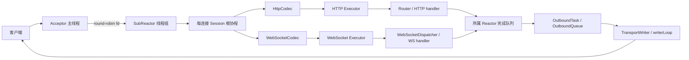

# web-test 2.0 · test6.3

这是一个面向 Linux 的 C++20 高并发 Web 服务器学习项目。当前版本完成到学习路线第 22 课，核心结构是：

- 一个 Acceptor 接收连接，多个 SubReactor 分管连接；
- 每条连接由 Session 根协程表达协议流程；
- HTTP 与 WebSocket handler 分别进入独立的有界 Executor；
- HTTP 与 WebSocket 出站统一经过 `OutboundTask + OutboundQueue + TransportWriter + writerLoop`；
- WebSocket 在基础帧协议之上实现跨 Reactor 寻址、ACK、幂等、重试、退避和指标；
- handler 支持协作式取消与单调时钟 deadline，Runtime 按安全顺序停机。

> **版本边界**：`test6.3` 分支保存的是“第 22 课完成、接入 SSE 之前”的稳定版本。后续 SSE 实验不属于该分支。

## 1. 本文中的版本如何定义

为了让对比可以重复验证，本文把 GitHub 上的上一条 2.0 分支作为主基线：

| 名称 | 基线 | 含义 |
|---|---|---|
| 之前的 2.0 | GitHub `test6.2`，提交 `e8bc307` | 已有 WebSocket、统一出站和应用层消息 ID/ACK 的版本 |
| 当前的 2.0 | 本地第 22 课完成态，即将提交的 `test6.3` | 在 `test6.2` 上补齐自动重试、接收端幂等、运行时隔离、取消和安全停机 |

最初上传的 `web-test6.1.zip` 是更早的学习起点：它已有 HTTP Reactor、协程等待和单一 Executor，
但没有当前 2.0 的 WebSocket 长连接架构、统一出站、可靠投递和运行时控制平面。

另有两个课程快照用于定位最后一步升级：`lesson22-before-20260915.zip` 是第 21 课完成态，
`lesson22-after-20260915.zip` 是第 22 课完成态。它们用于复查取消与双线程池改动，不替代 `test6.2`
作为本文的上一版本基线。

## 2. 当前 2.0 的整体架构



可以把服务器想成一座酒店：

- Acceptor 是总前台，只负责接客并分楼层；
- SubReactor 是楼层经理，每位经理只修改自己楼层的连接表；
- Session 协程是每位客人的专属服务员，用顺序代码记录“读、处理、写”的进度；
- HTTP 和 WS Executor 是两间独立后厨，慢 HTTP 不会占满 WS 工位；
- OutboundQueue 是发货队列，TransportWriter 是唯一真正接触 socket 写操作的搬运工。

## 3. 线程模型与状态归属

| 状态或操作 | 唯一所有者/执行位置 |
|---|---|
| `epoll`、socket、`Connection`、Session 状态 | 连接所属 SubReactor |
| HTTP 增量解析、WS 帧解析和分片重组 | 所属 Reactor 上的 Session 根协程 |
| HTTP handler | HTTP Executor Worker |
| WebSocket handler | WS Executor Worker |
| HTTP 路由表 | Router；注册在启动期，Worker 负责调用 |
| WS handler 表 | WebSocketDispatcher；`shared_mutex` 保护结构，锁外执行 handler |
| 跨 Reactor 出站请求 | 目标 Reactor 的线程安全 pending mailbox |
| socket 写入 | 所属 Reactor 的 `writerLoop + TransportWriter` |
| 整体构造和销毁顺序 | ServerRuntime |

这套设计最重要的规则是：**Worker 计算业务结果，Reactor 操作连接与协议状态。** Worker 不能通过
Context 取得 Session 裸指针并直接操作 socket。

## 4. 一次 HTTP 请求怎样流动

```text
EPOLLIN
  → HttpSession::readRequest
  → HttpParser 增量解析
  → 创建 RequestContext 和 handler deadline
  → HTTP Executor 执行中间件、Router 和 handler
  → completeQueue + eventfd 唤醒所属 Reactor
  → HttpResponse 编码为 OutboundTask
  → writerLoop 使用 writev/sendfile 非阻塞发送
  → Keep-Alive 继续下一轮，或统一 fd_close
```

关键行为：

1. Parser 总是先消费已有 Buffer，流水线中的下一条请求不必等待新的 EPOLLIN；
2. handler 排队与执行都计入默认 5 秒预算；
3. 队列满返回 503，handler 异常返回 500，deadline 超时返回 504；
4. `EAGAIN` 只让协程挂起，不阻塞 Reactor 线程；
5. 静态文件根据大小和热度选择内存体、mmap 或 sendfile，并支持 Range/ETag。

## 5. HTTP 升级到 WebSocket

```text
HTTP GET /ws + Upgrade headers
  → Router handler 调 ctx.acceptWebSocket()
  → HttpSession 校验 Version 13 / Sec-WebSocket-Key
  → 生成 101 Switching Protocols
  → 等 101 完整写出
  → SessionFactory 创建 WebSocketSession
  → Connection::session 从 HTTP Session 换成 WS Session
  → 旧 HTTP 根协程退出，新 WS 根协程接管同一个 fd
```

这里使用 `SessionFactory` 做依赖倒置：HttpSession 只认识工厂接口，不直接依赖 WebSocketSession 的
具体构造细节。

## 6. WebSocket 消息链路

当前 WebSocket 层支持：

- RFC 6455 Version 13 握手；
- 客户端帧掩码校验；
- Text/Binary、Ping/Pong、Close；
- Continuation 分片重组及整条消息大小限制；
- Text 消息在重组完成后统一校验 UTF-8；
- 单连接 handler 串行、不同连接并行；
- 用户 ID 到连接位置的弱引用索引；
- 跨 Reactor 私聊和广播；
- 应用消息 ID、ACK 所有权校验、发送方幂等；
- 指数退避、稳定抖动、有限重试和失败通知；
- 接收端“业务成功后记账，再 ACK”的有界幂等示例；
- 投递计数器和当前水位指标。

一条完整业务消息的处理路径是：

```text
WebSocket 帧
  → WebSocketParser
  → WebSocketMessageAssembler
  → UTF-8 / Close 语义校验
  → WsMessageContext
  → WS Executor
  → WebSocketDispatcher
  → 回所属 Reactor
  → 编码帧并进入统一 OutboundQueue
```

## 7. 统一出站系统

HTTP 响应、WS 单播帧和广播共享帧都被封装为 `OutboundTask`。每条连接只有一个 writerLoop，因此不会
出现多个协程同时写 socket、破坏 HTTP 响应或 WS 帧边界的问题。

已实现的出站保护包括：

| 保护 | 当前行为 |
|---|---|
| 单连接任务上限 | 4096 个任务 |
| 写侧高/低水位 | 4 MiB 暂停读，降到 2 MiB 后恢复 |
| 每轮公平预算 | 最多冲刷 256 KiB 后让出 Reactor |
| 跨 Reactor 邮箱 | 同时限制总任务、总字节、单连接任务和单连接字节 |
| 最终发送回执 | 区分 Written、关闭、二次背压、连接代际失效和系统错误 |

`Written` 只表示数据已写进本机内核，不表示对方业务已处理；需要业务确认时必须继续等待应用 ACK。

## 8. 所有权与生命周期

核心所有权关系如下：

- `ServerRuntime` 拥有 Router、两个 Executor、WebSocket 全局服务和 ReactorGroup；
- ReactorGroup 独占多个 SubReactor；
- 每个 SubReactor 独占自己的 `Connection`；
- Connection 用 `shared_ptr<Session>` 持有当前协议会话；
- CoroutineScheduler 在协程存活期间保留 Session owner；
- Session 内部持有 Parser、Codec 和跨挂起点需要保留的 Context；
- SessionManager 只保存 `weak_ptr<WebSocketSession>`，避免循环引用；
- HTTP 响应从对象池借出，移交给 OutboundTask 后由 RAII 包装归还。

所有跨挂起恢复都使用 `ConnectionKey{fd, connId}` 重新查表。`connId` 像房间的新住客编号：即使操作系统
复用了同一个 fd，旧协程和旧投递也不能误伤新连接。

## 9. 关闭、取消与 deadline

当前 Context 携带 `HandlerCancellation`：

```cpp
while (hasMoreWork()) {
    if (ctx.stopRequested())
        return false;
    processOneBatch();
}
```

取消是协作式的：连接关闭或 Runtime 停机只会点亮“撤单灯”，不会从任意指令处强杀 C++ 线程。
handler 应在循环、分批计算和可中断 I/O 边界检查它。忽略信号的 handler 仍会占用 Worker，返回后框架
才能将结果收口为 HTTP 504 或 WS Close 1013。

Runtime 的安全停机顺序是：

```text
停止 acceptor 和可靠投递线程
  → stop + join Reactor，并通知在途 handler 取消
  → drain HTTP Executor
  → drain WS Executor
  → 最后销毁 ReactorGroup、Session、协程和 eventfd
```

Worker 完成时还要通知 Reactor，因此不能先销毁 Reactor 再等待 Worker。

## 10. 当前 2.0 相比 GitHub `test6.2` 的变化

`test6.2` 已经搭好了“通信公路”：WebSocket 帧、跨 Reactor 寻址、统一出站、消息 ID 和 ACK 都已存在。
当前版本主要增加“运输公司的调度中心”：它会自动重试、控制重试节奏、识别重复包、统计运行状态，
并在连接关闭或服务器停机时有序撤销工作。

| 架构维度 | `test6.2` | 当前 `test6.3` |
|---|---|---|
| 可靠投递驱动 | 已有应用消息 ID、ACK 和投递状态判断 | 新增 `WebSocketDeliveryService`，后台调度到期任务并真正执行重试 |
| 重试节奏 | 具备基础 retry 决策 | 指数退避、稳定抖动、最大尝试次数和失败通知形成完整闭环 |
| 接收端语义 | 发送方可等 ACK | 增加有界幂等示例：业务成功后记账，再发送 ACK，重复消息不重复执行业务 |
| 可观测性 | 主要依赖日志和单次结果 | 增加入队、ACK、重试、失败、当前待确认水位等指标 |
| WS handler 边界 | handler 与连接处理仍耦合较深 | handler 进入 WS Executor；同连接串行、不同连接并行，结果回到所属 Reactor |
| Dispatcher 并发 | 注册和调用边界较弱 | `shared_mutex` 保护 handler 表，复制目标后锁外执行 handler |
| Worker 容量 | HTTP/WS 共用 Executor | HTTP/WS 使用独立有界 Executor，慢 HTTP 不会吃光 WS 工位 |
| handler 时间预算 | 没有统一 deadline | 提交时生成默认 5 秒 deadline，排队时间也计入预算 |
| 连接关闭 | 以清连接和协程状态为主 | 同时通知在途 handler 协作停止，结果回来时再由 Reactor 收口 |
| HTTP 超时语义 | 无统一结果 | 丢弃过期业务结果并返回 504 |
| WS 超时语义 | 无统一结果 | 发送 Close 1013，reason=`handler timeout` |
| Context 权限 | Worker 上下文仍有接触会话对象的历史痕迹 | HTTP/WS Context 都不暴露 Session，只提供受限能力和取消视图 |
| Runtime 停机 | 组件可停，但生产者与消费者顺序还不完整 | 先停 accept/可靠投递，再停 Reactor、发取消、排空双 Executor，最后销毁依赖 |
| 验证体系 | 已有 HTTP/WS、出站和可靠投递基础测试 | 增加自动重试、幂等、退避、指标、线程隔离、取消、deadline 和停机测试 |

这次升级形成了三条闭环：

1. **投递闭环**：登记消息 → 首次发送 → 等 ACK → 到期重试 → 成功删除或最终失败；
2. **线程闭环**：Reactor 解析 → Worker 执行业务 → 完成队列回 Reactor → 唯一 writer 发送；
3. **生命周期闭环**：Runtime 制定停止顺序 → 连接发出取消 → handler 在安全点响应 → Executor 排空后再销毁依赖。

其中第 22 课专门完成第三条闭环的最后一段：双 Executor、协作式取消、统一 deadline，以及 HTTP 504 / WS 1013
的协议映射。它的价值不只是增加一个 token，而是让“谁发出停止、谁观察停止、谁负责最终结果”都有明确归属。

## 11. 相比最初上传版 web-test6.1.zip

| 上传版学习起点 | 当前 2.0 |
|---|---|
| Runtime 持有共享 HttpCodec | Codec 下沉到每个 HTTP/WS Session |
| 单一 HTTP Executor | HTTP/WS 双 Executor，带 deadline |
| `RequestContext` 暴露 `HttpSession*` | Worker Context 不暴露连接对象 |
| 主要处理 HTTP 请求响应 | HTTP + 完整 WebSocket 协议与应用投递链 |
| HTTP 专用发送思路 | 协议无关统一出站任务体系 |
| fd 是主要定位信息 | `fd + connId` 防止描述符复用误投 |
| 关闭主要依赖局部流程和析构 | 显式生产者停止、协作取消、Worker drain、依赖销毁顺序 |
| 测试集中在 HTTP 基础行为 | 单元、组件、生命周期、HTTP/WS 黑盒、模糊测试和 Sanitizer 门禁 |

## 12. 当前亮点

1. **线程归属清晰**：Reactor 管连接，Worker 管业务，跨线程用消息和完成队列交接；
2. **协议与传输解耦**：Session 负责协议状态，TransportWriter 是唯一写 socket 的边界；
3. **长连接可靠投递层次明确**：准入、写入内核、应用 ACK 是三种不同成功；
4. **连接代际安全**：fd 复用不会让旧事件落到新连接；
5. **关闭顺序可证明**：先停生产者、发取消、排空消费者，再销毁回调目标；
6. **测试对应架构不变量**：测试不只判断返回值，也验证线程隔离、生命周期和协议收口。

## 13. 当前限制

- handler 取消仍依赖业务主动检查，不能打断不支持取消的数据库或 RPC 调用；
- HTTP/WS 空闲 Worker 暂不能跨池借用，线程数、队列容量和 deadline 尚未配置化；
- 同一 WS 连接等待 handler 时，自己的后续 Ping、Close 和数据帧暂不继续处理；
- 可靠投递状态和指标保存在进程内，重启后不能恢复；
- 尚未接入 TLS、permessage-deflate、SSE、租户配额和进程级内存预算；
- 性能结论仍需在目标 Linux 环境用真实负载、TSan 和尾延迟数据验证。

## 14. 目录导航

```text
server/
  Runtime/              组件装配、监听和安全停机
  Reactor/ SubReactor/  多 Reactor、连接表和跨线程完成通知
  CoroutineScheduler/   根协程所有权与各类 Awaiter
  Executor/             Worker 边界、handler deadline 和取消视图
  http/ response/       HTTP 解析、路由、响应与静态文件
  websocket/            WS 协议、会话、寻址、可靠投递和指标
  transport/            统一出站任务、准入、队列与唯一写入口
tests/                   单元、组件、生命周期及 HTTP/WS 黑盒测试
fuzz/ fuzz-corpus/       HTTP/WS Parser 模糊测试
examples/                可靠 WS 接收端示例
docs/                    架构、测试、性能、排错和阶段讲义
scripts/                 构建、测试与报告脚本
```

建议阅读顺序：

1. [`docs/architecture/ARCHITECTURE.md`](docs/architecture/ARCHITECTURE.md)
2. [`docs/architecture/phase3/README.md`](docs/architecture/phase3/README.md)
3. [`docs/architecture/phase4_upgrade.md`](docs/architecture/phase4_upgrade.md)
4. [`docs/architecture/phase14_websocket_executor_boundary.md`](docs/architecture/phase14_websocket_executor_boundary.md)
5. [`docs/architecture/phase15_handler_cancellation_and_executor_isolation.md`](docs/architecture/phase15_handler_cancellation_and_executor_isolation.md)
6. [`docs/testing/TESTING.md`](docs/testing/TESTING.md)

## 15. 构建与验证

项目目标平台是 Linux。需要 C++20 编译器、CMake 3.16+、Python 3 和系统安装的 GoogleTest。

```bash
cmake -S . -B build-tests -DCMAKE_BUILD_TYPE=Debug -DBUILD_TESTING=ON
cmake --build build-tests --parallel
ctest --test-dir build-tests --output-on-failure
```

也可以使用统一脚本：

```bash
bash scripts/run_tests.sh
```

建议在线程边界、取消、Session 生命周期或跨 Reactor 逻辑变更后额外运行：

```bash
BUILD_DIR=build-tsan bash scripts/run_tests.sh -DWEBSERVER_ENABLE_TSAN=ON
```

TSan 不能与 ASan/UBSan 放在同一个构建目录和同一次运行中。

## 16. 本版本后续方向

`test6.3` 分支本身停在 SSE 接入之前。合理的后续顺序是：

1. 将 Worker 数、队列容量和 handler deadline 收敛为启动期配置；
2. 把取消预算继续传给数据库、RPC 等外部 I/O；
3. 在 HTTP Session 与统一出站基础上接入 SSE 长连接；
4. 增加 TLS、外部指标后端和可靠投递持久化；
5. 在目标 Linux 环境建立吞吐、P99 延迟、内存和断连风暴基线。

当前架构细节以 [`docs/architecture/ARCHITECTURE.md`](docs/architecture/ARCHITECTURE.md) 为准；阶段文档用于解释
为什么演进成现在的结构。
