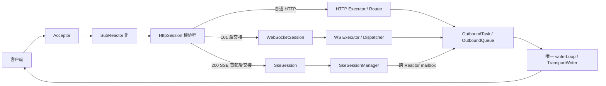

# web-test 2.0 · test7.0（SSE 版）

这是一个面向 Linux 的 C++20 Web 服务器学习项目。`test7.0` 在上一版 [`test6.3`](https://github.com/aurora-deng/web/tree/test6.3)（提交 `cda6ea514441350a431a636acc6f05a1514ab248`）之上加入 SSE。核心是一个 Acceptor、多条 SubReactor、每连接一条协议根协程、HTTP/WS 双 Executor，以及 HTTP、WebSocket、SSE 共用的单写者出站通道。

**版本边界**：本分支记录接入 SSE 后、接入 HTTP/2 前的状态。后续 HTTP/2 实验只在本地进行，不属于 `test7.0`。

## 1. 整体架构



可以把 Reactor 看作“楼层经理”，只由它管理本楼层的连接；Executor 是“后厨”，只做业务计算；Session 是每条连接的“服务员”，记住协议进行到哪一步；唯一 writerLoop 是“发货口”，保证不同任务不会同时乱写同一个 socket。

| 层 | 当前职责 |
|---|---|
| `ServerRuntime` | 装配 Router、Executor、协议管理器、ReactorGroup，控制启动与停机顺序 |
| Acceptor / SubReactor | 接入连接，处理 epoll、定时器、连接表及完成通知 |
| Session 根协程 | HTTP 解析与应答，或交接给 WebSocket / SSE 长会话 |
| HTTP / WS Executor | 业务 handler；带有界排队、协作取消和 deadline |
| 统一出站 | `OutboundTask → OutboundQueue → TransportWriter → writerLoop`，每条连接只有一个写入口 |
| 跨 Reactor 寻址 | Manager 保存弱定位，目标 Reactor 校验 `fd + connId` 后发送 |

`connId` 是连接代际编号。系统可能复用相同 fd；旧任务必须同时匹配新旧连接不同的 `connId`，才能避免把过期数据发给新住客。这里的连接身份检查**不是登录鉴权**；示例路由目前没有用户认证。

## 2. 与上一版 2.0 的准确对比

比较基线固定为 `test6.3` 的上述提交；这次变化集中在 SSE 协议接入和文档整理。`test6.3` 已具备 HTTP、完整 WebSocket 链路、跨 Reactor 寻址、应用层 ACK/重试/幂等、统一出站、双 Executor、handler 取消和安全停机，这些继续沿用。

| 维度 | `test6.3`（接入前） | `test7.0`（当前） |
|---|---|---|
| 长连接类型 | WebSocket | WebSocket + SSE；普通 HTTP 继续保留 |
| HTTP handler 的意图 | `acceptWebSocket()` | 增加与其互斥的 `acceptSse()` |
| 连接交接 | HTTP 发完 101 后换成 WS Session | SSE 先发完 HTTP 200 流式首部，再换成 SseSession |
| 会话工厂 | 只创建 WS Session | `ProtocolSessionFactory` 统一创建 WS/SSE Session |
| 出站格式 | HTTP 响应、WS 帧 | 再加入 SSE 文本包裹的 HTTP chunk；仍走唯一 writer |
| 跨 Reactor 投递 | WS 用户定位与可靠投递 | 新增 SSE 多标签页订阅目录；发布可投给同一 uid 的多个连接 |
| 心跳与关闭 | WS Ping/Pong、Close | SSE 注释心跳；对端断开时注销会话 |
| 测试 | HTTP/WS 与运行时测试 | 增加 SSE 编码、首部、会话目录单元检查及 Linux 黑盒脚本 |
| 文档 | WebSocket 历史阶段 5–15 与新阶段编号混杂 | 历史文档改为 `websocket-lessons/lessonNN`，新增 SSE `phase5.md` |

这次升级的关键点不是多加一个路由，而是让“一次 HTTP 响应长期开放”有清楚的所有权：HTTP Session 发完首部并确认完成，SseSession 接管后续事件与心跳；HTTP Worker 不被长连接占住。

## 3. 三条协议的运行路径

### 普通 HTTP

`EPOLLIN → HttpSession 增量解析 → HTTP Executor 路由/handler → 完成通知回所属 Reactor → OutboundTask → writerLoop → Keep-Alive 或关闭`。静态文件支持内存体、mmap/sendfile 与 Range/ETag；HTTP handler 的排队和执行都计入 deadline。

### WebSocket

`GET /ws?uid=... → Upgrade 校验 → HTTP 101 完整写出 → WebSocketSession 接管 → 帧解析/消息组装 → WS Executor → 回 Reactor → 统一出站`。在基础帧收发之外，项目还演示应用消息 ID、ACK、限次重试、退避、接收端幂等和指标。写入内核不等于业务方确认收到。

### SSE

`GET /events?uid=1001 → handler 调 acceptSse() → HttpSession 返回 200 + text/event-stream + chunked → 首部写完 → SseSession 登记并发 ready → 等待读事件或定时心跳`。

发布路径是 `POST /events/1001?event=notice&id=42&data=hello → SseSessionManager → 目标 SubReactor mailbox → fd + connId 校验 → OutboundQueue → writerLoop`。一条事件先编码成 SSE 字段，再封装成 HTTP chunk。`publish()` 的返回值表示多少目标通过当前队列准入，**不表示浏览器已经处理事件**。

```bash
# 终端 A：订阅
curl -N "http://127.0.0.1:8080/events?uid=1001"

# 终端 B：发布
curl -X POST "http://127.0.0.1:8080/events/1001?event=notice&id=42&data=hello"

# 查看当前在线 SSE 连接数
curl "http://127.0.0.1:8080/events-status"
```

浏览器断线重连会重新建立 TCP/HTTP 连接与 `SseSession`。当前示例没有事件持久化和 `Last-Event-ID` 补发，断线期间的事件可能丢失；示例接口也没有身份鉴权。SSE 的具体交接、编码、心跳和背压见 [`docs/architecture/phase5.md`](docs/architecture/phase5.md)。

## 4. 目录与学习顺序

```text
server/Runtime/       装配与停机
server/Reactor/       ReactorGroup
server/SubReactor/    epoll、连接表、writerLoop
server/http/          HTTP 解析、响应与 Session
server/websocket/     WS 协议、会话、投递
server/sse/           SSE 编码、Session、订阅目录
server/session/       协议会话工厂
server/transport/     统一出站
tests/                单元、组件及黑盒测试
docs/                 架构课程、测试、性能和运维说明
```

已熟悉 `test6.3` 的读者，建议按顺序读 [`phase5.md`](docs/architecture/phase5.md) 的第 3–9 节、[`HttpSession.cpp`](server/http/HttpSession/HttpSession.cpp) 的交接代码、[`SseSession.cpp`](server/sse/SseSession.cpp)、[`SseSessionManager.cpp`](server/sse/SseSessionManager.cpp)。需要回顾历史架构时，从[文档导航](docs/README.md)和[旧 WebSocket 课程目录](docs/architecture/websocket-lessons/README.md)进入。

## 5. 构建、验证与已知边界

目标平台是 Linux，要求 C++20 编译器、CMake 3.16+、Python 3；开启单元测试还需要系统安装的 GoogleTest。

```bash
cmake -S . -B build-tests -DCMAKE_BUILD_TYPE=Debug -DBUILD_TESTING=ON
cmake --build build-tests --parallel
ctest --test-dir build-tests --output-on-failure
```

Windows 工作区已完成 SSE 相关 C++20 语法编译、独立编码/管理器/流式首部验证、CMake 生成、Python 黑盒脚本语法检查及原有 WS Python 测试回归。**完整 Linux 构建和真实网络黑盒尚未在当前环境执行**；`tests/integration/sse_blackbox.py` 已准备好，进入有构建权限的 Linux 环境后按上面的命令完成最终验收。

当前边界：SSE 为实时通知，没有持久化、断线重放或用户鉴权；背压可能拒绝新事件；没有 TLS；查询参数不做百分号解码；未在反向代理下验证缓冲和超时。HTTP/WS handler 的协作式取消要求业务代码主动检查停止标志。服务器是学习项目，性能仍需在目标 Linux 上测量。
