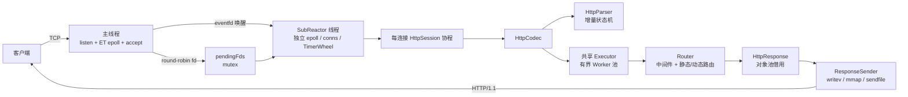
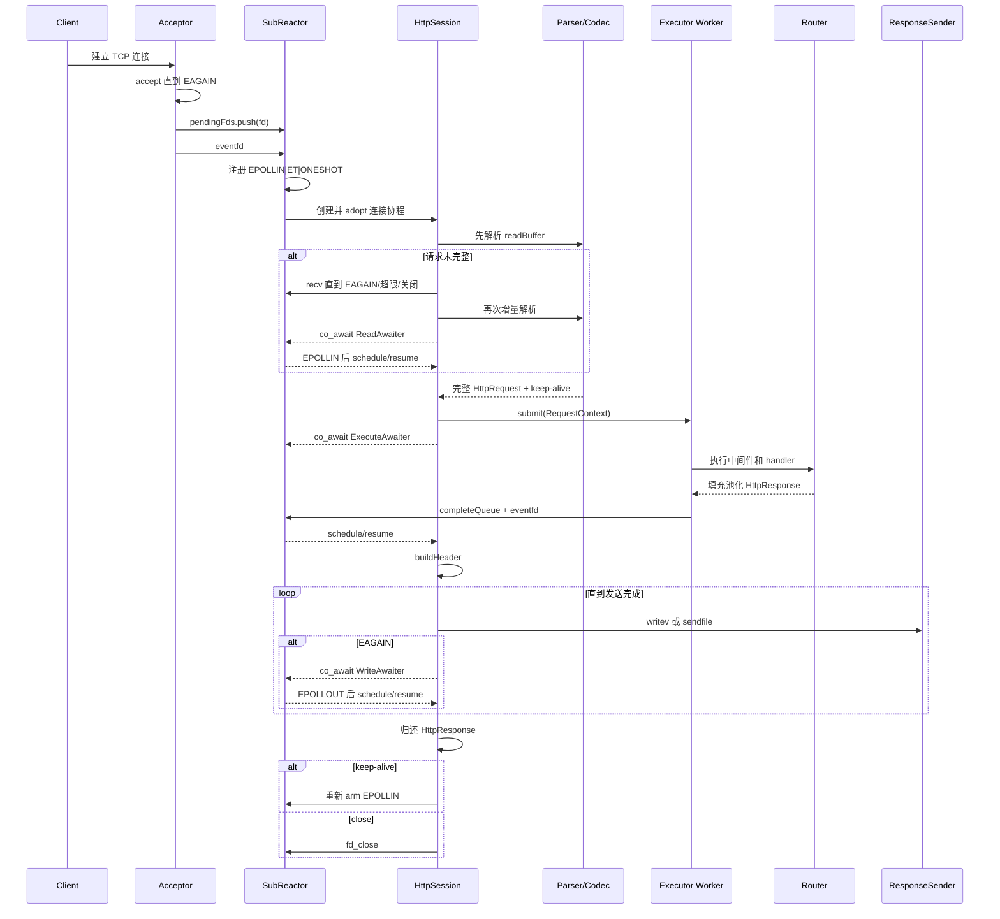
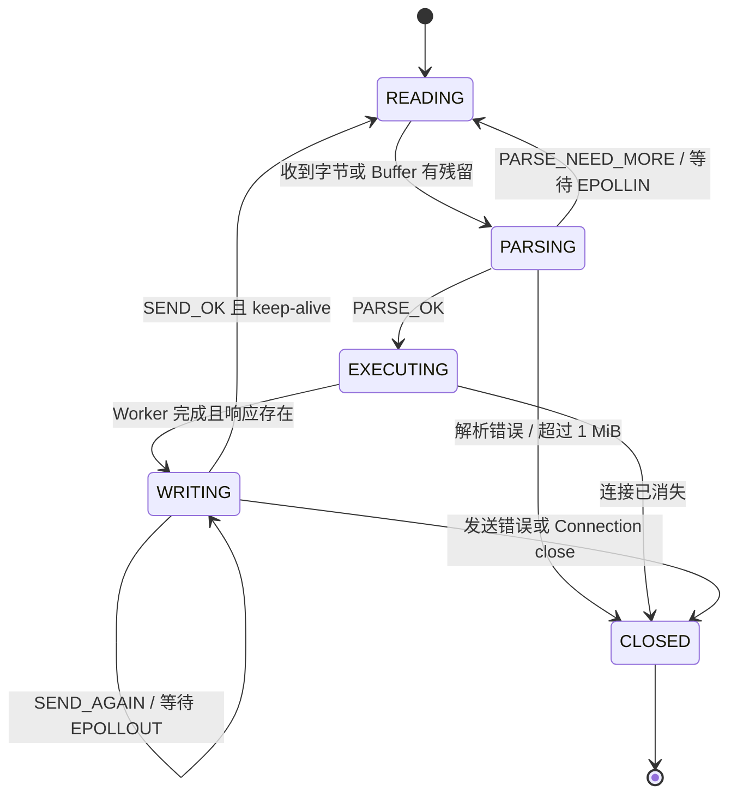
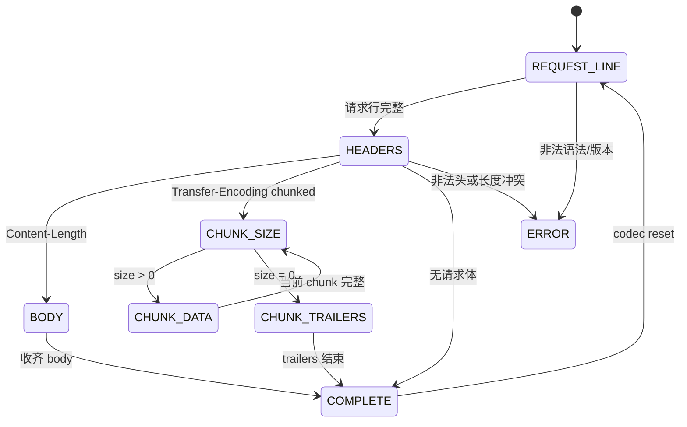
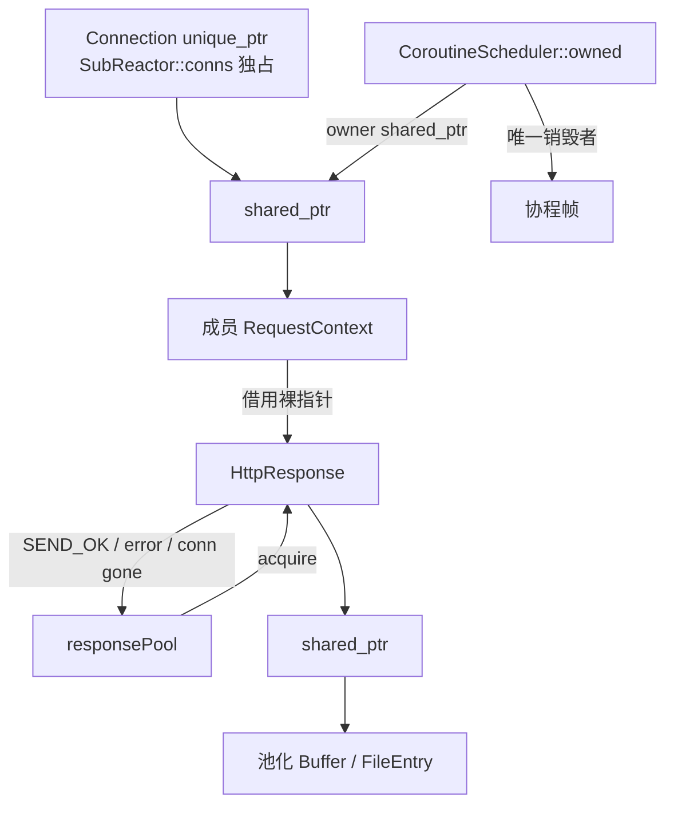

# 架构说明

本文描述当前代码实际行为，而不是目标架构。服务面向 Linux/C++20，采用一个 acceptor 加多个
SubReactor；连接协程负责协议和发送流程，业务 handler 统一投递到 Runtime 共享的 Executor。

## 阅读目标与设计动机

本文用于回答四个问题：请求如何穿过当前框架、资源由谁持有、非阻塞流程为何这样组织，以及哪些边界
会限制后续演进。选择“多 Reactor + 线程内状态”是为了减少连接热路径上的共享写入；选择“每连接协程”
是为了用顺序代码表达增量解析和分段发送，同时仍让 `EAGAIN` 回到事件循环。这些设计服务于清晰的
线程归属与生命周期，不意味着协程或对象池天然更快，性能判断必须交给实测。

本文是文档体系中的结构基线：[TESTING.md](TESTING.md) 应验证这里声明的协议、所有权和关闭路径，
[BENCHMARK.md](BENCHMARK.md) 应量化这些取舍带来的吞吐、尾延迟和资源成本。对 Web 收口而言，
该基线可帮助后续只补齐配置、优雅停机、安全和过载保护等明确缺口，而不继续无边界扩框架；
对机器人转向而言，线程归属、消息传递、背压、状态机和故障收尾可迁移到 ROS 2/DDS 与设备网关，
业务执行通过有界队列与 Reactor 隔离，过载时生成 503，不允许协程无完成通知地挂起。

## 组件与线程模型

主线程创建数量等于 `hardware_concurrency()`（无法获取时为 4）的 SubReactor，并对新连接轮询分配。
`addFd` 只在 acceptor 线程设置非阻塞并入队；SubReactor 被 `eventfd` 唤醒后才执行
`epoll_ctl`、创建 `Connection` 和协程，因此 `conns` 的增删查改保持在线程内。

每个 SubReactor 包含：

- 一个 ET + ONESHOT 的 `epoll` 实例及一个 `eventfd`；
- fd 到 `Connection` 的独占映射；
- 时间轮（当前连接超时配置 30 秒）、段池、ResponseSender，并借用 Runtime 的 Codec/Executor；
- 一个协程调度器及其去重后的 ready queue。

`ServerRuntime` 持有共享 `Executor`，所有 handler 在 Worker 上执行；文件 mmap 预热另用专用线程池。

## 从 accept 到响应

关键细节：

1. `HttpSession::readRequest` 总是先解析已有缓冲，避免 pipeline 的下一条请求必须等新事件；
   数据不足时才 `recv`，ET 模式下一直读取到 `EAGAIN`。
2. `HttpCodec::decode` 只在完整请求后更新 Session keep-alive 并 reset parser。Buffer 已消费部分之外的
   pipeline 数据被保留。
3. `HttpCodec::dispatch` 在共享 Executor Worker 中从 `responsePool` 获取响应，再调用 Router。
   队列满时 Session 直接形成 503；handler 异常转换为 500，且完成通知始终回到 Reactor。
4. `ResponseSender` 在响应对象中保存 header/body 的消费位置。因此写入只完成一部分时，
   协程挂起后可从原位置继续，不重新构造响应。

## 状态机

### 会话状态

### 解析状态

`PARSE_NEED_MORE` 不会 reset 状态，因此请求行、header、Content-Length body 和 chunked body
都可以跨多次读取继续。当前错误策略是关闭连接，不发送 400/413。

## 所有权与生命周期

- `Connection` 由所属 SubReactor 的 `unordered_map<int, unique_ptr<Connection>>` 独占。
- `Task::release()` 后协程帧立刻交给 `CoroutineScheduler::adopt()`；调度器保存
  `shared_ptr<HttpSession>` owner，确保成员协程结束前 session 存活。协程到达 `final_suspend`
  后仅由 `reap()` 销毁。
- `HttpParser`、`RequestContext`（含 HttpRequest/response 指针）均属于 Session；Connection 仅保留传输状态。
  `response` 是对象池借出的非 owning 裸指针。
  正常发送、发送失败、连接消失和 dispatch 失败分支都显式 release 并置空。
- `HttpResponse` 自身持有 header/body 的 `shared_ptr`。对象池 reset 时清理这些引用和协议状态。

Worker 只访问 Session 持有的请求上下文；Connection、epoll、时间轮和发送仍只由所属 Reactor 访问。
调度器持有 Session 的 shared_ptr，保证连接在 handler 执行期间关闭时上下文仍然存活。

## 关闭与取消

所有套接字最终经过 `SubReactor::fd_close`：

1. 从时间轮移除，标记 closed，从 epoll 删除，关闭 fd，再从 `conns` 删除。
2. 若是超时、epoll 错误等外部关闭，不在关闭函数中直接 `destroy` 协程帧；先清空 session 中的观察句柄，
   删除 Connection 后再将句柄调度一次。恢复后的协程通过 `getConn()==nullptr` 自行 `co_return`。
3. 若协程因解析/发送错误主动关闭，使用 `fromCoroutine=true`，让当前协程自然运行到
   `final_suspend`，不重复调度。
4. 调度器的 `scheduled` 集合避免同一句柄被读写事件重复入队，完成后统一 `reap`。

这是一种“关闭资源 + 协作式收尾”，不是通用 cancellation token。Runtime 析构时先 stop/join
Reactor，再 drain Executor，最后销毁协程与连接，线程不再 detach。

## 背压

### 已实现

- **读侧内存水位**：连接未解析数据超过 1 MiB 时设置 `pauseByMemory`，`updateEvent` 不再订阅
  EPOLLIN；当前 session 将该情况视为 TOO_LARGE 并关闭连接。发送结束后低于 512 KiB 的恢复逻辑
  因此主要服务于未来可恢复策略。
- **内核写背压**：`writev`/`sendfile` 返回 `EAGAIN` 时设置 `wantWrite`，协程等待 EPOLLOUT，
  响应消费位置保留在 body 对象中。
- **每连接串行**：同一连接只有一个活跃 session 协程，避免无界并发响应和响应乱序。
- **accept 跨线程传递**：pending fd 队列使用 mutex，`notified` 原子标志合并 eventfd 唤醒。

### 尚缺

- 没有响应队列/待发送字节高低水位，也没有进程级内存预算；
- 没有 accept 限流、最大连接数、每 IP 配额或过载拒绝策略；
- 慢 handler 会占用 Worker 槽位，慢客户端虽能因 EAGAIN 挂起，但其响应对象仍持续占用内存；
- 尚未实现最大连接数、每 IP 配额和进程级总内存预算。

## 关键权衡

- **多 Reactor + 线程内状态**减少连接热路径上的锁，但连接按 accept 时轮询，无法根据实时负载迁移；
  阻塞 handler 不阻塞 Reactor，但会消耗共享 Worker 容量。
- **每连接协程**让非阻塞状态机接近同步代码，但协程帧、调度去重和外部关闭之间需要严格所有权规则。
- **EPOLLONESHOT + 显式 rearm**避免同一 fd 被重复处理，但每个挂起点必须正确恢复 interest；
  漏 rearm 会造成连接永久沉默。
- **串行 pipeline**保证响应顺序且限制单连接并发资源，但无法利用并行 handler 降低一条长流水线的总时间。
- **对象池和分段发送**降低分配与拷贝，但提高生命周期复杂度；任何新增 early return 都必须审计归还路径。
- **文件缓存 + mmap/sendfile**覆盖不同大小文件，但缓存清理、mmap 失效和 Content-Type/路径安全还需要强化。

## 可观测与验证边界

仓库有 GoogleTest、Linux 黑盒测试、Sanitizer 和 HttpParser fuzz 入口；压测及 perf 流程见
[BENCHMARK.md](BENCHMARK.md)。由于当前宿主无 Linux/WSL，本次未运行服务、未验证线程调度时序，
也未生成 QPS/延迟结论。图中关系来自当前源码静态检查，Linux 实测应作为发布前门禁。
