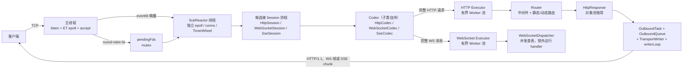
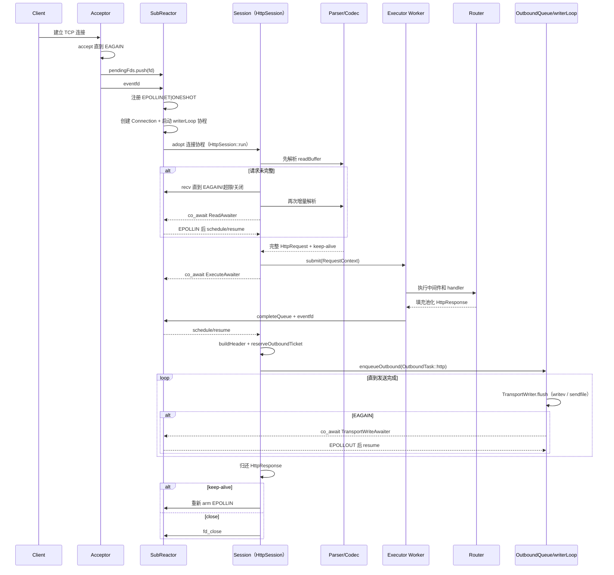
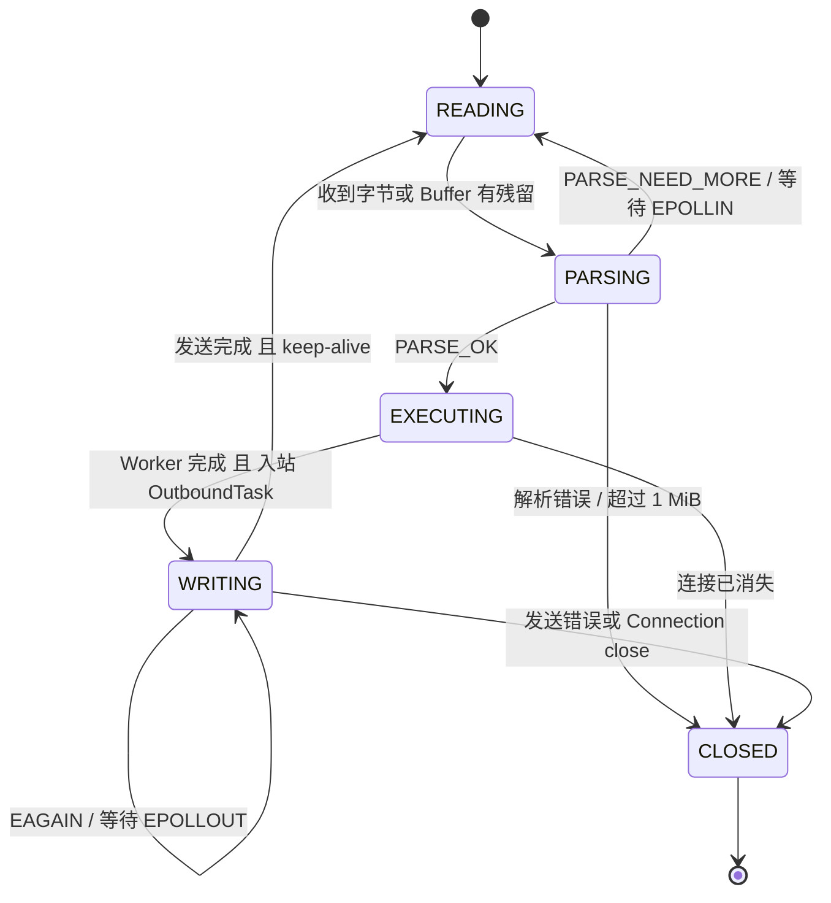
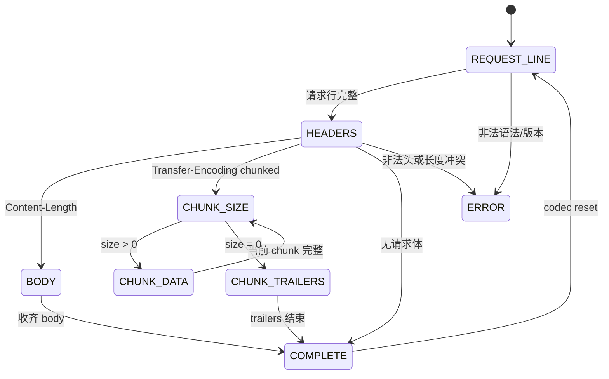
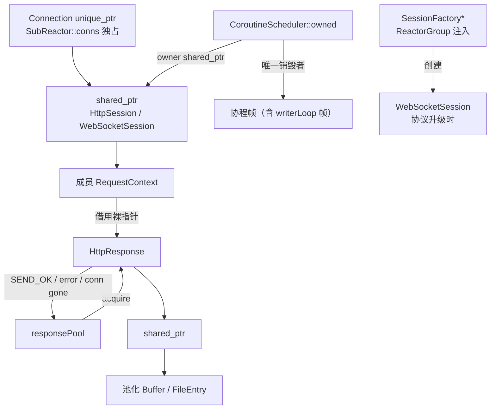

# 架构说明

> 当前实现以本文为结构基线；阶段演进从 [`phase4_upgrade.md`](phase4_upgrade.md) 延伸到
> [`phase15_handler_cancellation_and_executor_isolation.md`](websocket-lessons/lesson15_handler_cancellation_and_executor_isolation.md)。
> 本地 SSE 接入见 [`phase5.md`](phase5.md)；GitHub `test6.3` 仍是接入前基线。
> 排错入口：[`../debugging/CHEATSHEET.md`](../debugging/CHEATSHEET.md)。

服务面向 Linux/C++20，采用一个 acceptor 加多个
SubReactor；连接协程负责 HTTP、WebSocket 或 SSE 协议循环，HTTP 与 WebSocket handler 分别投递到独立 Executor，出站字节统一走
`OutboundTask` + `OutboundQueue` + `TransportWriter` + `writerLoop` 协程这套任务体系。

## 阅读目标与设计动机

本文用于回答四个问题：请求如何穿过当前框架、资源由谁持有、非阻塞流程为何这样组织，以及哪些边界
会限制后续演进。选择“多 Reactor + 线程内状态”是为了减少连接热路径上的共享写入；选择“每连接协程”
是为了用顺序代码表达增量解析和分段发送，同时仍让 `EAGAIN` 回到事件循环。这些设计服务于清晰的
线程归属与生命周期，不意味着协程或对象池天然更快，性能判断必须交给实测。

本文是文档体系中的结构基线：[../testing/TESTING.md](../testing/TESTING.md) 应验证这里声明的协议、所有权和关闭路径，
[../performance/BENCHMARK.md](../performance/BENCHMARK.md) 应量化这些取舍带来的吞吐、尾延迟和资源成本。对 Web 收口而言，
该基线可帮助后续只补齐配置、优雅停机、安全和过载保护等明确缺口，而不继续无边界扩框架；
对机器人转向而言，线程归属、消息传递、背压、状态机和故障收尾可迁移到 ROS 2/DDS 与设备网关，
业务执行通过有界队列与 Reactor 隔离，过载时生成 503，不允许协程无完成通知地挂起。

## 组件与线程模型

主线程创建数量等于 `hardware_concurrency()`（无法获取时为 4）的 SubReactor，并对新连接轮询分配。
`addFd` 只在 acceptor 线程设置非阻塞并入队；SubReactor 被 `eventfd` 唤醒后才执行
`epoll_ctl`、创建 `Connection` 和协程，因此 `conns` 的增删查改保持在线程内。

每个 SubReactor 包含：

- 一个 ET + ONESHOT 的 `epoll` 实例及一个 `eventfd`；
- fd 到 `Connection` 的独占映射；
- 时间轮（当前连接超时配置 30 秒）、段池、`TransportWriter`、`OutboundQueue`，并借用 Runtime 的 `Router`/HTTP `Executor`/`SessionFactory`；
- 一个协程调度器及其去重后的 ready queue；
- 协议升级工厂指针 `sessionFactory_`（依赖倒置，由 `ReactorGroup` 注入，不直接依赖 WebSocket 具体类型）。

`ServerRuntime` 持有 HTTP/WS 两个 `Executor`、`Router`、`WebSocketDispatcher`、
`WebSocketSessionManager`、`WebSocketDeliveryService`、`SseSessionManager` 和 `ProtocolSessionFactory`。HTTP 与
WebSocket handler 使用独立 Worker 容量；协议解析、连接状态与出站入队仍回到所属 Reactor。
文件 mmap 预热另用专用线程池。`ReactorGroup` 接收 `Router&` / HTTP `Executor&` /
`SessionFactory&`，统一工厂单独接收 WS `Executor&` 与两种长会话的依赖；在 `start` 时
把 `SessionFactory` 注入每个 SubReactor，使其能独立完成 HTTP→WebSocket/SSE 的会话交接。

## 从 accept 到响应

关键细节：

1. `HttpSession::readRequest` 总是先解析已有缓冲，避免 pipeline 的下一条请求必须等新事件；
   数据不足时才 `recv`，ET 模式下一直读取到 `EAGAIN`。
2. `HttpCodec::decode` 只在完整请求后更新 Session keep-alive 并 reset parser。Buffer 已消费部分之外的
   pipeline 数据被保留。
3. `HttpCodec::dispatch` 在 HTTP Executor Worker 中从 `responsePool` 获取响应，再调用 Router。
   队列满时 Session 形成 503，handler 异常转换为 500；默认 5 秒 deadline 从提交时开始，排队
   也计入预算，超时结果统一转换为 504。完成通知始终回到 Reactor。
4. 出站不再由单个发送器类承担，而是 **`OutboundTask` + `OutboundQueue` + `TransportWriter` + `writerLoop` 协程** 这套统一任务体系：
   `OutboundTask` 用 `variant` 统一封装 WS 帧 / HTTP 响应 / 广播共享帧三种货；
   `enqueueOutbound` 把任务入队到本连接的 OutboundQueue；`writerLoop` 协程串行化冲刷
   `TransportWriter`（`writev` 聚集、`sendfile` 零拷贝）；消费位置由 body 对象保存，`EAGAIN` 后从断点续发。
   每次 flush 最多写 256 KiB，预算耗尽返回 `Yielded` 重新经过 epoll 调度；可选
   `OutboundReceipt` 区分 Written、二次背压、关闭、fd 代际失效和系统写错误。

WebSocket 可靠私聊在传输层之上再增加应用信封、`WebSocketDeliveryTracker` 与
`WebSocketDeliveryService`：客户端 ID 用于请求去重，服务端 ID 用于 ACK 关联，只有记录中的真实
收件人可以确认。`accepted` 表示跨 Reactor 邮箱准入，`Written` 表示写入本机内核，
`acknowledged` 表示接收方应用确认。Service 观察最终写回执，从 Written 后开始 ACK 计时，
并自动执行有界重试和失败通知；详见
[`phase10_websocket_application_delivery.md`](websocket-lessons/lesson10_websocket_application_delivery.md) 与
[`phase11_websocket_retry_runtime.md`](websocket-lessons/lesson11_websocket_retry_runtime.md)。

## 状态机

### 会话状态

### 解析状态

`PARSE_NEED_MORE` 不会 reset 状态，因此请求行、header、Content-Length body 和 chunked body
都可以跨多次读取继续。当前错误策略是关闭连接，不发送 400/413。

## 所有权与生命周期

- `Connection` 由所属 SubReactor 的 `unordered_map<int, unique_ptr<Connection>>` 独占。
  Connection 分层为 `ConnTransport`（fd、readBuffer、state）与 `ConnTimer`（expireSlot），传输状态与定时器状态隔离。
- `Task::release()` 后协程帧立刻交给 `CoroutineScheduler::adopt()`；调度器保存
  `shared_ptr<Session>` owner，确保成员协程结束前 session 存活。协程到达 `final_suspend`
  后仅由 `reap()` 销毁。
- `Session` 基类只规定 `run()` 纯虚 + `onTimeout()`/`onClose()` 钩子（**无 `protocol()`**）。
  `HttpSession` 与 `WebSocketSession` 各自自持 Codec（`HttpCodec` / `WebSocketCodec`），
  SubReactor 通过基类指针统一唤醒，不关心协议类型。HTTP→WS 升级时
  经 `sessionFactory_->createWebSocketSession(...)` 创建新住客，替换 `conn->session` 指针，
  旧协程 `co_return` 退出。
- `HttpParser`、`RequestContext`（含 HttpRequest/response 指针）均属于 Session；Connection 仅保留传输状态。
  `response` 是对象池借出的非 owning 裸指针。
  正常发送、发送失败、连接消失和 dispatch 失败分支都显式 release 并置空。
- `HttpResponse` 自身持有 header/body 的 `shared_ptr`。对象池 reset 时清理这些引用和协议状态。

Worker 只访问 Session 持有的 HTTP 请求上下文或 WS 消息工作单；Connection、epoll、parser、
Session 状态、时间轮和出站冲刷仍只由所属 Reactor 访问。调度器持有 Session 的 shared_ptr，WS
Worker 任务也显式捕获 shared_ptr，保证连接在 handler 执行期间关闭时上下文仍然存活。

## 关闭与取消

所有套接字最终经过 `SubReactor::fd_close`：

1. 从时间轮移除，标记 closed，从 epoll 删除，关闭 fd，再从 `conns` 删除。
2. 若是超时、epoll 错误等外部关闭，不在关闭函数中直接 `destroy` 协程帧；先清空 session 中的观察句柄，
   删除 Connection 后再将句柄调度一次。恢复后的协程通过 `getConn()==nullptr` 自行 `co_return`。
3. 若协程因解析/发送错误主动关闭，使用 `fromCoroutine=true`，让当前协程自然运行到
   `final_suspend`，不重复调度。
4. 调度器的 `scheduled` 集合避免同一句柄被读写事件重复入队，完成后统一 `reap`。
5. `Session::onClose()` 钩子在 `fd_close` 真正动手前给 Session 一个收尾机会——WebSocketSession
   可在此向 `WebSocketSessionManager` 注销自己；`onTimeout()` 返回 false 时本轮跳过关闭，
   让 WS 先发 Close/Ping 帧再等下一轮。

这是一种“关闭资源 + 协作式收尾”。`fd_close` 和 Reactor loop 退出都会先调用
`Session::requestHandlerStop()`；业务通过 Context 的 `stopRequested()` 在安全边界主动停止。
Runtime 正常退出时先停止 DeliveryService 与 acceptor，再 stop+join Reactor 线程；此时保留 Reactor
对象和 eventfd，分别排空 HTTP/WS Executor，最后才 reset ReactorGroup。这样 Worker 的完成通知不会
回调已销毁对象。线程不使用 detach。详见
[`phase15_handler_cancellation_and_executor_isolation.md`](websocket-lessons/lesson15_handler_cancellation_and_executor_isolation.md)。

## 背压

### 已实现

- **读侧内存水位**：连接未解析数据超过 1 MiB 时设置 `pauseByMemory`，`updateEvent` 不再订阅
  EPOLLIN；当前 session 将该情况视为 TOO_LARGE 并关闭连接。发送结束后低于 512 KiB 的恢复逻辑
  因此主要服务于未来可恢复策略。
- **出站写背压**：`TransportWriter` 维护高低水位线（`kWriteHighWatermark`=4MB /
  `kWriteLowWatermark`=2MB）。积压超过高水位时撤销读关注暂停收货，降到低水位再恢复；
  `kMaxOutboundTasks`=4096 限制单连接出站任务数防 OOM。`writev`/`sendfile` 返回 `EAGAIN` 时
  `writerLoop` 协程 `co_await TransportWriteAwaiter` 等待 EPOLLOUT，消费位置保留在 body 对象中。
- **每连接串行**：同一连接只有一个 `writerLoop` 发件员协程串行化出站 I/O，避免多协程并发写
  破坏帧边界；读协程与写协程分槽互不干扰。每轮 256 KiB 写预算同时约束 encoded、HTTP 内存体
  和 sendfile；预算耗尽返回 `Yielded`，重新武装 EPOLLOUT 后让出 Reactor。
- **accept 跨线程传递**：pending fd 队列使用 mutex，`notified` 原子标志合并 eventfd 唤醒。
- **全局连接数门禁**：accept 后检查 `maxConnections_`（默认 10000），超额连接立即关闭，避免
  fd 与连接对象无界增长。
- **跨 Reactor 投递**：`postOutbound` 把任务暂存到目标 SubReactor 的 OutboundQueue pending 队列并
  `write(eventfd)` 唤醒目标线程，所有 conns 表操作集中在本线程，消除数据竞争。邮箱通过
  `OutboundAdmission` 同时限制 Reactor 总任务/字节和单连接任务/字节；`EnqueueResult` 沿
  SubReactor、ReactorGroup、SessionManager 返回。业务回复触发背压时，WebSocketSession 尝试
  发送 1013 后关闭；广播采用拒绝最新任务并返回实际准入数量。
- **最终发送回执**：需要跟踪的任务可携带原子 `OutboundReceipt`。邮箱拒绝、连接二次背压、
  fd/connId 失效、连接关闭、写错误和完整写入内核都有互斥终态；普通任务不创建回执，避免热路径
  固定承担跟踪成本。`Written` 不代表对端应用已处理。
- **应用 ACK 与幂等窗口**：`WebSocketDeliveryTracker` 按 `(sender, clientMessageId)` 去重，
  校验 ACK 的真实收件人，并在有界窗口中保存 AwaitingTransport/AwaitingAck/RetryScheduled/
  Acknowledged/Failed 状态；服务端消息 ID 携带进程实例段，避免重启后序号复用与客户端去重窗碰撞。
- **自动重试驱动**：`WebSocketDeliveryService` 观察 `OutboundReceipt`，用 attempt 拒绝旧回执，
  从 Written 后开始 ACK 超时；超时后按指数退避和稳定抖动错峰重发，耗尽次数后通知原发送者。
- **投递观测面**：Service 用 relaxed atomic 记录提交、attempt、传输结果、超时、ACK 和失败累计值，
  同时提供 pending/receipt 水位；`/delivery-metrics` 以 JSON 暴露进程内快照。
- **接收端幂等示例**：`examples/reliable_websocket_consumer.py` 按服务端消息 ID 保存有界消费窗口；
  首次消息按“业务成功 → 记账 → ACK”处理，重复 attempt 跳过业务但重新 ACK。
- **WS 业务线程隔离**：完整消息在 Reactor 组装后提交 WS Executor；根协程在 ExecuteAwaiter 等待，
  Worker 只填写 Context，完成后回 Reactor 编码和入队。Dispatcher 用 shared_mutex 保护动态路由表。
- **协议容量隔离与协作取消**：HTTP 与 WS 使用独立有界 Worker 池；Context 携带 stop token 和
  steady-clock deadline。连接关闭或 Runtime 停机发出撤单信号，HTTP 超时映射 504，WS 超时映射 1013。
- **SSE 长会话**：HTTP 200 首部完整写出后由 `SseSession` 接管连接；Manager 用弱引用和连接代际定位
  多标签页订阅者，事件继续走跨 Reactor 邮箱与唯一 writer，时间轮注释帧负责心跳。

### 尚缺

- 没有进程级内存预算；
- 没有 accept 速率限制、每 IP/租户配额或带协议响应的过载拒绝策略；
- 忽略 `stopRequested()` 的慢 handler 仍会占用本协议 Worker 槽位；同一 WS 连接等待 handler 时也暂不处理自己的 Ping/Close；
  慢客户端虽能因 EAGAIN 挂起，但其响应对象仍持续占用内存；
- 可靠投递、消费窗口和累计指标仍是进程内状态，重启后不能恢复；尚无延迟直方图和外部指标后端；

## 关键权衡

- **多 Reactor + 线程内状态**减少连接热路径上的锁，但连接按 accept 时轮询，无法根据实时负载迁移。
- **HTTP/WS 独立 Executor**限制跨协议饥饿，但空闲容量不能动态借用；每池队列上限独立，仍无租户
  配额或优先级。
- **每连接协程**让非阻塞状态机接近同步代码，但协程帧、调度去重和外部关闭之间需要严格所有权规则。
- **EPOLLONESHOT + 显式 rearm**避免同一 fd 被重复处理，但每个挂起点必须正确恢复 interest；
  漏 rearm 会造成连接永久沉默。
- **串行 pipeline**保证响应顺序且限制单连接并发资源，但无法利用并行 handler 降低一条长流水线的总时间。
- **对象池和分段发送**降低分配与拷贝，但提高生命周期复杂度；任何新增 early return 都必须审计归还路径。
- **OutboundTask variant 统一出站货**（WS 帧 / HTTP 响应 / SSE chunk / 广播共享字节）共用一套冲刷逻辑，
  避免协议分叉；代价是 variant 的访客分支需要覆盖所有变体。
- **依赖倒置（SessionFactory）**让 SubReactor 不直接依赖 WebSocket 具体类型，新增协议只需新增
  Session 子类 + SessionFactory 实现；代价是多一层工厂间接。
- **文件缓存 + mmap/sendfile**覆盖不同大小文件，但缓存清理、mmap 失效和 Content-Type/路径安全还需要强化。

## 可观测与验证边界

仓库有 GoogleTest、Linux 黑盒测试、Sanitizer 和 HttpParser fuzz 入口；压测及 perf 流程见
[../performance/BENCHMARK.md](../performance/BENCHMARK.md)。由于当前宿主无 Linux/WSL，本次未运行服务、未验证线程调度时序，
也未生成 QPS/延迟结论。图中关系来自当前源码静态检查，Linux 实测应作为发布前门禁。
