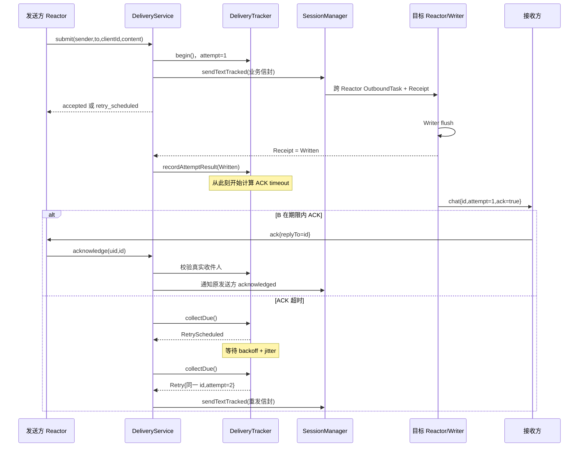

# 第十一阶段：自动重试驱动、最终写回执与停机生命周期

## 1. 本课解决的问题

第十阶段的 `WebSocketDeliveryTracker` 像一本挂号信登记簿：它知道何时应重发，但自己不会叫邮车。
本阶段增加 `WebSocketDeliveryService`，负责四件事：

1. 调用 `WebSocketSessionManager::sendTextTracked()` 发出每次尝试。
2. 观察 `OutboundReceipt`，判断字节最终写入、被背压拒绝、连接关闭或写错误。
3. 周期调用 `collectDue()`，执行重发并在次数耗尽后通知原发送者。
4. 跟随 `ServerRuntime` 启停，退出时停止并 join 后台线程。

这体现了状态机和驱动器的分层：Tracker 决定“下一步是什么”，Service 决定“何时执行并调用谁”。

## 2. 完整调用链



## 3. 为什么 ACK 计时从 Written 开始

如果消息刚进入跨 Reactor 邮箱就启动 ACK 倒计时，目标连接写队列很慢时，计时器可能先到期，
服务端会在第一份消息尚未写入 socket 前又排入第二份。

现在状态分成：

```text
AwaitingTransport → AwaitingAck → Acknowledged
        │                │
        └→ RetryScheduled└→ AwaitingTransport（下一 attempt）
```

- `AwaitingTransport`：等待这次 `OutboundReceipt` 的最终结果。
- `AwaitingAck`：确认字节已经写入内核，从此刻等待接收方业务 ACK。
- `RetryScheduled`：已知此次传输失败或 ACK 超时，等待指数退避与抖动。

`transportTimeout` 仍然有必要。若回执因缺陷或极端关闭路径永久停在 Pending，系统不能无限等待；
超时后先进入 RetryScheduled，退避到期再使用相同服务端 ID 发起下一次尝试。

## 4. attempt 为什么是并发安全令牌

每次发出的信封带 `attempt`：

```json
{"v":1,"type":"chat","id":"ws-1001-boot7-7","from":1001,"to":1002,"attempt":2,"ack":true,"content":"hello"}
```

假设 attempt 1 卡住，transportTimeout 到期后 attempt 2 已经发出。随后 attempt 1 的旧回执才变成
Written。若 Tracker 只按消息 ID 回填，它会错误地把当前 attempt 2 的状态改成 AwaitingAck。

因此 `recordAttemptResult(serverId, attempt, outcome)` 同时比较消息 ID、当前状态和 attempt：

- 当前仍等待同一次 attempt：接受结果；
- 旧 attempt 迟到：返回 `StaleAttempt`；
- 消息已经 ACK/Failed：返回 `Terminal`；
- 查不到记录：返回 `Unknown`。

这和 2.0 用 `fd + connId` 防止旧连接事件误伤新连接是同一种思想：可复用或可推进的对象，
必须带“代际身份”。

## 5. 传输结果怎样分类

| Outbound 结果 | 投递状态处理 | 原因 |
|---|---|---|
| `Written` | 进入 AwaitingAck | 已写入内核，可以开始等业务确认 |
| `Backpressured` | RetryScheduled | 当前队列拥塞，稍后可能恢复 |
| `Closed` | RetryScheduled | 用户可能重连 |
| `Stale` | RetryScheduled | 原连接代际失效，目录可能随后更新 |
| `WriteError` | RetryScheduled | 本次传输失败 |
| `Invalid` | Failed | 服务端构造出的消息本身非法，重复发送没有意义 |

离线目标的首次结果现在是 `retry_scheduled`。默认最多三次；三次都失败后，原发送方收到：

```json
{"v":1,"type":"delivery","id":"ws-1001-boot7-7","replyTo":"client-42","to":1001,"status":"failed"}
```

## 6. 为什么 Service 使用发送函数注入

Service 构造函数接收：

```cpp
using SendFunction =
    std::function<OutboundSubmission(UserId, std::string)>;
```

生产环境注入 `WebSocketSessionManager::sendTextTracked()`；单元测试注入一个保存 payload 和
可控 Receipt 的 lambda。这样测试可以手动把回执从 Pending 改成 Written，无需启动 epoll、socket
或多个 Reactor。

它是一种轻量依赖注入：Service 依赖“能发送并返回回执”的能力，不依赖目标用户具体在哪个线程。

## 7. tick 与 jthread 的职责

`tick(now)` 按固定顺序工作：

1. 收割已经完成的 `OutboundReceipt`。
2. 把结果回填 Tracker。
3. 调用 `collectDue(now)` 取得重发和失败动作。
4. 发出重试；次数耗尽则通知原发送方。

公开 `tick(now)` 是为了测试。测试传入人为时间点，不需要真的等待五秒，因此能够稳定验证边界。

生产环境由 `std::jthread` 周期调用 tick。`jthread` 自带 `stop_token`，Service 的 `stop()` 会：

1. 关闭 accepting，拒绝新的可靠投递。
2. `request_stop()` 并唤醒条件变量。
3. `join()` 等线程真正退出。
4. 等正在执行的 submit/ack/tick 离开活动门闩。
5. 清理不再需要观察的 Receipt。

条件变量既能按 `pollInterval` 唤醒，也能在新回执加入或停止时立即唤醒，避免用固定 sleep 阻塞退出。

## 8. Runtime 所有权与销毁顺序

```text
ServerRuntime
├── WebSocketSessionManager
├── WebSocketDeliveryService
│   ├── WebSocketDeliveryTracker
│   ├── Receipt observations
│   └── jthread
├── Executor
├── WebSocketSessionFactory
└── ReactorGroup
```

Runtime 启动顺序：

```text
listener → ReactorGroup → Manager bind → DeliveryService → acceptLoop
```

退出顺序：

```text
停止 DeliveryService → 关闭 listener → stop/join ReactorGroup → Runtime 返回
```

先停 Service 可以保证退出阶段不会继续产生新重试。Service 的活动门闩会等待已经开始的 submit/tick
结束，然后 Reactor 才退出。

本阶段还修正了成员声明顺序：`Executor` 在 `ReactorGroup` 之前构造，因此析构时 ReactorGroup
先销毁，Executor 后销毁。否则异常启动路径可能出现 Reactor 仍引用 Executor，而 Executor 已先析构。

`ServerRuntime::start()` 使用统一 shutdown lambda；`createReactors()`、后台线程创建或 acceptLoop
任一处抛异常，都走相同的停止和 join 路径。

## 9. ACK 与重试竞态为什么仍可能产生重复消息

超时线程决定重发的同时，接收方 ACK 可能正在网络上返回。Service 在发送前会再次查看 Tracker，
如果消息已经终态就跳过；但 ACK 仍可能恰好发生在“检查完成”和“重发入队”之间。

这不是锁住整个网络调用可以合理解决的问题。可靠系统通常采用：

```text
发送侧：至少一次投递
接收侧：按 server message id 幂等处理
```

因此不能宣称严格 exactly-once。把 Tracker 锁一直持有到跨 Reactor 投递完成，会扩大临界区并产生
锁顺序风险，仍无法覆盖消息离开服务端后的网络竞态。

## 10. 与上传版 web-test6.1 的关系

上传版的 Reactor 和协程解决“怎样高效搬运请求与响应”。当前 2.0 的可靠投递服务继续向上增加：

- 可停止后台任务；
- 最终写回执观察；
- 跨线程状态推进；
- 超时重试和失败通知；
- attempt 代际校验；
- Runtime 级异常收尾。

这些思想也适用于设备控制和机器人网关：命令写入网络不等于设备执行，仍需命令 ID、设备 ACK、
超时、幂等与生命周期控制。

## 11. 优点、代价与适用场景

优点：

- ACK 超时从 Written 后开始，语义更准确。
- 旧回执不能覆盖新 attempt。
- 后台线程可以快速停止并被 join，不使用 detach。
- 纯 tick 接口让时间测试无需 sleep。
- 离线和异步写失败会自动重试并最终通知发送方。

代价：

- 每个在途 attempt 多保存一个 shared receipt。
- 当前轮询会周期扫描观察表和 Tracker；高规模下应改为最小堆或时间轮。
- 退避增加了临时故障恢复延迟，需要按业务时效调整上限。
- 内存状态无法跨进程重启恢复。

适合聊天私信、可靠通知和设备命令。支付、订单等不可丢业务仍需要数据库事务、持久化消息队列与
消费端幂等表。

## 12. 实践练习

练习一：在纸上从 `submit()` 开始画出“目标离线三次”的状态变化，并标出哪一步生成失败通知。

练习二：阅读 `IgnoresLateReceiptAndRetriesWithSameId` 测试，先遮住断言，预测两个 Receipt 分别变成
Written 后，观察表数量为什么依次是 2、1、0。

练习三：把测试配置临时改成 `maxAttempts=1`，预测离线首次提交返回 `failed` 还是
`retry_scheduled`，再用测试验证。完成后恢复配置。

练习四：为 Service 写一个 fake SendFunction，让首次返回 Backpressured、第二次返回 Written，
验证状态顺序 `RetryScheduled → AwaitingTransport → AwaitingAck`。

## 13. 阅读顺序与理解检查

建议依次阅读：

1. [`WebSocketDeliveryTracker.h`](../../server/websocket/WebSocketDelivery/WebSocketDeliveryTracker.h)：五态状态机和 attempt 回填接口。
2. [`WebSocketDeliveryService.h`](../../server/websocket/WebSocketDelivery/WebSocketDeliveryService.h)：驱动器公开边界和所有权。
3. [`WebSocketDeliveryService.cpp`](../../server/websocket/WebSocketDelivery/WebSocketDeliveryService.cpp)：`submit → dispatchAttempt → harvestReceipts → tick`。
4. [`ServerRuntime.cpp`](../../server/Runtime/ServerRuntime.cpp)：启动和统一 shutdown 顺序。
5. [`main.cpp`](../../main.cpp)：业务 handler 已缩减为调用 Service 和转换状态。
6. [`unit_tests.cpp`](../../tests/unit_tests.cpp)：人为时间和可控 Receipt 怎样测试异步状态机。
7. [`websocket_blackbox.py`](../../tests/integration/websocket_blackbox.py)：真实连接的 ACK 超时重发与离线失败。

理解检查：

1. 为什么不能在 `EnqueueResult::Ok` 后立刻开始 ACK 超时？
2. attempt 1 的 Written 为什么可能在 attempt 2 发出后才到？
3. `StaleAttempt` 与连接层 `fd + connId` 解决的问题有什么共同点？
4. 为什么 `tick(now)` 比单元测试里真的 sleep 五秒更好？
5. Runtime 为什么先停 DeliveryService，再停 ReactorGroup？
6. ACK 与超时重发同时发生时，为什么接收端仍必须幂等？
7. 哪些 OutboundOutcome 适合重试，哪个应直接失败？

接收端的具体实现、ACK 顺序与跨重启边界见
[`phase12_websocket_receiver_idempotency.md`](phase12_websocket_receiver_idempotency.md)。

指数退避、抖动和投递指标见
[`phase13_websocket_backoff_and_metrics.md`](phase13_websocket_backoff_and_metrics.md)。
