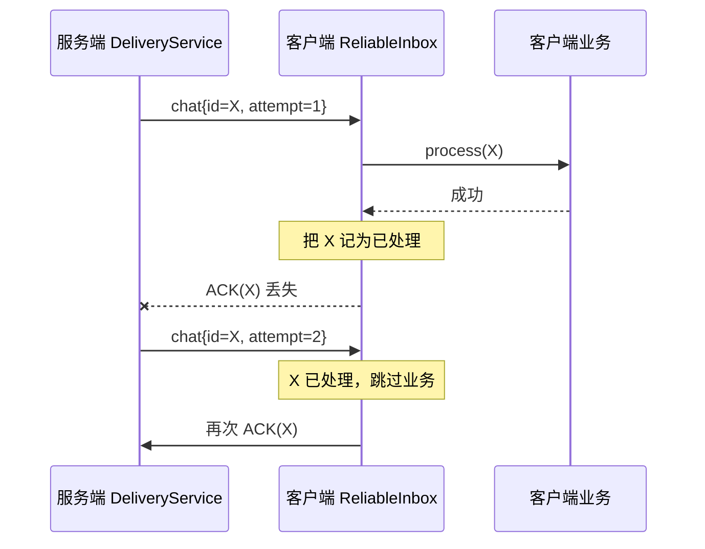

# 第十二阶段：接收端幂等、ACK 顺序与可靠消费边界

## 1. 本阶段解决什么问题

第十一阶段已经能自动重发。自动重发带来一个必然结果：接收方可能看见同一个业务消息多次。
本阶段补齐接收端规则，让网络可以重复投递，而业务效果只发生一次。

可以把它想成快递签收：同一张运单可能因为系统没有收到签收记录而再次派送。收件人应检查运单号，
已经收过就再次回传签收，不应该把包裹里的付款指令执行第二次。

```text
网络语义：同一 id 可能到达多次
业务目标：同一 id 的业务效果只执行一次
处理办法：按 server message id 记账，重复包跳过业务但重新 ACK
```

示例实现位于 `examples/reliable_websocket_consumer.py`。它是无第三方依赖的 Python 消费边界，
便于把规则移植到浏览器 JavaScript、机器人节点或其他客户端。

## 2. 两种去重不要混淆

2.0 现在有两个方向的去重：

| 位置 | 去重键 | 防止的问题 |
|---|---|---|
| 服务端发送入口 | `(sender, clientMessageId)` | 发送客户端因响应丢失而重复提交同一个请求 |
| 接收客户端 | `serverMessageId` | 服务端因 ACK 丢失而重复投递同一个业务消息 |

`attempt` 不是去重键。`attempt=1` 和 `attempt=2` 是同一张运单的两次派送，二者共用相同
`serverMessageId`。若把 `(id, attempt)` 当作去重键，每次重试都会被误认为新业务。

去重键还必须跨服务重启保持“不重复”。旧格式 `ws-发送者-序号` 会在服务重启后重新出现序号 1，
可能撞上客户端窗口中的旧消息。本阶段将格式升级为：

```text
ws-发送者-服务实例ID-序号
```

服务实例 ID 默认在 `WebSocketDeliveryTracker` 构造时生成，也可以通过
`WebSocketDeliveryConfig.serverInstanceId` 注入，方便确定性测试和部署管理。实例 ID 不需要永久
不变；恰恰应该让每次新服务进程使用不同值，使新旧进程生成的序号处于不同命名空间。

## 3. 最关键的故障窗口

下面这条链路解释了为什么收到重复包时还要 ACK：



若重复包只被静默丢弃，服务端永远收不到 ACK，会继续重试并最终错误地通知发送方失败。

## 4. 正确的处理顺序

`ReliableInbox.consume()` 固定执行：

```text
校验信封
  → 查询 server message id
  → 未处理：执行业务
  → 业务成功：记入已处理窗口
  → 发送 ACK
```

顺序不能随意交换：

1. **不能先 ACK 再执行业务。** ACK 后业务失败，服务端认为已经成功，不会再重试。
2. **业务失败时不能记入窗口。** 否则下一次重试会被当成重复包跳过。
3. **ACK 失败时不能删除已处理记录。** 业务已经成功，下一包只能补 ACK，不能重做业务。

核心代码形态如下：

```python
if message_id not in processed:
    process(envelope)              # 失败：不记账、不 ACK
    processed[message_id] = now    # 成功：先记账

send_ack(message_id)              # 重复包也执行
```

## 5. 五种消费结果

示例将结果分成五类：

| 状态 | 含义 | 后续动作 |
|---|---|---|
| `processed_and_acked` | 首次业务成功且 ACK 已发出 | 正常完成 |
| `duplicate_acked` | 业务以前成功，本次只补 ACK | 正常完成 |
| `processing_failed` | 业务失败，未记账、未 ACK | 等待服务端重试 |
| `ack_failed` | 业务已经成功，但 ACK 发送失败 | 保留记录，重试到达时补 ACK |
| `invalid` | 信封版本、类型、ID 或 attempt 不合法 | 不进入业务 |

返回明确结果比一个 `bool` 更容易记录指标，也能区分“业务失败”和“只是 ACK 失败”。

## 6. 为什么窗口必须有容量和保留时间

永久保存所有消息 ID 会形成无限增长的内存表。因此示例同时设置：

- `capacity`：最多保存多少个已处理 ID；
- `retention_seconds`：一个 ID 保留多长时间；
- `max_message_id_bytes`：限制外部字符串占用。

默认保留时间必须覆盖服务端完整重试周期及网络余量。当前服务端默认三次尝试，单次传输超时和
ACK 超时均为 5 秒，重试间隔 0.5 秒；示例使用 120 秒是便于学习的宽松值。

容量淘汰和时间过期意味着：非常晚的旧消息可能再次执行业务。支付、订单、设备控制等强业务不能
只依赖内存窗口，应在数据库中给业务消息 ID 建唯一约束。

## 7. 进程内幂等不等于严格 exactly-once

内存窗口仍有一个无法覆盖的崩溃点：

```text
数据库写入成功 → 客户端进程崩溃 → 内存还没记住 id
```

重启后消息再次到达，业务可能再次执行。强一致业务通常把“业务写入”和“记录消息 ID”放进同一个
数据库事务：

```sql
BEGIN;
INSERT INTO consumed_message(message_id) VALUES (?);  -- 唯一键
UPDATE account SET balance = balance - ? WHERE id = ?;
COMMIT;
```

重复消息再次插入相同 ID 时触发唯一键冲突，应用把它视为已经完成并重新 ACK。这里追求的是
“业务效果 exactly-once”，底层网络仍然是至少一次投递。

## 8. 为什么去重属于客户端边界

服务端不能在重发前替接收客户端过滤相同 ID。服务端看见的只是“尚未收到 ACK”，它不知道客户端
究竟没有收到、处理失败，还是处理成功但 ACK 丢失。若服务端自行抑制重发，前两种情况会永久丢消息。

因此职责分配是：

```text
DeliveryService：没有 ACK 就负责重发
ReliableInbox：相同 id 只执行业务一次，但每次都可以 ACK
业务存储：需要跨重启时提供持久化唯一约束
```

## 9. 与上传版 web-test6.1 的关系

上传版主要展示连接、Reactor、协程和 HTTP 响应生命周期。2.0 的第十一、十二阶段把可靠性继续向
应用两端扩展：服务端负责至少一次投递，客户端负责幂等消费。这里的关键升级不是新的 WebSocket
帧格式，而是明确“网络成功”和“业务成功”之间的边界。

这套模式同样适合机器人命令：同一个 `command_id` 可以因超时再次下发，但电机启动、任务创建等
副作用只能执行一次，随后重复返回命令完成确认。

## 10. 测试如何证明它

`tests/python/reliable_websocket_consumer_test.py` 覆盖：

1. 两个 attempt 共用一个 ID，业务只执行一次、ACK 两次；
2. 业务失败后不记账，下一次可以重新处理；
3. 首次业务成功但 ACK 失败，下一次只补 ACK；
4. 容量淘汰与时间过期；
5. 非法信封不能进入业务回调。
6. 两个服务实例即使发送者和序号相同，也生成不同的服务端消息 ID。

`websocket_blackbox.py` 的真实连接用例模拟“业务完成后 ACK 连接丢失”，等待服务端发送
`attempt=2`，再验证业务列表仍只有一项且第二次 ACK 能结束服务器重试。

## 11. 优点、代价与适用场景

优点：

- 网络重试不会直接造成重复业务副作用；
- ACK 丢失后可以靠下一次重试自愈；
- 有界窗口防止普通长连接无限吃内存；
- 处理、记账和 ACK 的边界清晰，便于替换成数据库实现。

代价：

- 内存实现不能跨进程重启；
- 窗口过小或保留时间过短会让很晚的重试再次执行；
- 多线程消费者还需处理中间态或依赖数据库事务；
- 每个可靠业务都必须选择稳定的消息 ID。

适合聊天消息、通知、普通设备遥测与可恢复任务。资金变更、订单创建和不可逆设备动作应使用持久化
幂等表、事务或消息队列的消费确认机制。

## 12. 实践与理解检查

练习一：把示例 `process()` 改成向列表追加订单，模拟 ACK 第一次失败，确认列表最终只有一个订单。

练习二：把 `capacity` 改成 2，连续消费三个 ID，再重放第一个 ID，解释为什么业务会再次执行。

练习三：画出“业务数据库已经成功，但进程在内存记账前崩溃”的时间线，并说明内存窗口为什么无解。

理解检查：

1. 为什么 `attempt` 不能成为去重键的一部分？
2. 为什么重复消息不能只丢弃，而必须重新 ACK？
3. `process()` 失败和 `acknowledge()` 失败，对去重表的处理有何不同？
4. 为什么去重表的保留时间必须大于服务端完整重试周期？
5. 要跨进程重启保证业务幂等，唯一键应和哪项业务修改放在同一个事务中？
