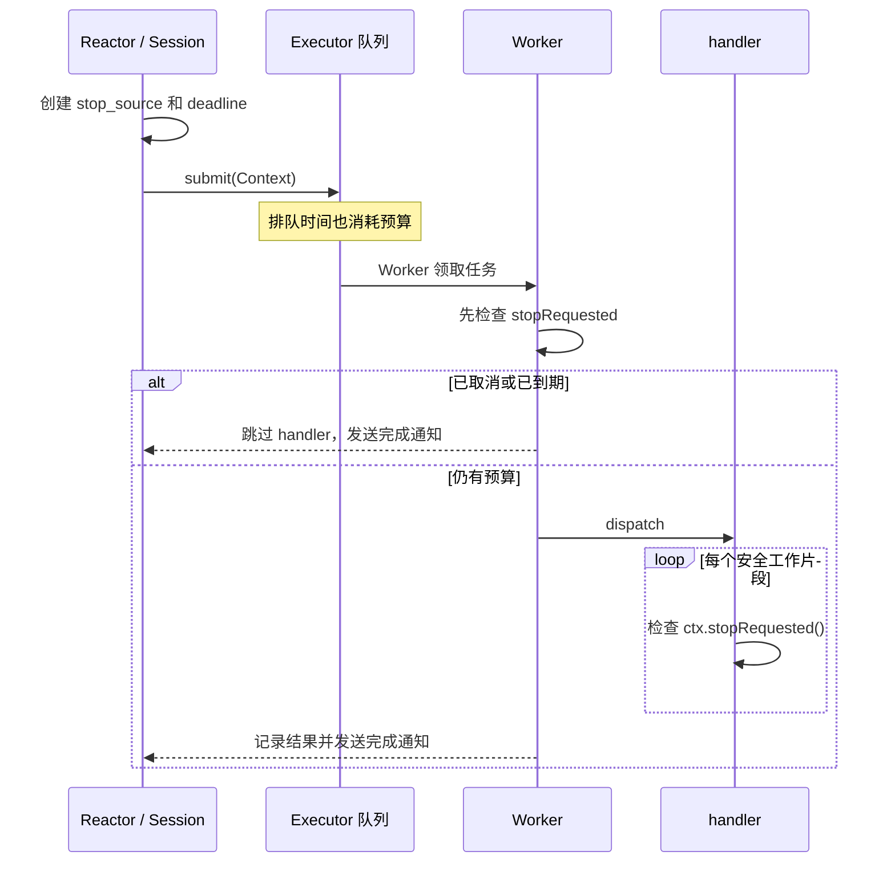
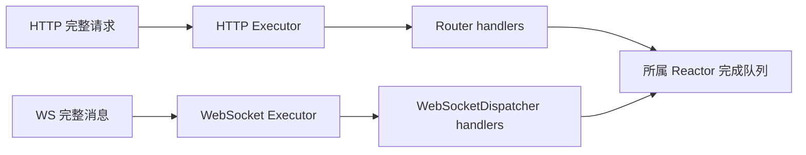

# 第十五阶段：handler 协作式取消、截止时间与执行容量隔离

## 1. 本课要解决的两个故障

第十四阶段已经让 HTTP 与 WebSocket handler 离开 Reactor 线程，但还有两个运行时风险：

1. handler 被连接关闭或服务停机后，仍可能继续计算。它像订单已经撤销，后厨却还在做菜；
2. HTTP 与 WebSocket 共用一个 Worker 池。一批慢 HTTP 请求可以坐满全部工位，使 WS 消息也排队。

本阶段为每个 handler 工作单加入**撤单信号和截止时间**，并把总 Worker 数近似均分为 HTTP 与
WebSocket 两条独立容量通道。默认业务预算为 5 秒。

这两个改造解决不同问题：取消减少失去价值的工作，容量隔离限制故障传播范围。

## 2. 三个容易混淆的词

| 名词 | 含义 | 本实现中的表示 |
|---|---|---|
| timeout（超时长度） | 最多给业务多长时间，例如 5 秒 | `Executor::handlerTimeout()` |
| deadline（截止时刻） | 具体在哪个单调时钟时刻到期 | `steady_clock::time_point` |
| cancellation（取消） | 连接关闭或 Runtime 停机，要求业务尽快停下 | `std::stop_token` |

可以把 timeout 看成“考试时长 5 秒”，deadline 看成“交卷铃在 10:05:23 响”，cancellation
看成“监考员因停电提前收卷”。`HandlerCancellation::stopRequested()` 把后两种停工理由合并成
业务最常用的一个判断。

截止时间使用 `std::chrono::steady_clock`，因为它只会向前走。系统时间被管理员校准、NTP 回拨或
时区改变时，业务预算不会突然变长或变短。

## 3. 为什么不能从外部强杀一个 C++ handler

C++ 没有一种通用且安全的“终止线程当前函数”操作。handler 可能正持有 mutex、正在修改容器，或只
完成了一半事务。若在任意指令处把线程掐断，锁可能永远不释放，对象也可能停在不变量被破坏的状态。

因此本实现采用协作式取消：Runtime 只点亮撤单灯，handler 自己在安全边界查看并退出。

```cpp
server.router().GET("/report", [](RequestContext &ctx) {
    for (const auto &batch : batches) {
        if (ctx.stopRequested())
            return false;
        calculate(batch); // 每批完成后对象仍处于合法状态
    }
    ctx.response->text("done");
    return true;
});
```

检查点应放在循环、分批计算和可中断 I/O 边界。颗粒越小，取消反应越快；检查太频繁则会增加少量
热路径开销。通常让单个工作片段保持在 10~100 毫秒内是清晰的起点，最终值应由业务延迟目标决定。

## 4. 工作单怎样携带撤单信息

`HandlerCancellation` 保存两样东西：

```cpp
class HandlerCancellation {
    std::stop_token token_;
    Clock::time_point deadline_ = Clock::time_point::max();
};
```

HTTP 的 `RequestContext` 和 WS 的 `WsMessageContext` 都按值持有它，并公开：

- `stopRequested()`：连接取消或 deadline 到期时返回 true；
- `handlerDeadlineExceeded()`：只判断是否超过业务截止时间。

后一个函数不能由业务自行决定协议响应，它主要供 Session 完成阶段区分“被撤单”和“超时”。业务侧
一般只调用 `stopRequested()`。

`std::stop_source` 由 Session 持有，`std::stop_token` 放入 Context。比喻上，Session 拿着撤单按钮，
工作单上装着指示灯；按钮和灯共享标准库内部的线程安全状态。

## 5. deadline 从提交时开始，而不是 Worker 开工时开始

完整时序如下：



如果 5 秒预算从 Worker 真正开工才算，队列里等待 20 秒的请求仍会再运行 5 秒，客户端看到的是 25 秒。
现在 deadline 在 Reactor 提交前生成，排队也算在总延迟中；已在队列中过期的工作会被 Worker 直接跳过。

## 6. HTTP 的完成语义

HTTP Worker 完成后分四种情况：

| 结果 | HttpSession 的处理 |
|---|---|
| 正常命中 handler | 使用业务响应 |
| 未命中路由 | 释放未使用响应，沿用原有流程 |
| handler 抛异常 | 丢弃业务响应，生成 500 |
| deadline 已超过 | 丢弃业务响应，生成 `504 Gateway Timeout`，并关闭连接 |

超时判断放在 dispatch 之后再做一次。这样 handler 即使在最后一刻返回了 200，若已经越过 deadline，
客户端看到的仍是稳定的 504 契约。`/slow` 示例每 10 毫秒查看一次撤单灯，本来要运行 10 秒，默认会
在约 5 秒时退出并收到 504。错误收口还会清除 handler 可能留下的 WebSocket 升级标记，避免 500/504
随后被错误地覆盖成 101 Switching Protocols。

若 handler 完全忽略 `stopRequested()`，框架无法保证在第 5 秒立刻响应。它会一直占着 Worker，直到
自己返回；返回后结果才会被改写为 504。这是协作式取消最关键的能力边界。

## 7. WebSocket 的完成语义

WebSocket 没有 HTTP 状态码，因此用 Close 帧表达结果：

| 结果 | Close code | reason |
|---|---:|---|
| deadline 已超过 | 1013 Try Again Later | `handler timeout` |
| handler 抛异常 | 1011 Internal Error | `handler exception` |
| Executor 队列满或已关闭 | 1013 Try Again Later | `handler queue full` |

1013 表示当前服务暂时无法处理，客户端可以稍后重试；1011 表示服务器执行业务时遇到意外错误。
两者分开后，客户端重试策略和监控归因都更准确。

同一 WS 连接仍然一次只执行一条应用消息，以保持消息顺序。handler 执行期间，这条连接自己的后续
数据帧、Ping 和 Close 仍需等待根协程恢复。协作式取消缩短慢任务占用时间，但没有把单连接改成多在途。

## 8. 撤单信号怎样穿过关闭路径

`Session` 基类新增幂等钩子 `requestHandlerStop()`：HTTP 与 WS Session 分别对当前
`stop_source` 调 `request_stop()`。

信号有两条入口：

1. 单连接关闭：`SubReactor::fd_close` 先 `requestHandlerStop()`，再执行 `onClose()` 和资源清理；
2. Runtime 停机：每个 SubReactor 的 loop 退出前给当前所有 Session 发撤单信号。

停机顺序是：

```text
停止 acceptor 与可靠投递生产者
    ↓
stop + join Reactor（loop 退出前发出 handler 撤单信号）
    ↓
分别 drain HTTP Executor 与 WS Executor
    ↓
销毁 ReactorGroup、Session、协程帧和 eventfd
```

这里必须保留 Reactor 对象到 Worker 全部退出。Worker 完成时仍会向原 Reactor 的 complete queue 投递
通知；若先销毁 Reactor，这个回调就会成为悬空指针。

## 9. HTTP/WS 为什么拆成两个 Executor

旧结构像 HTTP 菜和 WS 菜共用一间厨房：只要慢 HTTP 坐满全部灶台，哪怕 WS 菜只需 1 毫秒，也得
排在后面。当前 Runtime 创建两间厨房：



总 Worker 数按 `hardware_concurrency()` 取得并限制在 4~32：

- HTTP 得到 `(总数 + 1) / 2`；
- WS 得到 `总数 / 2`；
- 因总数至少为 4，两条通道都至少有 2 个 Worker。

两池隔离保证 HTTP 队列和 Worker 全满时，WS 仍有自己的容量。WS 至少两个 Worker，也保证一条连接
执行慢 handler 时，另一条连接的快消息仍可并行完成。

隔离的代价是空闲容量不能自动借用：HTTP 很忙而 WS 空闲时，WS 工人不会临时去处理 HTTP；两个池
也各自拥有 4096 个排队上限，总队列容量随之增加。生产系统通常还需要把线程数、队列上限和 deadline
做成配置，并按指标调整比例。

## 10. 线程可见性为什么不要求把每个结果都改成 atomic

Worker 写 `handlerFailed_`、`handlerTimedOut_` 和 Context，随后调用 Reactor 的完成通知；根协程只有在
`ExecuteAwaiter` 被完成队列恢复后才读取这些字段。完成队列的 mutex 操作形成 happens-before：Worker
解锁前的写入，对 Reactor 随后加锁后的读取可见。

atomic 不能代替整体所有权协议。如果允许 Reactor 在 Worker 尚未完成时同时读 Context，即使把两个
bool 改成 atomic，`HttpResponse`、字符串和 map 仍会发生数据竞争。正确规则仍是“Worker 阶段只由
Worker 写；完成通知后所有权交回 Reactor”。

## 11. 与上传版 web-test6.1 的精确差异

上传版是本课的已知起点：它已有 HTTP Executor，把 `codec.dispatch(ctx)` 从 Reactor 移到 Worker；
`RequestContext` 仍包含 `HttpSession* session`，`Executor` 只有一个 `ThreadPool` 和 `submit()`，没有
显式 deadline、取消或 shutdown 接口，也没有 WebSocket 业务通道。

2.0 当前版本在这个骨架上增加：

| 上传版 web-test6.1 | 当前 2.0 |
|---|---|
| 单一 HTTP Executor | HTTP/WS 独立 Executor |
| Context 暴露 `HttpSession*` | Context 不暴露 Session，只给安全的业务数据和取消视图 |
| handler 无截止时间 | 提交即生成 5 秒 deadline，排队计入预算 |
| 连接关闭无法通知在途业务 | `Session::requestHandlerStop()` 贯穿关闭和停机 |
| Executor 依赖析构收尾 | 显式、幂等 shutdown，排空已接任务并拒绝新任务 |
| 只有 HTTP 完成边界 | HTTP 504、WS 1013/1011 各有协议映射 |

这次升级的思路不是“给 Context 多加一个 bool”，而是补齐运行时控制平面：谁创建预算、谁能撤单、
谁解释结果、谁保证对象活到 Worker 结束，以及一种业务拥塞能影响多大范围。

## 12. 适用场景、优点和局限

适合聊天网关、设备控制台、机器人遥测入口、带数据库/RPC 的 HTTP API，以及任何 handler 延迟可能
明显高于 socket 事件处理时间的服务。

优点：

- 连接关闭和停机能通知业务尽快停止，减少无效计算；
- deadline 同时覆盖排队与执行时间，客户端延迟含义更清晰；
- HTTP 与 WS 相互隔离容量，降低跨协议饥饿；
- HTTP/WS 复用同一取消抽象，各自保留正确的协议错误表达。

局限：

- 忽略 token 的 handler 仍能无限占用 Worker；
- 普通阻塞数据库调用只有在驱动支持取消或超时时才能及时结束；
- 当前预算、线程比例和队列上限是固定值；
- 没有动态借用、优先级、租户隔离和进程级总内存预算；
- 同一 WS 连接等待 handler 时暂不处理后续控制帧。

## 13. 验证矩阵

1. 单元测试区分“连接取消”和“deadline 到期”；
2. 一个 20 毫秒预算的协作循环必须观察到到期并退出；
3. 堵住单 Worker HTTP 池时，独立 WS 池的任务仍须完成；
4. HTTP 黑盒中 `/slow` 应在约 5 秒返回 504，且同期间 `/fast` 立即响应；
5. WS 黑盒中协作式超时 handler 应返回 Close 1013；抛异常仍返回 1011；
6. Linux 完整门禁继续运行 GTest、HTTP/WS blackbox 和 TSan。

## 14. 本课练习与理解检查

练习一：把一个 1 亿次循环拆成批次，每批结束调用 `ctx.stopRequested()`。分别把批次设为 100、1 万、
100 万，比较吞吐和取消延迟。

练习二：假设数据库查询函数只提供 `query(sql)`，内部可能阻塞 30 秒。说明只在查询前后检查 token
为什么不够，再为它设计驱动级 4 秒超时。

练习三：画出“WS handler 正在运行时客户端断开，随后 Runtime 又停机”的时序。指出为什么两次
`request_stop()` 必须幂等，以及 Worker 完成时哪些对象仍然存活。

理解检查：

1. 为什么 deadline 使用 `steady_clock` 而不是 `system_clock`？
2. 为什么排队时间必须计入 5 秒预算？
3. handler 忽略 `stopRequested()` 时，框架能保证什么，不能保证什么？
4. HTTP 和 WS 拆池后解决了哪种饥饿，又付出了什么容量代价？
5. 为什么 Worker 写完普通字段后，Reactor 能看到；这条结论依赖哪条同步路径？

下一步建议在回答这些检查题后进入第十六阶段：先补运行时配置对象，把线程数、队列上限与 deadline
从硬编码变为可验证配置；再讨论数据库/RPC 等外部 I/O 如何把同一个取消预算继续向下传递。
