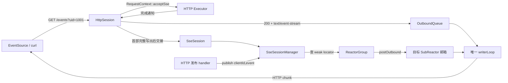

# Phase 5：在 2.0 架构上接入 SSE

> 本文记录 `test7.0` 的 SSE 接入过程，重点是架构边界、连接交接和跨 Reactor 推送。
> SSE 协议理论不重复展开。上一版 `test6.3` 停在接入 SSE 之前，提交为
> `cda6ea514441350a431a636acc6f05a1514ab248`。
> 旧课程的第 5 课已归档至 [`websocket-lessons/lesson05_connection_identity_and_root_coroutine.md`](websocket-lessons/lesson05_connection_identity_and_root_coroutine.md)。

## 1. 接入后的结果

当前服务器同时承载三种会话：

| 会话 | 入口 | 连接后续由谁管理 | 出站方式 |
|---|---|---|---|
| HTTP | 普通路由 | `HttpSession` | `OutboundTask::http` |
| WebSocket | `GET /ws?uid=...` | `WebSocketSession` | 已编码 WS 帧 |
| SSE | `GET /events?uid=...` | `SseSession` | 已编码 SSE HTTP chunk |

SSE 复用了已有的连接身份、协程调度、时间轮、跨 Reactor 邮箱、背压和唯一 `writerLoop`。新增部分只回答三个问题：

1. HTTP handler 如何表达“这条连接要进入 SSE 模式”；
2. HTTP 首部发完后，谁继续拥有这条长连接；
3. 任意 Worker 如何找到订阅者并把事件送回正确的 Reactor。

## 2. 总体架构



可以把它想成报社订阅：

- `HttpSession` 是开户柜台，核对 `uid` 并把订阅回执交给客户；
- `SseSession` 是长期有效的订阅合同，负责登记、心跳和注销；
- `SseSessionManager` 是地址簿，只记客户在哪个投递站，不亲自送报；
- `OutboundQueue + writerLoop` 是原有物流系统，HTTP、WS 和 SSE 都从这里发货。

## 3. 为什么不能把 SSE 写成长时间运行的 HTTP handler

最直观的写法是 handler 中不断 `writeChunk()`、`sleep()`。它能做演示，却破坏当前 2.0 的边界：

1. **长期占用 HTTP Worker**：一条 SSE 连接占一个线程，几百个订阅者就能耗尽 HTTP Executor；
2. **Response 生命周期含糊**：handler 返回后 `HttpResponse` 会移交出站队列并最终归还对象池，后台线程继续拿
   裸指针写会产生悬空访问；
3. **跨线程直接碰连接**：发布者可能在别的 Worker 或 Reactor，不能直接写目标 fd；
4. **关闭难收口**：客户端断开、Runtime 停机和背压需要统一回到 Session/Reactor 生命周期。

因此本次选择和 WebSocket 相同的思路：**HTTP 只负责建立会话，长连接由新的 Session 子类接管。**

## 4. 建立 SSE 连接的完整路径

```text
GET /events?uid=1001
  → Router 命中 /events
  → handler 调 RequestContext::acceptSse()
  → HTTP Worker 完成，通过 eventfd 通知所属 Reactor
  → HttpSession::prepareSseStream()
      ├─ 校验 uid 是正整数
      ├─ Content-Type: text/event-stream; charset=utf-8
      ├─ Cache-Control: no-cache
      ├─ X-Accel-Buffering: no
      └─ Transfer-Encoding: chunked
  → OutboundTask::http 只发送响应首部
  → SendCompletionAwaiter 等首部真正写入内核
  → HttpSession::handoffSse()
  → ProtocolSessionFactory::createSseSession()
  → Connection::session 替换为 SseSession
  → 调度器 adopt 新根协程，旧 HttpSession 协程退出
  → SseSession 注册订阅并发送 ready 事件
```

这里最关键的是“先发完首部，再换会话”。如果先启动 `SseSession`，ready 事件可能排到 HTTP 首部前面，客户端会把
事件文本误当成响应状态行。`SendCompletionAwaiter` 就是两段协议之间的闸门。

## 5. `beginChunked()` 与 `beginChunkedStream()` 的区别

两者都生成 `Transfer-Encoding: chunked`，但所有权不同：

| API | 数据由谁继续生产 | HttpResponse 何时结束 | 适合场景 |
|---|---|---|---|
| `beginChunked()` | 当前响应里的 `ChunkedBody` | 调用 `endChunked()` 后 | 一次请求内生成完的流式结果 |
| `beginChunkedStream()` | 接管连接的 `SseSession` | 响应对象发完首部即可归池 | 生命周期不受 handler 限制的 SSE |

`beginChunkedStream()` 故意让 `body == nullptr`。`TransportWriter` 发完 HeaderBody 后就完成这张 HTTP 运单，
HttpSession 因此能收到 ticket 完成通知并执行会话交接。后续每个 SSE 事件是独立的 encoded 运单，不会把一个
永不结束的 `ChunkedBody` 卡在队首。

这是本次接入最难也最有价值的设计点：**流式 HTTP body 和长期协议会话看起来都在“不断发数据”，但它们的
生命周期所有者不同。**

## 6. 一条事件为什么有两层编码

业务事件：

```text
id=42, event=notice, data=hello
```

第一层由 `SseCodec::encodeEvent()` 变成 SSE 文本：

```text
id: 42\n
event: notice\n
data: hello\n
\n
```

第二层由 `SseCodec::encodeChunk()` 包成 HTTP chunk：

```text
<十六进制长度>\r\n
<上面的 SSE 文本>\r\n
```

分两层的原因：SSE 决定事件字段和空行边界，HTTP chunked 决定传输边界。`TransportWriter` 只看到最终字节串，
因此不需要认识 `event`、`data` 或 `retry`，统一出站层仍保持协议无关。

编码器还做了两项边界处理：

1. `data` 中的 CRLF/CR 统一成 LF，每行分别生成一个 `data:` 字段；
2. `id` 和 `eventName` 中的换行会被压成普通空格，防止用户输入伪造新的 SSE 字段。

## 7. 发布事件的跨 Reactor 路径

```text
POST /events/1001?event=notice&id=42&data=hello
  → HTTP handler 构造 SseEvent
  → SseSessionManager::publish(1001, event)
  → 锁内复制在线 Locator，立即释放锁
  → 事件只编码一次，所有目标连接共享 const string
  → ReactorGroup::postOutbound(reactorIndex, fd, connId, task)
  → 目标 SubReactor 的线程安全 pending 邮箱
  → eventfd 唤醒目标 Reactor
  → 校验 fd + connId，转入该 Connection 的出站队列
  → writerLoop 串行写 socket
```

`Locator` 包含：

```cpp
weak_ptr<SseSession> + reactorIndex + ConnectionKey{fd, connId}
```

- `weak_ptr` 只观察会话，不和 `Connection::session` 争夺所有权；
- `reactorIndex` 决定投递到哪条 Reactor；
- `fd` 找连接槽位；
- `connId` 防止 fd 被操作系统复用后把旧事件发给新连接。

一个 `clientId` 对应 `vector<Locator>`，所以同一用户打开两个浏览器标签页时两个连接都会收到事件。注销按
`ConnectionKey` 删除，旧标签页断开不会误删新标签页。

## 8. 心跳、断开和背压

### 8.1 心跳

时间轮触发 `SseSession::onTimeout()` 时，会发送一条注释心跳：

```text
: heartbeat\n
\n
```

注释不会触发浏览器的业务 `message` 事件，但能让代理和 NAT 看到链路仍有数据。如果心跳无法进入出站队列，
`onTimeout()` 返回 `true`，让 Reactor 关闭这条异常或严重拥塞的连接；发送成功则刷新空闲时间并继续保留。

### 8.2 客户端断开

`SseSession::run()` 长期挂在 `ReadAwaiter` 上。收到 FIN/RDHUP 后，Reactor 唤醒它，Session 重新用
`fd + connId` 查表并统一 `fd_close`。`onClose()` 从 Manager 注销当前定位记录。

### 8.3 背压

SSE 事件复用现有单连接任务数、单连接字节数以及 Reactor 邮箱的两级配额。`publish()` 返回的数字表示多少连接
通过了当前准入，不表示浏览器已经处理事件。当前示例是实时推送语义：过载时允许拒绝最新事件，不做持久化与重放。

## 9. 统一协议工厂

原来的具体工厂名是 `WebSocketSessionFactory`。接入 SSE 后它不再只创建 WebSocket，因此改成
`ProtocolSessionFactory`：

```text
SessionFactory（抽象）
  ├─ createWebSocketSession(...)
  └─ createSseSession(...)

ProtocolSessionFactory（Runtime 中的具体装配）
  ├─ 注入 WS Manager / Dispatcher / Executor
  └─ 注入 SSE Manager
```

`SubReactor` 和 `ReactorGroup` 仍然只依赖 `SessionFactory` 抽象。新增协议依赖停留在 Runtime 的装配层，没有把
`SseSessionManager` 塞进每一个 SubReactor。这保持了依赖方向：基础事件循环不认识具体上层协议。

## 10. 文件变更地图

| 文件 | 职责 |
|---|---|
| `server/sse/SseEvent.h` | SSE 业务事件和 clientId 类型 |
| `server/sse/SseCodec.{h,cpp}` | 事件文本、注释和 HTTP chunk 的纯编码 |
| `server/sse/SseSession.{h,cpp}` | 长连接登记、ready、心跳、断开和注销 |
| `server/sse/SseSessionManager.{h,cpp}` | 多标签页订阅目录与跨 Reactor 发布 |
| `server/session/ProtocolSessionFactory.{h,cpp}` | 统一创建 WS/SSE 会话 |
| `server/session/SessionFactory.h` | 扩展协议会话抽象，增加 SSE 创建入口 |
| `RequestContext.h` | 新增互斥的 `acceptSse()` 意图 |
| `HttpSession.{h,cpp}` | SSE 首部准备与 Session 交接 |
| `http.{h,cpp}` | 新增只发首部的 `beginChunkedStream()` |
| `ServerRuntime.{h,cpp}` | 装配并绑定 SSE Manager 与统一工厂 |
| `main.cpp` | 订阅、发布和在线数示例路由 |
| `tests/unit_tests.cpp` | 编码、字段安全、首部和接受标志测试 |
| `tests/integration/sse_blackbox.py` | 真实连接、双标签页与发布链路黑盒测试 |
| `CMakeLists.txt` | 编译 SSE 源文件并注册黑盒测试 |

## 11. 运行与观察

先启动服务器。终端一保持订阅：

```bash
curl -N "http://127.0.0.1:8080/events?uid=1001"
```

终端二发布：

```bash
curl -X POST "http://127.0.0.1:8080/events/1001?event=notice&id=42&data=hello"
```

查看在线 SSE 连接数：

```bash
curl "http://127.0.0.1:8080/events-status"
```

浏览器端最小示例：

```javascript
const stream = new EventSource("/events?uid=1001");
stream.addEventListener("ready", event => console.log("ready", event.data));
stream.addEventListener("notice", event => console.log(event.lastEventId, event.data));
stream.onerror = error => console.error("SSE disconnected", error);
```

当前示例查询参数解析器不会做 URL 百分号解码。手工测试含空格或中文时应先按当前 parser 行为核对原始值；这属于
HTTP 查询解析能力，不是 SSE 编码器的问题。

## 12. 验收点

单元测试验证：

1. 多行 `data` 编码；
2. `id/event` 换行注入防护；
3. SSE 文本的 HTTP chunk 包装；
4. 首部只有 `Transfer-Encoding: chunked`，没有 `Content-Length`；
5. `acceptWebSocket()` 与 `acceptSse()` 互斥。

Linux 黑盒测试验证：

1. 缺失 uid 返回 400；
2. `/events` 返回正确 SSE 首部和 ready 事件；
3. 同一个 uid 的两个连接同时收到发布事件；
4. `/events-status` 的在线连接数正确；
5. 真实数据经过 HTTP handler、Manager、跨 Reactor 邮箱和 writerLoop 到达客户端。

### 12.1 当前实际验证记录

本次在 Windows 工作区已经实际通过：

1. `main.cpp`、SSE 三层实现、统一工厂、`HttpSession` 和 `ServerRuntime` 的 C++20 严格语法编译；
2. `tests/unit_tests.cpp` 的完整语法编译，过程中修正了 `buildHeader()` 重载选择错误；
3. 独立可执行验证：多行编码、字段换行防注入、HTTP chunk、注释心跳、接受标志互斥；
4. 独立可执行验证：同一 clientId 的多连接登记、按连接注销、弱引用失效和发布目标数；
5. 独立可执行验证：`beginChunkedStream()` 清空旧 body、生成 chunked 首部且不生成 Content-Length；
6. CMake 配置和生成成功，生成的构建图包含全部 SSE 源文件；
7. Python SSE 黑盒脚本的语法与命令行入口通过，原有可靠 WebSocket 接收端 5 项回归测试继续通过。

真实 Linux 网络黑盒尚未在本机执行：项目依赖 epoll，而当前可启动的 Ubuntu 虚拟机只开放口令登录，
本次会话没有可用的非交互认证。测试脚本和 CMake 测试项已经就绪；进入已认证的 Linux 终端后执行下面三条命令即可完成最终网络验收。

```bash
cmake -S . -B build-tests -DBUILD_TESTING=ON
cmake --build build-tests --parallel
ctest --test-dir build-tests --output-on-failure
```

## 13. 与 WebSocket 的架构差异

| 维度 | SSE | WebSocket |
|---|---|---|
| 建立方式 | 普通 HTTP 200 长响应 | HTTP 101 协议升级 |
| 方向 | 服务端到客户端 | 双向 |
| 入站解析 | 不解析业务消息 | 帧解析、分片、UTF-8、Close/Ping/Pong |
| 出站编码 | SSE 文本 + HTTP chunk | RFC 6455 帧 |
| Session 主循环 | 等断开，生命周期钩子发心跳 | 持续读取和分发 WS 帧 |
| 可靠性 | 当前实时推送，掉线由 EventSource 重连 | 当前版本已有消息 ID、ACK、重试和幂等 |
| Manager | 一个 clientId 可对应多个标签页 | 当前一个 UserId 对应一个 WS 会话 |

## 14. 当前限制与后续学习建议

1. 没有保存事件历史，也没有根据 `Last-Event-ID` 重放；
2. 发布接口只用于学习演示，没有鉴权、租户隔离和请求体 JSON 解析；
3. 查询参数暂不做百分号解码；
4. 背压时拒绝最新事件，没有按主题或用户配置丢弃策略；
5. 心跳周期复用当前连接空闲时间轮，没有独立配置；
6. 未在反向代理环境验证缓冲、超时与连接上限。

后续如果继续学习，最值得做的是“事件游标 + 有界重放窗口”：为每个主题保存有限条事件，读取
`Last-Event-ID`，只补发断线期间缺失的数据。它会把当前的实时通知升级成可恢复通知，同时直接复用 2.0 已学过的
消息 ID、幂等窗口、容量上限和失败收口思想。
