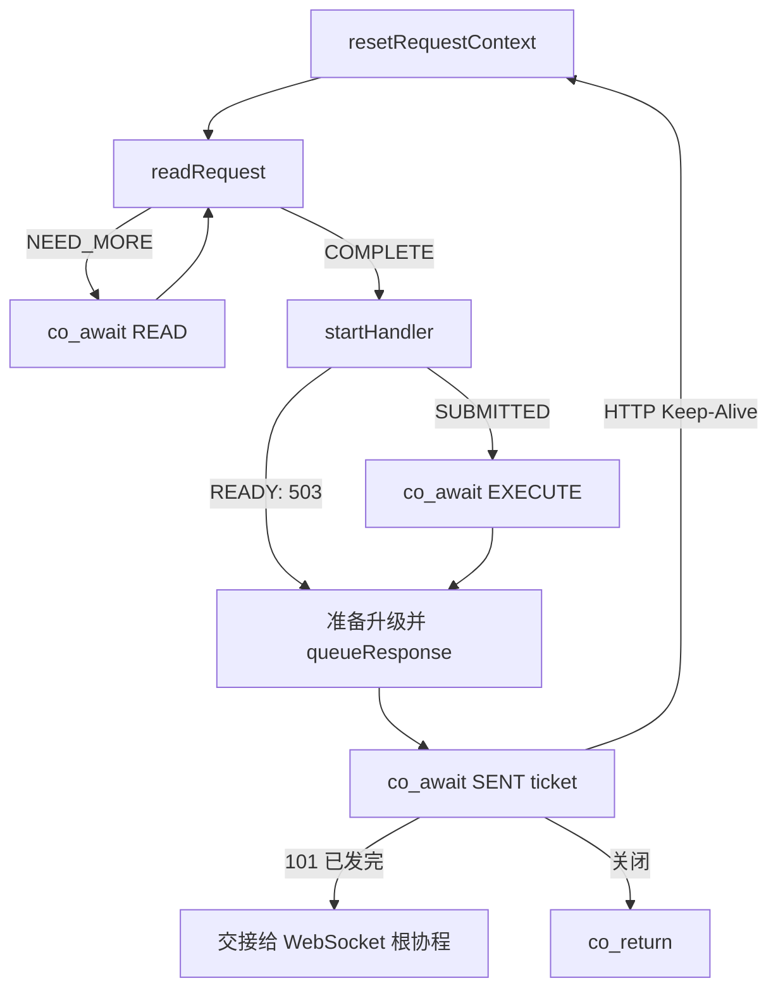

# 第五阶段：连接身份与唯一根协程

本阶段不是继续堆功能，而是先把 2.0 的异步骨架收紧。目标有两个：

1. 每条连接只让一个根协程掌管 HTTP 主流程中的挂起点。
2. 任何跨 `co_await`、线程队列或延迟回调的操作，都携带 `fd + connId`。

可以把它们记成两句话：**一个班长管流程，一张完整身份证找连接。**

## 1. 从熟悉的压缩包到 2.0

上传的 `web-test6.1.zip` 主要是一套 HTTP 服务器骨架：`HttpSession` 直接绑定 `fd`，
`SubReactor` 里持有 HTTP 专用的 `ResponseSender`，连接也直接持有
`shared_ptr<HttpSession>`。

2.0 在它之上完成了几组架构拆分：

| 关注点 | 压缩包版本 | 2.0 |
|---|---|---|
| 会话抽象 | `Connection -> HttpSession` | `Connection -> Session`，可放 HTTP 或 WebSocket |
| 发送路径 | HTTP 专用 `ResponseSender` | 协议无关的 `OutboundTask -> OutboundQueue -> TransportWriter` |
| 协议升级 | 无 WebSocket 会话体系 | `SessionFactory` 创建 WS 会话，101 发完后交接 |
| 连接内状态 | 多项状态散在 `SubReactor` | `Connection` 聚合 transport、timer、coroutine slots |
| WebSocket | 无 | Parser、Codec、Dispatcher、Session、Manager 分层 |
| 连接身份 | 主要依赖 `fd` | 跨异步边界使用 `ConnectionKey{fd, connId}` |

这就是为什么学习 2.0 时不能只沿着“收到请求然后返回响应”看代码。2.0 的主线变成了：
**谁拥有状态、谁有权操作连接、异步回来后怎样确认还是原来的连接。**

## 2. 为什么 HTTP 只保留一个根协程

改造前的 2.0 把读取、执行、发送拆成多个 `Task<bool>`，再让 `run()` 去
`co_await` 它们。拆函数本身没有问题，问题在于本项目的 `Task<T>` 没有启用
`await_ready / await_suspend / await_resume`，也没有完整的 continuation 所有权协议。

这像是班长把任务交给三位临时员工，却没有规定：

1. 临时员工完成后叫醒谁；
2. 临时员工的“工牌”由谁销毁；
3. 连接关闭时，父子协程按什么顺序退场。

本阶段选择把 `HttpSession::run()` 作为唯一根协程。辅助函数仍然保留，但都改成同步的
“推进一步”：

- `readRequest()`：解析现有缓冲，必要时非阻塞读取一次，返回当前结果。
- `startHandler()`：提交业务任务，返回是否需要等待 Worker。
- `queueResponse()`：编码并移交响应，返回发送票据 `ticket`。

只有 `run()` 写 `co_await`：



这样做的价值不是“代码少了”，而是暂停与恢复顺序变得可证明：

1. 同一时刻，Main 槽只对应一个根协程句柄。
2. 所有恢复点下一行都重新校验连接身份。
3. `CoroutineScheduler` 独占协程帧销毁权，Session 的 `shared_ptr` 保证 `this` 在
   Worker 执行期间仍然有效。
4. 以后若要支持真正的嵌套 Task，应单独设计 continuation、异常传播和取消协议，
   不能只补一个 `operator co_await` 就算完成。

## 3. `ConnectionKey`：房号加入住单号

`fd` 只是操作系统连接表中的槽位，连接关闭后会被复用。假设：

```text
旧连接：fd=17, connId=1001
旧连接关闭
新连接：fd=17, connId=1002
```

如果旧 Worker、旧协程或旧推送任务稍后只拿 `fd=17` 回来，它会误操作新连接。
因此新类型把两项绑定在一起：

```cpp
struct ConnectionKey {
    int fd;
    std::uint64_t connId;
};
```

类比酒店：`fd` 是 17 号房，`connId` 是本次入住单号。只说“去 17 号房送餐”不够，
还要确认订单属于入住单 1001；如果房间里已经是 1002，就丢弃旧任务。

当前必须携带完整 key 的边界包括：

| 异步边界 | 为什么会晚回来 |
|---|---|
| `ReadAwaiter` / `WriteAwaiter` | 等 epoll 事件 |
| `ExecuteAwaiter` | 等 Worker 线程完成 |
| `OutboundAwaiter` / `TransportWriteAwaiter` | 等队列或 socket 可写 |
| `SendCompletionAwaiter` | 等指定 ticket 真正发送完成 |
| WebSocket SessionManager | 跨 Reactor 投递、同 uid 重连 |
| HTTP → WebSocket 交接 | 旧 HTTP 与新 WS 协程有短暂生命周期重叠 |

同一个 Reactor 线程内、两个语句之间没有挂起或投递时，部分底层 API 仍可接收裸 `fd`；
Session 在调用前已经用完整 key 查过连接，而且该线程是连接表的唯一写者。只要操作要离开
当前调用栈，就必须重新携带完整 key。

## 4. HTTP 响应的所有权接力

`RequestContext::response` 是对象池借出的裸指针。裸指针并不表示“没人负责”，它只表示
责任需要由代码约定。现在的接力顺序是：

```text
responsePool.acquire()
        │ HttpSession 暂时持有
        ▼
PooledHttpResponse(response)
        │ 所有权移交给 OutboundTask
        ▼
writerLoop 发送完成 / 任务销毁
        │ RAII 自动归还
        ▼
responsePool.release()
```

关键操作是创建 `PooledHttpResponse` 后立刻把 `context_.response = nullptr`。这表示接力棒
已经交出去，HttpSession 不再释放它。若连接在移交前关闭、线程池拒绝任务或 Session 析构，
`releasePendingResponse()` 负责归还仍在手里的响应。

判断所有权代码时可以固定问三句：

1. 现在谁负责释放？
2. 所有权在哪一行发生转移？
3. 转移失败和提前返回时由谁收尾？

## 5. 同一 uid 重连为什么必须条件注销

场景：同一用户快速重连，新 Session 已经覆盖 Manager 中的旧记录；随后旧 Session 才收到
关闭通知。

若接口只是 `unregister(uid)`，旧 Session 会把新 Session 的记录删除，用户明明在线，目录却
显示离线。现在注销必须传入自己的 `ConnectionKey`：

```text
目录中的 key == 退场者 key  -> 删除
目录中的 key != 退场者 key  -> 这是旧连接，拒绝删除
```

这是一种常见的“比较后删除”模式。它适用于账号顶号、设备重连、租约续期、缓存版本更新等
带代际的数据。

## 6. HTTP 到 WebSocket 的安全交接

交接顺序必须固定：

1. HTTP handler 调用 `acceptWebSocket()`。
2. HTTP Session 校验握手并准备 101。
3. 101 进入统一出站队列。
4. HTTP 根协程等待对应 `ticket` 完成。
5. 工厂用相同 `ConnectionKey` 创建 WebSocketSession。
6. `Connection::session` 换成 WS Session，Main 槽登记 WS 根协程。
7. HTTP 根协程 `co_return`。

第 4 步不能省。若 101 尚未完整写出就让 WS 协程处理数据，HTTP 握手字节和 WebSocket 帧
可能在连接上交错。

旧 HTTP 协程随后会被调度器回收。完成回调会比较具体的 coroutine handle；此时 Main 槽已经
保存 WS handle，因此旧 handle 不匹配，不会误清除新会话。

## 7. 本阶段涉及的代码

- `server/transport/ConnectionKey.h`：稳定连接身份。
- `server/transport/Connection.h`：通过 `key()` 导出身份。
- `server/CoroutineScheduler/AWaiter.*`：所有等待器恢复前校验完整身份。
- `server/http/HttpSession/HttpSession.*`：唯一根协程、响应清理、身份贯穿。
- `server/session/SessionFactory.h` 与 `server/websocket/WebSocketSessionFactory.*`：升级时传递 key。
- `server/websocket/WebSocketSession/*`：WS 生命周期绑定完整 key。
- `server/websocket/WebSocketSessionManager/*`：注册和注销都保存、比较完整 key。
- `tests/unit_tests.cpp`：覆盖旧连接不能注销同 uid 新连接的契约。

## 8. 自检题

1. 为什么 `fd` 可以复用，而 `connId` 能识别连接代际？
2. `queueResponse()` 把 `context_.response` 置空的确切时机为什么重要？
3. 101 响应为什么必须等到 ticket 完成后再启动 WS 根协程？
4. 为什么本项目当前适合根协程扁平化，而不是直接嵌套 `Task<bool>`？
5. 旧 uid 会话退出时，Manager 依据什么决定是否删除目录项？

能不看代码讲清这五题，就掌握了本阶段的核心。下一阶段应进入 WebSocket 协议正确性：
分片状态、消息大小上限、UTF-8 校验、Close 帧合法性和长度编码规范。
