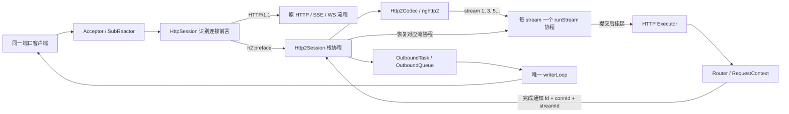
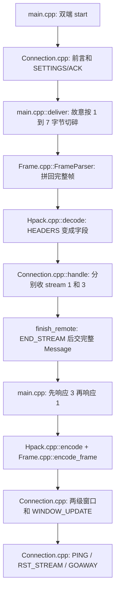

# Phase 6：HTTP/2 生产接入、教学版与完整流程核对

> 本文把原 HTTP/2 接入阶段和随后新增的独立手写教学版合在一起，作为 **Phase 6 的完整总结**。本阶段在 C++ 进程内接入 HTTP/2，没有 Caddy 或其他反向代理；教学版没有替换生产 nghttp2。下一阶段 TLS/ALPN 见 [Phase 7](phase7.md)。`test7.0` 是仅接入 SSE 的比较基线；Phase 6/7 的代码纳入 `test8.0`。

## 1. 先弄清楚接入的究竟是哪一层

HTTP/1.1 的 `HttpSession` 像一条只有一个窗口的柜台：同一条 TCP 连接上，它读完一个请求，等待该请求处理并应答，再读下一单。HTTP/2 把一条 TCP 连接分成多条带编号的 **stream**，像在同一条运输通道里给包裹贴上不同订单号。各 stream 的 HEADERS 和 DATA 帧可以交错到达，响应也可以按另一顺序完成。

HTTP/2 不只是“HTTP/1.1 长连接”。它还规定连接前言、二进制帧、HPACK 首部压缩、流状态、流量控制、SETTINGS、RST_STREAM 等。参考 [RFC 9113](https://www.rfc-editor.org/rfc/rfc9113.html) 与 [HPACK RFC 7541](https://www.rfc-editor.org/rfc/rfc7541.html)。本项目使用 [nghttp2](https://nghttp2.org/documentation/) 处理这些标准协议细节；自己的 `Http2Codec` 把帧事件变为项目的请求对象，自己的 `Http2Session` 管理 stream 与业务线程池。使用协议库不等于把协议交给网关。

## 2. 当前实现的范围

- 同一个监听端口保留 HTTP/1.1、原有 WebSocket 和 SSE。新连接起始的 24 字节若匹配 HTTP/2 client connection preface，就从 `HttpSession` 交接给 `Http2Session`；支持 TCP 把前言拆成多次到达。
- Phase 6 的明文入口采用 **h2c prior knowledge**：客户端直接发送前言和二进制帧，不经过 HTTP/1.1 `Upgrade: h2c`。明文端口的 HTTP/1.1/h2c 共存是项目自己的前言识别设计；它不等于 TLS ALPN。HTTPS/h2 是 Phase 7 新增的独立入口，详见 [Phase 7](phase7.md)。
- 支持普通有界请求/响应：GET、POST 等按原 Router 分发；请求体最多 1 MiB，累计请求首部最多 16 KiB，最多向客户端宣告 32 个并发 stream；响应体最多 1 MiB。`nghttp2` 负责 HPACK、SETTINGS、帧、RST_STREAM 与窗口管理。
- 尚未把 SSE 长流映射为 HTTP/2 DATA 流，也未实现 RFC 8441 Extended CONNECT WebSocket。业务调用 `acceptSse()` / `acceptWebSocket()` 的路由在 HTTP/2 stream 上回 501；它们在 HTTP/1.1 上继续按 Phase 5 工作。HTTP/1.1 的 chunked 字节和 101 升级不能直接写进 HTTP/2 stream。
- 文件响应如果仍可从 mmap 分段取出、总大小在上限内，可以复制并编码为 DATA 帧；依赖 `sendfile` 的大文件路径和 HTTP/1.1 `ChunkedBody` 暂回 501。这里牺牲了 HTTP/1.1 的零拷贝优势，后续若需要大文件，应做按窗口拉取的 HTTP/2 DATA provider。
- 出站仍受现有每连接 4 MiB 写积压水位约束。大量 stream 同时产生大响应、队列拒绝时，当前实现关闭该连接；后续可增加“等待 writer 释放额度再继续编码”的会话级输出调度。

## 3. 从 HTTP/2 初版到教学扩展，具体增加了什么

| 维度 | HTTP/2 初版 | 增加手写教学版后 | 边界 |
|---|---|---|---|
| 生产入口与协议 | `HttpSession` 识别前言；`Http2Session` 和 nghttp2 处理连接、帧、HPACK、stream、窗口 | 保持原样 | 教学代码没有替换生产版 nghttp2 |
| 业务与出站 | 每个 stream 建 Job，复用 Router/Executor、`OutboundTask` 和唯一 writer | 保持原样 | 线程归属与出站背压边界未改变 |
| 协议学习 | 可从生产接线理解 nghttp2 回调，但内部细节较黑盒 | 新增独立的 [`learn` 教学版](../../server/http2/learn/README.md)，逐字节演示前言、帧、HPACK、stream 和窗口 | 只供学习，不承担生产互操作 |
| 全流程演示 | 独立 codec 往返覆盖拆包、HPACK、多 stream、POST DATA 和 RST | 教学双端程序还演示 SETTINGS/ACK、PING、GOAWAY、DATA 分帧与逆序响应 | 演示覆盖增加，不代表吞吐或延迟提升 |
| 验证 | 本机 codec 往返通过；Linux 完整服务待验收 | 教学版 C++20 直接编译运行通过 | 真实 Linux h2c/SSE 共存和性能仍待验证 |

`test8.0` 后续补充了**生产业务流协程**：每个 Job 持有一个 `Task<bool>`，Worker 完成后由 Reactor 恢复，响应逻辑写在 `runStream()` 的挂起点之后。协议层仍由 nghttp2 负责，也没有把业务 handler 改成协程；独立的 `learn/stream_coroutine_main.cpp` 只演示该调度机制。这是对上表“业务与出站保持原样”的后续增量，不改变原先的连接级单写者和背压边界。

可以把它们想成一台分拣机：HTTP/2 规范规定包裹格式，nghttp2 是生产分拣机的协议内核，`Http2Codec`/`Http2Session` 是接入本项目业务的线路，`learn` 则是拆开齿轮供学习的透明模型。教学版有自己的协议状态，不被根 `CMakeLists.txt` 编进 `webserver_core`。

## 4. 生产架构接线图



关键区别是 **Session 仍按连接创建，但业务 Job 和业务流协程按 stream 创建**。`Http2Session` 与 `nghttp2_session` 都只由所属 Reactor 线程访问；Worker 只处理各自的 `RequestContext`，完成后通过锁保护的完成队列和现有 eventfd 通知 Reactor。这样不会让不同 Worker 并发修改同一个 HPACK 状态，也不会让它们直接写同一个 socket。这里的“流协程”是项目的业务等待状态，不是 nghttp2 内部的协议 stream 状态，也不意味着每条流占一个线程。

## 5. 生产代码逐步走读

1. **识别与交接**：`server/http/HttpSession/HttpSession.cpp` 在 HTTP/1 parser 之前比对前言。只收到前几个字节时保留在 `readBuffer`，等待下一次读取；完整匹配后经 `SessionFactory::createHttp2Session()` 创建会话，替换 `Connection::session`，把新根协程交给调度器。缓冲字节不提前取走，由 nghttp2 自己消费前言。
2. **收帧与拼请求**：`server/http2/Http2Codec.cpp` 为每个连接创建一个 nghttp2 server session。回调按 stream ID 收集 `:method`、`:path`、普通首部和 DATA；收到 END_STREAM 才把一个完整请求交给业务。HPACK 解码、帧顺序和流量控制由 nghttp2 判断。超过请求首部或请求体上限的 stream 被重置。
3. **并发业务与流协程**：`Http2Session::dispatchReady()` 为每个完整 stream 建一个 Job、独立 `RequestContext`、取消源和截止时间，并创建 `Task<bool>` 流协程。首次 `resume()` 进入 `runStream()`，把 handler 交给现有 HTTP Executor 后在 `co_await std::suspend_always{}` 停住。连接根协程继续读别的帧；stream 3 可以先于 stream 1 完成。Executor 排队满则流协程直接提交 503。
4. **完成通知与恢复**：Worker 把 Job 放进会话的完成队列，再调用 `notifyExecuteComplete(fd, connId)`。`SubReactor::processComplete()` 用 `connId` 防 fd 复用，并唤醒连接根协程。根协程在 `finishCompleted()` 找到对应 Job，**只在所属 Reactor 线程**恢复这条流协程；Worker 不碰 nghttp2。若客户端提前 RST_STREAM，取消源亮起、挂起协程被销毁，迟到的业务结果被丢弃。
5. **响应与写入**：恢复的流协程把 `HttpResponse` 转为 `:status`、小写首部及 DATA。连接级首部（如 `Connection`、`Transfer-Encoding`）不能出现在 HTTP/2 中，所以过滤。`nghttp2_session_mem_send()` 产出的临时内存立即复制为 `OutboundTask::encoded`，复用原有唯一 writerLoop；所有 stream 共享同一发送顺序和连接窗口。
6. **关闭清理**：连接关闭时 `requestHandlerStop()` 向仍在运行的各 stream Job 发协作取消信号；`Job` 析构销毁未完成的流协程并把池化响应归还。停止信号不是强制终止，业务 handler 仍需在耗时循环里主动检查 `stopRequested()`。

这里的 `connId` 与 `streamId` 解决两个不同问题：`connId` 证明“还是原来那条 TCP 连接”，`streamId` 证明“是这条连接里的哪一张订单”。只用 fd 会误认复用后的新连接；只用 connId 无法区分并发请求。

## 6. nghttp2 与手写教学版：按协议步骤对照

生产版入口是 `<nghttp2/nghttp2.h>` 和 `libnghttp2`，它们**不会替应用执行 socket I/O**：应用把收到的字节交给库，再自行发送库产出的字节；同一个 `nghttp2_session` 同一时间应只由一个线程使用。见 [nghttp2 Programmers' Guide](https://nghttp2.org/documentation/programmers-guide.html)。本项目因此让所属 Reactor 独占 codec；业务 Worker 不直接操作它。库负责协议状态，项目仍负责连接生命周期、业务调度、响应体和出站队列。

官方新版本指南还会出现 `nghttp2_session_mem_recv2` / `mem_send2`；下表写的是**本项目实际调用的** `nghttp2_session_mem_recv` / `mem_send`。走读源码时注意区分名称。

| 线上步骤 | nghttp2 的职责或接口 | 本项目生产接线 | 手写教学版的对应实现 |
|---|---|---|---|
| 1. 前言 | server session 由 `nghttp2_session_mem_recv()` 消费客户端前言 | [`Http2Preface.h`](../../server/http2/Http2Preface.h)、[`HttpSession.cpp`](../../server/http/HttpSession/HttpSession.cpp) 先识别并交接 | [`Connection.cpp::start/receive`](../../server/http2/learn/Connection.cpp) 生成、逐字节校验固定 24 字节 |
| 2. 会话与 SETTINGS | 创建 callbacks 和 `nghttp2_session_server_new`，调用 `nghttp2_submit_settings` | [`Http2Codec.cpp`](../../server/http2/Http2Codec.cpp) 每连接建一个协议会话 | [`Connection.h`](../../server/http2/learn/Connection.h) 中每端一个对象，`start()` 交换 SETTINGS/ACK |
| 3. TCP 字节到帧 | `nghttp2_session_mem_recv` 增量拆帧和检查协议顺序 | `Http2Session::run()` 把读缓冲交给 `Http2Codec::receive()` | [`Frame.cpp::FrameParser::feed`](../../server/http2/learn/Frame.cpp) 等齐 9 字节帧头和 payload |
| 4. HEADERS 到字段 | HPACK 解码后触发 `on_begin_headers` / `on_header` 回调 | `Http2Codec` 映射 `:method`、`:path` 等为请求字段 | [`Hpack.cpp::decode`](../../server/http2/learn/Hpack.cpp) 解前缀整数、字符串及静态/动态表索引 |
| 5. DATA 到请求 | `on_data_chunk_recv` 和 `on_frame_recv`；END_STREAM 才结束消息 | `Http2Codec::finishRequest()` 交给 `Http2Session::dispatchReady()` | [`Connection.cpp::handle/finish_remote`](../../server/http2/learn/Connection.cpp) 按 stream ID 拼 HEADERS 和 DATA |
| 6. 流量控制 | 维护连接和 stream 两级窗口，调度 DATA | 项目还要管理自己的 `OutboundQueue` 背压；它不是 HTTP/2 窗口 | `Connection.cpp::handle` 扣额度、发 WINDOW_UPDATE；`send_message` 检查额度 |
| 7. 响应与发送 | `nghttp2_submit_response` 和 body 回调；`nghttp2_session_mem_send` 产出帧字节 | `Http2Session::finishCompleted/flushOutput()` 复制成 `OutboundTask`，交唯一 writer | `Hpack.cpp::encode`、`Connection.cpp::send_message`、[`Frame.cpp::encode_frame`](../../server/http2/learn/Frame.cpp) |
| 8. 取消与关闭 | 处理 RST/GOAWAY 等协议状态 | `Http2Codec::onClose`、`Http2Session::reapClosed` 清理相关 Job | `Connection.cpp::reset/send_goaway` 演示单 stream 取消与无活跃 stream 时结束连接 |

注意三个容易混淆的编号：`connId` 标识项目中的一代 TCP 连接，防止 fd 复用后投错结果；`streamId` 标识这条连接中的一个请求；HPACK 表索引标识一个首部条目，和 stream 编号无关。

### 手写版的一次完整请求



教学入口是 [`main.cpp`](../../server/http2/learn/main.cpp)；状态、帧和首部分别看 [`Connection.h`](../../server/http2/learn/Connection.h)/[`Connection.cpp`](../../server/http2/learn/Connection.cpp)、[`Frame.h`](../../server/http2/learn/Frame.h)/[`Frame.cpp`](../../server/http2/learn/Frame.cpp)、[`Hpack.h`](../../server/http2/learn/Hpack.h)/[`Hpack.cpp`](../../server/http2/learn/Hpack.cpp)。教学版保留 RFC 的 61 项静态首部表，但省略 Huffman、CONTINUATION、完整流状态机、TLS/ALPN 和复杂窗口等待，因此不能替换 nghttp2 或直接用作通用网络服务器。

## 7. 为什么要保留这些边界

| 收益 | 代价或当前限制 |
|---|---|
| 同一 TCP 连接上多个请求可并发处理，避免 HTTP/1.1 的逐请求等待 | stream Job、回调、完成队列和取消状态更复杂 |
| HPACK 减少重复首部的传输字节 | 每条连接的压缩状态必须严格留在同一 Reactor 线程 |
| 帧级流量控制与 RST_STREAM 提供明确的背压和单 stream 取消 | 现有 HTTP/1.1 sendfile/chunked/SSE/WS 不能直接复用其线上字节格式 |
| 共享 Reactor、Router、Executor、OutboundQueue，不重写业务路由 | Phase 6 只提供明文 prior-knowledge h2c；HTTPS/h2 的 TLS/ALPN 在 Phase 7 单独接入 |

HTTP/2 的多路复用解决的是 **应用层请求队头等待**；多个 stream 仍共享一条 TCP 连接，丢包时底层 TCP 仍会影响这条连接上的所有 stream。

## 8. 库头文件与手写源代码怎么区分

扫描生产构建清单以及 `server`、`log`、`main.cpp` 的 include 后，项目实际接入的第三方 HTTP/2 协议库是 **nghttp2**。`Threads::Threads` 是系统线程链接抽象；`<sys/epoll.h>`、`<sys/eventfd.h>`、`<sys/socket.h>` 等是 Linux 系统接口，不是 HTTP/2 解析库。测试专用 GTest/Python 不计入下表。

| 来源 | 入口头文件 | 当前代码位置 | 生产构建中使用 |
|---|---|---|---|
| nghttp2 协议库 | `<nghttp2/nghttp2.h>` | [`Http2Codec.h`](../../server/http2/Http2Codec.h)、根 [`CMakeLists.txt`](../../CMakeLists.txt) 查找并链接 `libnghttp2` | **是** |
| 手写 HTTP/2 教学模块 | [`Frame.h`](../../server/http2/learn/Frame.h)、[`Hpack.h`](../../server/http2/learn/Hpack.h)、[`Connection.h`](../../server/http2/learn/Connection.h) | 各自对应 `.cpp`，由 `learn/CMakeLists.txt` 构建教学程序 | **否，独立实验** |
| 既有手写协议模块 | [`HttpParser.h`](../../server/http/HttpParser/HttpParser.h)、[`WebSocketCodec.h`](../../server/websocket/WebSocketCodec/WebSocketCodec.h)、[`SseCodec.h`](../../server/sse/SseCodec.h) 等 | HTTP/1、WebSocket、SSE 生产模块 | **是，但不是手写 HTTP/2** |

其他可供今后评估的成熟库入口包括 [llhttp](https://github.com/nodejs/llhttp) 的 `<llhttp.h>`（HTTP/1 解析）、[Boost.Beast](https://www.boost.org/doc/libs/latest/libs/beast/doc/html/index.html) 的 `<boost/beast/http.hpp>`/`<boost/beast/websocket.hpp>`、[libwebsockets](https://github.com/warmcat/libwebsockets) 的 `<libwebsockets.h>`、[Libevent](https://libevent.org/doc/) 的 `<event2/event.h>`（事件循环）、[zlib](https://www.zlib.net/manual.html) 的 `<zlib.h>`（内容压缩）和 [spdlog](https://github.com/gabime/spdlog) 的 `<spdlog/spdlog.h>`（日志）。这些候选库**均未接入本项目**；OpenSSL 已在 Phase 7 接入。尤其事件循环/网络框架可能与现有 Reactor 设计重叠，不是包含头文件就能完成升级。更细的适配范围见 [`server/http2/README.md` 的依赖清单](../../server/http2/README.md#5-项目依赖封装清单实际使用与可选项分开看)。

## 9. 构建、验证与学习顺序

在目标 Linux 环境安装 `libnghttp2-dev`，然后正常构建项目：

```bash
sudo apt install libnghttp2-dev libssl-dev
cmake -S . -B build -DBUILD_TESTING=OFF
cmake --build build -j
./build/webserver
curl --http2-prior-knowledge -i http://127.0.0.1:8080/
```

需要运行仓库测试时，再安装已有测试依赖 `libgtest-dev`，使用 `-DBUILD_TESTING=ON`；`http2_codec_roundtrip` 测试覆盖前言拆包、HPACK、同连接两个 stream 交错应答、POST DATA 请求体和 RST_STREAM。

**当前验证结果**：在本地 Windows 工作区，将官方 nghttp2 1.70.0 源码临时编为静态库后，独立编译并运行了 `tests/http2_codec_roundtrip.cpp`，上述协议测试通过；新增 Codec、Session、交接与工厂文件的 C++ 语法检查通过。SSE 事件与 HTTP chunk 编码的独立检查也通过。教学版用 C++20 `g++` 直接编译运行，覆盖 SETTINGS/ACK、DATA 分帧、动态表、窗口、PING、RST 和 GOAWAY；流协程教学程序另验证独立挂起、逆序完成与取消。独立 CMake 在本机编译器探测处未完成。这些结果均不等于生产服务的网络验收。

核心网络层使用 Linux epoll，当前 Windows 工作区无法直接启动完整服务，因此尚未完成“真实 SubReactor + 本地 socket + curl”的端到端验证。目标 Linux 环境中应运行上面的命令，同时验证 HTTP/1.1 `/events-status`、SSE `/events` 与 WebSocket 原路径继续工作，并检查连接断开后的资源清理。未做性能基准；不能据此宣称吞吐或延迟改善。

建议的学习顺序：先运行 [`learn/main.cpp`](../../server/http2/learn/main.cpp) 的内存双端演示，依次看 `Frame.cpp` 的帧边界、`Hpack.cpp` 的首部索引、`Connection.cpp` 的 stream 与窗口；再回到 `Http2Codec.cpp`，把手写的各步骤对应到 nghttp2 API 和回调；最后按本节命令在 Linux 验证生产连接。之后可继续研究 Huffman、CONTINUATION 和 HTTP/2 上的 SSE；TLS/ALPN 进入 [Phase 7](phase7.md)。

## 10. 对照完整 HTTP/2 流程：哪些在项目中，哪些在库里

你画的 `TCP → Connection → Session → 帧 → Stream → HttpRequest → Router → HttpResponse → 帧 → Sender` 是正确的学习地图，但它是**逻辑层次**，并不要求每一格都有一个同名 C++ 类。生产版的实际对应如下：

| 你画的环节 | 当前实现位置 | 核对结果 |
|---|---|---|
| accept、epoll、多 Reactor、协程 | `ServerRuntime`、`ReactorGroup`、`SubReactor`、`CoroutineScheduler` | 已有；每条连接由所属 Reactor 管 I/O |
| Connection、协议识别 | `Connection`、`HttpSession`、`Http2Preface.h` | 明文同端口识别 h2 前言；支持前言跨 TCP 分片 |
| Http2Session、FrameParser、Http2Frame、Frame Type Handler | `Http2Session`、`Http2Codec` 内持有的 `nghttp2_session` 及其回调 | **生产帧解析与类型处理在 nghttp2 内部**，项目没有同名手写类；教学版的 `FrameParser`/`Frame` 展示这一步 |
| Stream、HPACK、HTTP 对象 | nghttp2 的 stream/HPACK 状态；`Http2Codec::ReadyRequest`、`Http2Session::Job/runStream()` | 库管协议状态；项目按 stream ID 建独立业务 Job 和可挂起的流协程 |
| Router、Handler、HttpResponse | 原 Router/HTTP Executor/`RequestContext`/`HttpResponse` | 已复用；一个 stream 的 handler 不占住其他 stream 的业务执行 |
| Encoder、Frame Queue、Sender | `nghttp2_submit_response`、`nghttp2_session_mem_send`、`OutboundTask`/`OutboundQueue`、唯一 writer | nghttp2 编 HEADERS/DATA；项目队列写 socket |
| HTTP/2 Flow Control 与应用背压 | nghttp2 连接/stream 窗口；项目每连接写队列水位 | **两套不同机制**；窗口控制协议 DATA，水位保护本进程内存 |
| 多 stream 公平调度 | nghttp2 选择可发送帧；项目 writer 有单连接每轮写预算 | **尚无项目自写的 per-stream 公平 Scheduler**；多个大响应可能挤满连接级出站队列，不能把现状说成完整公平调度 |

连接建立的正确时序是：明文 TCP 建连后，客户端发固定 24 字节前言并紧跟 SETTINGS，服务器也发送自己的 SETTINGS；双方收到对方的 SETTINGS 后分别回复 ACK。ACK 与后续合法帧在网络上可以交错，不能把图中的 ④～⑦理解成所有连接都严格逐格等待。随后 HEADERS/DATA 按 stream 交错，收到 END_STREAM 才形成完整请求。`PING`、`WINDOW_UPDATE`、`RST_STREAM`、`GOAWAY` 各有连接级或 stream 级作用。[RFC 9113](https://www.rfc-editor.org/rfc/rfc9113.html) 对这些状态和明文 prior knowledge 有规范说明。

**本阶段结论**：生产版用 nghttp2 覆盖二进制帧、HPACK、SETTINGS、stream 与协议流控；项目自己完成协议识别、业务分发、生命周期和网络出站；手写版让这些被库封装的步骤可单步学习。保留的缺口是应用层 per-stream 公平输出、HTTP/2 上的 SSE/WS、TLS/ALPN、大文件按窗口发送，以及 Linux 完整端到端验收。其中 TLS/ALPN 已在下一阶段接入，其他项仍按本节边界看待。
