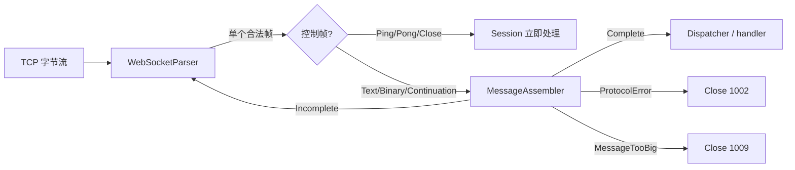

# 第六阶段：WebSocket 帧状态机与消息状态机

这一阶段解决一个常被混在一起的问题：**帧是运输箱，消息是整件商品。**

- Parser 检查一个运输箱的格式是否合规。
- MessageAssembler 检查多个运输箱能否按顺序拼成一件完整商品。
- Session 处理 Ping/Pong/Close，并把完整商品交给业务 handler。

上传的 `web-test6.1.zip` 没有这套 WebSocket 分层，因此这是 2.0 相比旧架构最值得学习的
协议扩展方式之一。

## 1. 为什么一个 Parser 不够

WebSocket 的 `Text/Binary` 消息可以拆成多帧：

```text
Text(FIN=0, "Hel")
Ping(FIN=1, "?")       <- 控制帧可以穿插
Continuation(FIN=0, "lo ")
Continuation(FIN=1, "World")
```

Parser 每次只看到一帧。它能证明 Ping 自己合法，却不知道当前是否还有一条未完成的 Text
消息；这个信息必须跨帧保存。因此需要第二个状态机。



## 2. 单帧状态机负责什么

`WebSocketParser` 仍按下面的工位推进：

```text
BASE_HEADER -> EXT_LENGTH -> MASK_KEY -> PAYLOAD -> COMPLETE
```

本阶段补齐了三组帧级规则。

### 2.1 保留 opcode 必须拒绝

当前实现只认识：

```text
0x0 Continuation   0x1 Text   0x2 Binary
0x8 Close          0x9 Ping   0xA Pong
```

`0x3..0x7` 和 `0xB..0xF` 是保留值。服务器没有协商扩展时不能猜它们的含义，基础头到齐后
就应立即返回协议错误。

### 2.2 控制帧必须一次送完

Close、Ping、Pong 有两个硬约束：

1. `FIN` 必须为 1，控制帧不能分片。
2. payload 最多 125 字节，所以长度字段不能写 126 或 127。

它们像消防警报，必须短小并能插队，不能拆成几封信慢慢送。

### 2.3 长度必须使用最短编码

WebSocket 有三档长度编码：

| 实际长度 | 合法写法 |
|---|---|
| 0..125 | 直接写入 7 位字段 |
| 126..65535 | 写 126，再跟 2 字节长度 |
| 65536 以上 | 写 127，再跟 8 字节长度 |

例如实际长度 125 却写成 `126 + 0x007D`，数值虽然能读出来，编码仍不规范。最短编码让每个
长度只有一种表示方式，减少解析差异和协议走私空间。

## 3. 消息组装器负责什么

新增 `WebSocketMessageAssembler`，核心状态可以简化成：

```cpp
bool fragmentActive_;       // 是否正在组装一条分片消息
WsOpcode firstOpcode_;      // 首片是 Text 还是 Binary
std::string buffer_;        // 已累计的数据
```

状态转移如下：

| 当前状态 | 收到帧 | 结果 |
|---|---|---|
| 空闲 | Text/Binary，FIN=1 | 直接完成 |
| 空闲 | Text/Binary，FIN=0 | 开始组装 |
| 空闲 | Continuation | 1002 协议错误 |
| 组装中 | Continuation，FIN=0 | 继续累计 |
| 组装中 | Continuation，FIN=1 | 恢复首片 opcode，交付完整消息 |
| 组装中 | 新 Text/Binary | 1002 协议错误 |
| 任意 | 累计超过消息上限 | 1009 消息过大 |

## 4. 为什么不能用 `buffer.empty()` 表示状态

旧逻辑用下面的思路判断是否存在前置分片：

```cpp
if (fragmentBuf_.empty()) {
    // 没有进行中的分片
}
```

但下面的首片完全合法：

```text
Text(FIN=0, payload="")
```

此时消息已经开始，缓冲却仍为空。状态和数据是两件事：

- `fragmentActive_` 回答“流程走到哪里”。
- `buffer_` 回答“目前积累了多少数据”。

这条原则也适用于 HTTP body、文件上传、数据库事务和任务队列：不要用“数据恰好为空”代替
明确的业务状态。

## 5. 帧上限与消息上限为什么是两个概念

攻击者可以把 20 MiB 消息拆成 20 个 1 MiB 帧。如果只检查每帧上限，每一帧都合法，最终
重组缓冲仍会增长到 20 MiB。

因此现在有两把尺子：

- `kWsMaxFramePayloadBytes`：单帧 payload 上限。
- `kWsMaxMessageBytes`：分片重组后的整条消息上限。

当前二者都为 1 MiB，但它们是独立配置概念。组装器使用减法形式判断是否还能追加：

```cpp
buffer.size() <= maxMessageBytes - incoming.size()
```

先验证 `incoming.size() <= maxMessageBytes`，再做减法，可以避免直接相加发生无符号整数溢出。

## 6. 为什么控制帧不进入 MessageAssembler

分片消息进行中允许收到 Ping/Pong/Close。若把所有帧都喂给组装器，Ping 可能被误认为
“插入了新消息”。Session 先处理控制帧，只把三种数据帧交给 Assembler：

```text
Continuation / Text / Binary
```

这体现了分层的实际价值：Parser 管 wire 格式，Assembler 管消息顺序，Session 管连接行为。

## 7. 消费帧后为什么要归还读额度

`recvSocket()` 在读缓冲超过水位时设置 `pauseByMemory=true`，`updateEvent()` 随后会暂停
`EPOLLIN`。Parser 消费完一帧后，未处理字节已经减少；WebSocketSession 必须重新计算
`pendingBytes` 并解除已经恢复的水位。

这像仓库收货：货架满时暂停卡车进场，工人搬走货物后还要更新“剩余库位”。只搬货却不改
门口的满仓牌，后面的卡车会一直被挡住。

## 8. 本阶段验证矩阵

| 场景 | 预期 |
|---|---|
| 保留 opcode 0x3 | Parser Error |
| FIN=0 的 Ping | Parser Error |
| 125 使用 126 扩展形式 | Parser Error |
| 65535 使用 127 扩展形式 | Parser Error |
| 126 使用合法 2 字节扩展 | 正常解析 |
| 空 Text 首片 + Continuation | 正常完成 Text 消息 |
| 分片中插入 Binary 首帧 | ProtocolError / Close 1002 |
| 两帧分别合法、总消息超限 | MessageTooBig / Close 1009 |
| 分片中穿插 Ping | Pong 正常返回，分片状态保留 |

前七项已经用本机可执行的纯逻辑测试验证；真实 socket 场景也已加入 Linux 黑盒脚本，等待
Linux 构建环境运行。

## 9. 推荐阅读顺序

1. `WebSocketTypes/WebSocketLimits.h`：先看两把尺子。
2. `WebSocketParser/FrameHeaderParser.h`：看单帧第一道门禁。
3. `WebSocketParser/ExtendedLengthParser.h`：看长度三档与最短编码。
4. `WebSocketMessageAssembler/*`：看跨帧状态转移。
5. `WebSocketSession::run()`：看控制帧如何旁路、完整消息如何派发。
6. `tests/unit_tests.cpp`：用反例倒推每一条规则。

## 10. 理解检查

1. 为什么空 payload 首片能证明 `empty()` 不能代替状态？
2. 为什么 Ping 可以穿插在分片中，却不能进入 MessageAssembler？
3. 两个 600 KiB 帧为什么可能各自合法，组合后却应关闭 1009？
4. 实际长度 125 使用 126 扩展形式，为什么仍属于协议错误？

下一阶段处理消息内容语义：文本和 Close reason 的 UTF-8 校验、Close payload 长度、关闭码
合法性，以及服务端编码控制帧时的 125 字节约束。
