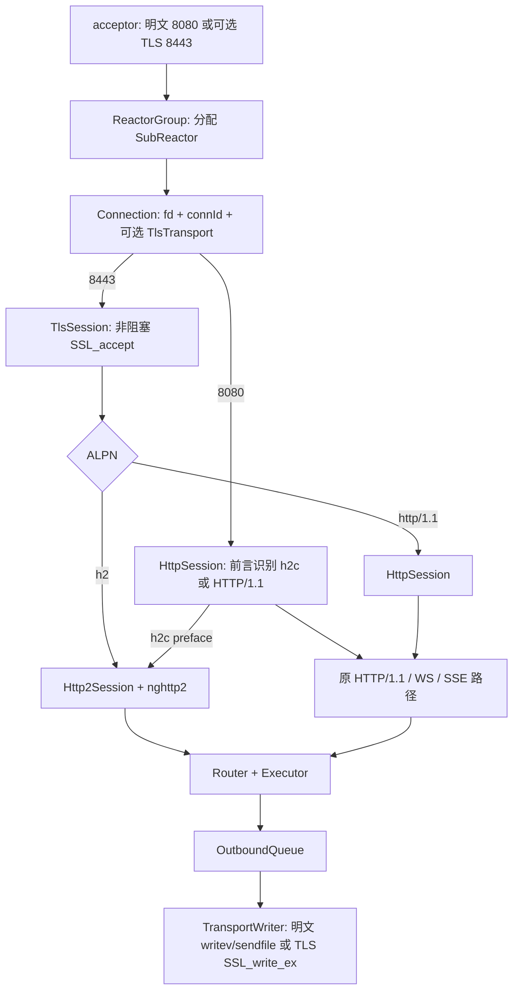

# Phase 7：在现有 HTTP/1.1 与 HTTP/2 服务器中接入 TLS/ALPN

> 本阶段代码纳入 `test8.0`，基线是 [Phase 6：HTTP/2 接入与教学版](phase6.md)。证书与私钥由运行环境提供，不放进仓库。Linux 真实网络端到端尚待虚拟机验证；本文把已写入代码的设计与尚未验证的结果分开说明。

## 1. 为什么 TLS 要接在 HTTP 协议层下面

可以把 TLS 想成一条加锁的运输通道，ALPN 是**握手时确认通道里说哪种 HTTP 语言的标签**。TLS 不负责解释 HTTP 请求，HTTP/2 也不负责加密。顺序是 `TCP → TLS 握手/ALPN → 已解密的 HTTP 字节 → HttpSession 或 Http2Session`；回程则反过来。因而只给入口加 `SSL_accept()` 仍不够：原来直接 `recv/writev/sendfile` 的读写路径也必须经过 `SSL_read_ex/SSL_write_ex`，否则响应会以明文泄出或破坏 TLS 记录。

Phase 6 的明文 8080 端口继续使用项目自己的 h2 前言探测：`HTTP/1.1` 或 h2c prior knowledge。Phase 7 在**独立的可选 HTTPS 端口**（默认 8443）先做 TLS 1.3 握手，再按 ALPN 的 `h2`/`http/1.1` 选择 Session；TLS 连接不走明文前言探测。HTTP/2 over TLS 必须使用 ALPN `h2`，不能把 `h2c` 放进 ALPN。[RFC 9113 第 3 节](https://www.rfc-editor.org/rfc/rfc9113.html#section-3)规定了这条边界。



## 2. 与 Phase 6 相比的变化

| 位置 | Phase 6 | Phase 7 | 为什么要变 |
|---|---|---|---|
| 监听与分配 | 8080 明文端口，按前言识别 h2c | 环境配置证书后另开 8443，accept 时标明是否 TLS | 不把 TLS 密文误送进 HTTP parser |
| 会话生命周期 | `HttpSession` 直接起步 | TLS fd 先由 `TlsSession` 握手，ALPN 后交接现有 h1/h2 Session | 握手与 HTTP 业务分层 |
| 入站 | `recv` 字节直接进 `readBuffer` | TLS fd 用 `SSL_read_ex` 解密，再进同一 `readBuffer` | Parser 只接收明文 HTTP 字节 |
| 出站 | 编码后走 `writev/sendfile` | TLS fd 用 `SSL_write_ex` 加密；文件用 `pread` 分块替代 `sendfile` | 内核 `sendfile` 不能直接经过用户态 OpenSSL 加密 |
| 非阻塞重试 | `EAGAIN` 等 EPOLLOUT | `SSL_*` 可能要求 `WANT_READ` 或 `WANT_WRITE`；Reactor 按真实方向唤醒 | TLS 读操作也可能需要写，写操作也可能需要读 |
| HTTP/2 协议处理 | nghttp2 处理帧、HPACK、stream | 保持原样 | TLS/ALPN 只改变 HTTP 字节外面的传输层 |

## 3. 代码怎样接起来

1. [`TlsContext.cpp`](../../server/tls/TlsContext.cpp) 载入 PEM 证书链和私钥、检查配对、设置最低 TLS 1.3，并在 ALPN 回调里按长度前缀解析客户端列表，优先选 `h2`，其次 `http/1.1`；无可接受协议则拒绝握手。`SSL_CTX` 由共享对象持有，覆盖所有连接生命周期。
2. [`ServerRuntime.cpp`](../../server/Runtime/ServerRuntime.cpp) 根据 `WEB_TLS_CERT`/`WEB_TLS_KEY` 可选建立第二个监听 fd。acceptor 把“这是 TLS 端口”连同 fd 经 [`ReactorGroup`](../../server/Reactor/ReactorGroup.cpp) 传到 [`SubReactor`](../../server/SubReactor/SubReactor.cpp)，不靠猜测首包。未设置证书时只启动原有明文端口。
3. [`Connection.h`](../../server/transport/Connection.h) 增加可选的 `TlsTransport`。TLS fd 的初始协议会话是 [`TlsSession.cpp`](../../server/tls/TlsSession.cpp)：`SSL_accept` 遇 `WANT_READ/WANT_WRITE` 时让根协程挂起；握手完成后读取 ALPN，创建 `Http2Session` 或 `HttpSession` 并把主协程交接给它。
4. [`TlsTransport.cpp`](../../server/tls/TlsTransport.cpp) 把 OpenSSL 返回值转为 `Done/WantRead/WantWrite/Closed/Error`；`SSL_write_ex` 未完成时保存**同一份字节和长度**供下次重试。这个缓冲是为满足 OpenSSL 的重试契约，不是新的无限出站队列。[OpenSSL `SSL_write` 文档](https://docs.openssl.org/3.4/man3/SSL_write/)说明了相同参数重试要求。
5. `SubReactor::recvSocket` 对 TLS 连接调用 `SSL_read_ex`；`updateEvent` 与事件分发让“读想写”“写想读”映射到正确的 epoll 唤醒。[OpenSSL `SSL_read` 文档](https://docs.openssl.org/3.0/man3/SSL_read/)明确指出两种 WANT 都可能出现。原有 1 MiB 读缓冲水位和连接身份检查继续适用。
6. [`TransportWriter.cpp`](../../server/transport/TransportWriter.cpp) 是统一出站入口。明文连接保留原 `writev/sendfile`；TLS 连接每次最多取 16 KiB 明文，经 `SSL_write_ex` 成功后才推进任务游标和 ticket。文件型响应改用 `pread` 取片段；TLS 下没有明文路径的 `sendfile` 零拷贝收益。
7. [`HttpSession.cpp`](../../server/http/HttpSession/HttpSession.cpp) 只在明文连接识别 h2c 前言。TLS `http/1.1` 由 ALPN 已经定好，不能再通过应用字节把它偷偷切成 h2。

## 4. TLS 理论、适用场景与当前边界

- **TLS 记录**：OpenSSL 把应用明文字节封装并加密成记录；TCP 仍只负责可靠字节流。这里没有手写加密、证书验证或 TLS 记录解析。
- **证书/私钥**：服务器出示证书并证明自己持有对应私钥；正式客户端还必须验证证书链和主机名。教学自签名证书只供本地练习。
- **ALPN**：客户端在 `ClientHello` 提供可接受的应用协议列表，服务端选中一个；结果是 `h2` 或 `http/1.1`，不是 HTTP 请求头。TLS 握手完成后，`h2` 才进入 HTTP/2 client preface、SETTINGS 和普通帧；ALPN 本身不替 nghttp2 解析帧。[OpenSSL ALPN API](https://docs.openssl.org/3.4/man3/SSL_CTX_set_alpn_select_cb/)提供回调与结果读取接口。
- **场景与收益**：浏览器常见的 HTTPS/h2、HTTPS/1.1、`wss://` 和 HTTPS SSE 可以复用原有业务路径；链路上的 HTTP 内容获得 TLS 机密性和完整性保护。实际浏览器互操作仍需 Linux 端到端验证。
- **代价与限制**：握手与加解密占 CPU；TLS 文件发送需要用户态读取，不再走明文 `sendfile`；目前只配置 TLS 1.3、单证书、无热更新、无 mTLS/0-RTT，也没有把 SSE/WS 映射到 HTTP/2 stream。ALPN 不解决 Phase 6 所列的 per-stream 公平调度和大响应队列问题。

HTTP/3 的 `h3` 不是在这条 TCP/TLS socket 上再加一个 `Session`：它运行在 QUIC 之上，传输层需要另行设计，本阶段不接入。

## 5. 怎样使用和验收

在 Linux 安装 `libnghttp2-dev`、`libssl-dev`，将正式证书和私钥放在运行环境的受控路径。以下生成的是**一次性本地演示证书**，只用于测试：

```bash
sudo apt install libnghttp2-dev libssl-dev
openssl req -x509 -newkey rsa:2048 -nodes -days 1 \
  -keyout /tmp/web-key.pem -out /tmp/web-cert.pem -subj '/CN=localhost'
cmake -S . -B build -DBUILD_TESTING=OFF
cmake --build build -j
WEB_TLS_CERT=/tmp/web-cert.pem WEB_TLS_KEY=/tmp/web-key.pem WEB_TLS_PORT=8443 ./build/webserver
```

另开终端，检查 ALPN 与两个 HTTP 版本：

```bash
openssl s_client -connect 127.0.0.1:8443 -servername localhost -alpn h2 </dev/null 2>&1 | grep 'ALPN protocol'
curl -kvi --http2 https://localhost:8443/
curl -kvi --http1.1 https://localhost:8443/
curl -vi --http2-prior-knowledge http://127.0.0.1:8080/
```

`-k` 仅因为上述测试证书未受信任；正式客户端要验证 CA 和主机名。还应验收 TLS 上的 POST、静态文件、SSE、WebSocket 及慢客户端背压与断线清理，并确认 `curl -V` 显示 HTTP2 支持。**当前 Windows 工作区没有可运行的 Linux epoll 环境与 OpenSSL 开发头文件，以上完整服务命令尚未在本机执行；不能把源码接入等同于已验证互操作。**

仓库另备有 [`tls_blackbox.py`](../../tests/integration/tls_blackbox.py)：它临时生成自签名证书、启动真实服务器，检查 ALPN `h2`/`http/1.1` 和 HTTPS/1.1 响应；若系统 `curl` 带 HTTP2 功能，还会发送实际 h2 请求。Linux 上安装测试依赖并使用 `-DBUILD_TESTING=ON` 后可运行 `ctest --test-dir build -R tls_blackbox --output-on-failure`。当前只通过该脚本的 Python 语法检查，**未运行真实服务测试**。Windows 上另已运行手写 TLS 记录拆包程序；OpenSSL 内存双端演示仍因缺少开发库而未运行。

## 6. 独立教学版怎么学

[`server/tls/learn`](../../server/tls/learn/README.md) 有两段独立练习：`Record.h`/`record_main.cpp` 手写 TLS **外层 5 字节记录信封**的增量拆包；`main.cpp` 用一对内存 BIO 连接教学客户端和服务端，执行真实 TLS 1.3 握手，观察 ALPN 列表、`WANT_*` 重试、协商结果和加密应用字节的往返。前一段只处理合成记录，不解密；后一段的密码学和真实记录层仍由 OpenSSL 完成。它们没有 socket、epoll、Router，也不编进生产 `webserver_core`。阅读顺序是：先看记录边界，再看 `selectAlpn()` 的长度前缀和交替调用 `SSL_do_handshake()`，最后把 `SSL_write_ex/SSL_read_ex` 对到生产 `TlsTransport` 和 `TransportWriter`。手写记录小程序已在 Windows g++ 下编译运行通过；OpenSSL 双端演示需到有开发库的 Linux 环境运行。

**阶段结论**：Phase 6 的 h2 帧/stream/HPACK 没有重写；Phase 7 在它外面加了独立 TLS 入口、ALPN 会话选择和全链路加密读写。下一步应先完成 Linux 真实网络验收，再评估证书轮换、SNI、多证书、TLS 关闭通知和 HTTP/2 大响应公平调度。
