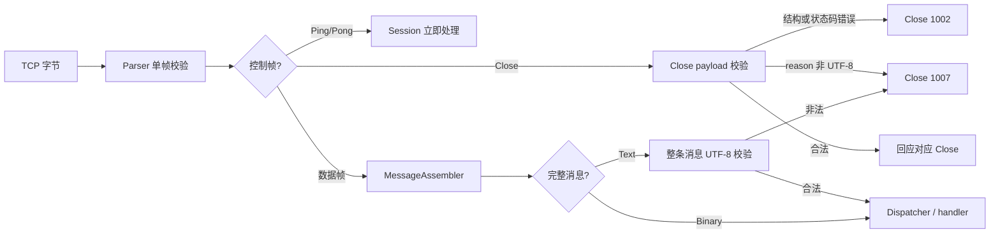

# 第七阶段：WebSocket UTF-8 与 Close 语义

上一阶段证明“运输箱没有破”；这一阶段继续检查“箱内标签是否能读懂”。

- Parser 负责单帧 wire 格式。
- MessageAssembler 负责跨帧顺序和整条消息大小。
- Validation 负责 UTF-8、Close 状态码与 Close reason。
- Session 根据错误种类选择 1002 或 1007。
- Codec 保证服务器自己不会编码出非法控制帧。

这使协议判断从 Session 的条件分支中独立出来，成为可复用、可单测的纯逻辑模块。

## 1. 新的接收链路



## 2. 为什么 UTF-8 不能逐帧检查

字符“中”的 UTF-8 是三个字节：

```text
E4 B8 AD
```

WebSocket 可以这样分片：

```text
Text(FIN=0):         E4
Continuation(FIN=1): B8 AD
```

第一帧单独看像“被截断的 UTF-8”，两帧拼起来却完全合法。因此正确顺序是：

```text
先验证每个帧的结构 -> 再重组消息 -> 最后验证 Text 的 UTF-8
```

这和快递单被分在两页上相似：第一页末尾只有半个汉字，不能立刻判定整份文件乱码。

Binary 消息不做 UTF-8 校验，因为它承诺的是“任意字节”，可能装图片、压缩数据或自定义协议。

## 3. UTF-8 校验器究竟防什么

合法 UTF-8 不只是“续字节数量看起来对”。校验器还要拒绝：

| 非法情况 | 示例 | 原因 |
|---|---|---|
| 孤立续字节 | `80` | 没有首字节 |
| 截断序列 | `E2 82` | 三字节字符少一个字节 |
| 过长编码 | `C0 AF` | 用两字节表示本可单字节表示的字符 |
| surrogate | `ED A0 80` | Unicode 不允许 UTF-16 代理区作为码点 |
| 超出上限 | `F4 90 80 80` | 大于 U+10FFFF |

本项目使用明确的字节区间判断。它不把内容转换为宽字符，所以没有区域设置依赖，也不需要
第三方 Unicode 库。

## 4. Close payload 的三种形态

Close 是控制帧，payload 最多 125 字节。它有三种有意义的形态：

| payload | 结果 |
|---|---|
| 0 字节 | 合法，没有携带状态码 |
| 1 字节 | 非法，状态码只有一半，回 1002 |
| 至少 2 字节 | 前 2 字节为大端状态码，其余为 UTF-8 reason |

空 Close 的回应也应为空。擅自补上 1000 会改变对端实际表达的信息。

## 5. 状态码为什么还需要白名单

状态码是 16 位整数，但不代表每个整数都能上 wire：

- `1000..1014` 中接受当前定义的码，排除 1004、1005、1006。
- `1015` 是本地表示 TLS 握手失败的内部值，不能发送。
- `1016..2999` 当前未分配，本实现拒绝。
- `3000..3999` 留给注册的库和框架。
- `4000..4999` 留给私有应用协议。

其中 1005 和 1006 很像程序里的“虚拟收据”：它们帮助本地代码描述“没有收到状态码”或
“连接异常消失”，但不能真的装进网络包裹。

## 6. 1002 与 1007 怎样选择

| 问题 | Close code | 判断理由 |
|---|---:|---|
| Close 只有 1 字节 | 1002 | 帧内协议结构错误 |
| Close 使用 1005 | 1002 | 状态码违反协议 |
| Close reason 非 UTF-8 | 1007 | 文本内容编码错误 |
| Text 消息非 UTF-8 | 1007 | 消息数据与 Text 类型不匹配 |
| Binary 含任意字节 | 不报错 | Binary 没有 UTF-8 承诺 |

错误码是协议层给对端的诊断接口。区分 1002 和 1007，可以让客户端知道应修正帧结构，还是
修正文本编码。

## 7. 出站也要有门禁

只校验客户端输入还不够。服务器自己的 Codec 现在也拒绝生成：

1. payload 超过 125 字节的 Ping、Pong、Close。
2. `FIN=0` 的控制帧。
3. 使用非法状态码或非法 UTF-8 reason 的 Close。
4. 非法 UTF-8 的完整 Text 消息。
5. 保留 opcode。

`encodeClose()` 专门表示空 payload；`encodeClose(code, reason)` 表示携带状态码。两个 API
把两种协议语义明确分开。

需要注意：无状态 Codec 无法独自验证一组“出站分片”的整体 UTF-8。当前业务发送路径使用
完整消息接口，已经受保护；若未来增加主动分片发送，应再增加一个出站消息组装/校验状态。

## 8. 与你熟悉的 web-test6.1 核心差别

重新核对上传压缩包后，里面没有 `server/websocket` 目录；它的主线是 HTTP、Reactor、协程、
ResponseSender 和连接生命周期。你已经熟悉的部分正好充当 2.0 的“地基”，WebSocket 是架在
同一套事件循环与连接对象上的新协议层。

| 关注点 | 上传的 web-test6.1 | 2.0 当前结构 |
|---|---|---|
| 协议入口 | HTTP Session | HTTP 可升级到 WebSocket Session |
| 解析 | HTTP Parser | WS Parser 与 MessageAssembler 两级状态机 |
| 文本 | HTTP 首部/正文按协议解析 | 完整 Text 额外执行 UTF-8 语义校验 |
| 关闭 | TCP/HTTP 连接生命周期 | Close 帧握手，并区分非法 code 与 reason |
| 发包 | ResponseSender | Codec 编码后进入统一 OutboundTask/Writer |
| 错误 | HTTP 状态码或关闭 socket | 用 Close 1002/1007/1009 表达协议原因 |

升级的核心是复用原有 Reactor 地基，同时把长连接协议的帧状态、消息状态和关闭语义分别交给
独立模块。

## 9. 本阶段验证矩阵

| 场景 | 预期 |
|---|---|
| ASCII / 中文 UTF-8 | 合法 |
| 一个中文码点跨两个分片 | 重组后合法 |
| 过长、surrogate、越界、截断 UTF-8 | 非法 |
| 空 Close | 回空 Close |
| 1 字节 Close | Close 1002 |
| Close 1005 | Close 1002 |
| Close reason 非 UTF-8 | Close 1007 |
| Text 非 UTF-8 | Close 1007 |
| 126 字节 Ping | 编码拒绝 |
| FIN=0 Ping | 编码拒绝 |

纯逻辑场景已在当前环境运行。Linux 黑盒脚本还覆盖真实握手、分片、回 Close 与发完关闭连接。

## 10. 推荐阅读顺序

1. `WebSocketValidation/WebSocketValidation.h`：先看模块对外承诺。
2. `WebSocketValidation/WebSocketValidation.cpp`：沿首字节范围读 UTF-8 状态判断。
3. `WebSocketSession::run()`：看校验插在“重组后、派发前”的位置。
4. `WebSocketCodec::encode*()`：看入站与出站的对称防线。
5. `tests/unit_tests.cpp`：从每个反例倒推协议规则。
6. `tests/integration/websocket_blackbox.py`：看网络端实际收到的 1002/1007。

## 11. 适用场景、优缺点

这套设计适合聊天、协作编辑、实时通知和游戏信令等长期连接服务，尤其适合协议错误需要明确
定位、服务端存在多种消息处理器的项目。

优点：职责清楚、纯逻辑易测、错误响应精确、Session 主循环更容易阅读。缺点：模块和状态比
演示型实现多；UTF-8 校验会线性扫描整条文本；主动出站分片还需要额外的跨帧状态。

## 12. 理解检查

1. `E4` 单独为什么非法，但 `E4` 与后续 `B8 AD` 两帧组合后合法？
2. Close payload 为空和状态码 1005，为什么不是同一件事？
3. 为什么 Close reason 错误用 1007，而 1 字节 Close 用 1002？
4. 为什么 Binary 不做 UTF-8 校验？
5. 为什么 Codec 只能可靠验证完整出站 Text，不能无状态地验证整组分片？

下一阶段建议学习 WebSocket 背压与慢客户端：出站队列上限、广播放大、单连接公平性，以及
“业务生产速度大于 socket 发送速度”时如何保护整个 Reactor。
