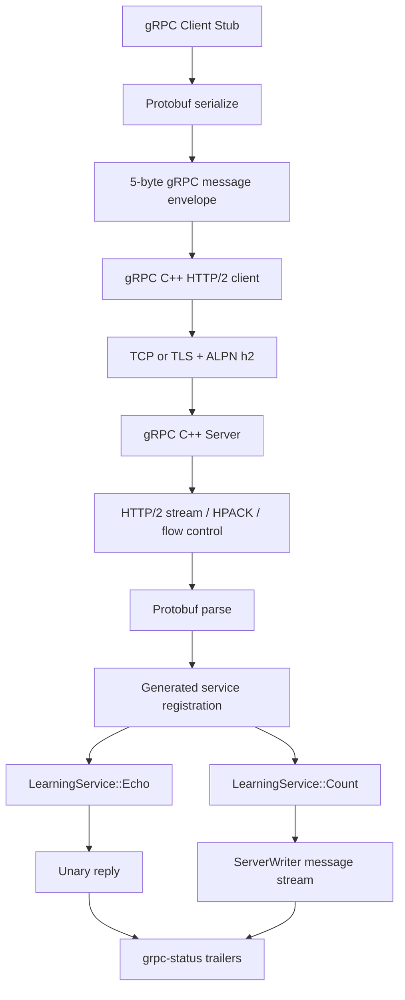

# Phase 8：在现有 Web 服务器旁接入 gRPC C++

> 本阶段基线是 [Phase 7：TLS/ALPN](phase7.md)。gRPC 最初按阶段要求只保留在工作区，现已随 Phase 9 纳入 `test9.0`。本页记录最初的同步 Service API 接入；当前 Callback API 版本见 [Phase 9](phase9.md)。生产 gRPC 路径使用官方 gRPC C++ 与 Protobuf；`server/grpc/learn` 另放一套只用于理解 5 字节消息封装的教学代码。

## 1. 当前状态是否适合继续接入

**适合，但不能把 gRPC 当成现有 Router 上再加一个普通 URL。** Phase 7 已经具备 C++20 构建、生命周期管理、TLS/ALPN 和 HTTP/2 学习基础，因此继续学习 gRPC 的前置条件已经够了。真正需要先补的边界是：当前 `Http2Session` 面向普通 HTTP 请求/响应，还没有完整处理 gRPC 的 Protobuf 消息封装、`grpc-status` trailers、deadline/取消、四种 RPC 形态和压缩协商。

本阶段采用“同一商场，两套专用电梯”的结构：

- 现有 `8080/8443` 继续由 `ServerRuntime + Reactor + nghttp2` 服务 HTTP、WebSocket、SSE 和普通 HTTP/2。
- gRPC 使用独立端口（默认 `50051`），由官方 gRPC C++ 管自己的 HTTP/2、HPACK、stream、流控、trailers 和工作线程。
- 两者在同一个 `webserver` 进程中，由 `main.cpp` 统一启动和停止；业务可以继续共享项目中的数据库、缓存或领域服务，但暂时不共享网络 Session。

这不是绕开现有 HTTP/2，而是在正确的抽象层复用它：Phase 6 的 nghttp2 路径用于学习和承载通用 Web 流量；gRPC 官方库承载需要严格互操作的 RPC 流量。若把两个库同时绑定到同一个 TCP 连接，就像让两名司机同时握方向盘，stream 状态和出站调度会互相破坏。

## 2. 与 Phase 7 相比改了什么

| 维度 | Phase 7 | Phase 8 |
|---|---|---|
| 对外协议 | HTTP/1.1、WebSocket、SSE、普通 HTTP/2 | 增加 gRPC unary 与 server streaming |
| 接口契约 | C++ Router 注册路径与 handler | `.proto` 定义 service/message，生成强类型 Stub 与 Service |
| HTTP/2 实现 | 项目封装 nghttp2 | gRPC 端口由官方 gRPC C++ 完整管理 |
| 数据编码 | 文本、JSON、HTTP body | Protobuf message + gRPC 5 字节消息信封 |
| 结束语义 | HTTP status/body 完成响应 | HTTP/2 trailers 中的 `grpc-status`/`grpc-message` 完成 RPC |
| 取消 | `RequestContext::stopRequested()` | `ServerContext::IsCancelled()` 感知断线、取消和 deadline |
| TLS | 项目 OpenSSL 传输层，ALPN 选 h2/h1 | gRPC 自己创建 TLS credentials，并通过 ALPN 使用 h2 |
| 构建 | nghttp2 + OpenSSL | 新增可选 `WEBSERVER_ENABLE_GRPC`，需要 gRPC C++ + Protobuf |

## 3. 完整架构与一次调用的路径



以 `Echo` 为例，线上大致是：

```text
客户端调用 Stub::Echo()
  → Protobuf 把 EchoRequest 序列化
  → 加 1 字节压缩标志 + 4 字节大端长度
  → HTTP/2 HEADERS:
       :method = POST
       :path = /webtest.rpc.v1.LearningService/Echo
       content-type = application/grpc
       te = trailers
  → HTTP/2 DATA 携带 gRPC 消息
  → 服务端生成代码把 bytes 还原成 EchoRequest
  → LearningService::Echo()
  → EchoReply 序列化并装入 DATA
  → trailers: grpc-status = 0
  → 客户端 Future/阻塞调用完成
```

这里有三层“信封”：TCP 是可靠字节运输；HTTP/2 frame 负责一个连接内的多 stream 运输；gRPC 的 5 字节前缀再标出一条 Protobuf 消息。HTTP/2 DATA 帧边界和 gRPC message 边界不要求对齐。

## 4. 新增文件与各自职责

| 文件 | 职责 |
|---|---|
| [`web_learning.proto`](../../server/grpc/proto/web_learning.proto) | 定义 `LearningService`、`Echo`、`Count` 及消息字段，是跨语言契约 |
| [`GrpcServer.h`](../../server/grpc/GrpcServer.h) | gRPC 服务生命周期与配置的稳定接口；PImpl 隔离第三方头文件 |
| [`GrpcServer.cpp`](../../server/grpc/GrpcServer.cpp) | 注册生成的 Service，实现 unary/server streaming、TLS credentials、大小限制、健康检查和有期限停止 |
| [`GrpcMessageCodec.h`](../../server/grpc/learn/GrpcMessageCodec.h) / [`cpp`](../../server/grpc/learn/GrpcMessageCodec.cpp) | 手写 5 字节信封、增量拆包、粘包/拆包和长度保护 |
| [`learn/main.cpp`](../../server/grpc/learn/main.cpp) | 逐字节投喂两条消息，直观看到消息边界不等于网络边界 |
| [`grpc_message_codec.cpp`](../../tests/grpc_message_codec.cpp) | 教学 codec 的拆包、粘包、压缩标志、错误态和上限测试 |
| [`grpc_integration.cpp`](../../tests/grpc_integration.cpp) | 启动真实 gRPC Server/Client，验证 unary、server streaming；提供证书时再验证 TLS + ALPN |
| 根 [`CMakeLists.txt`](../../CMakeLists.txt) | 可选查找 gRPC/Protobuf，调用 `protoc`/`grpc_cpp_plugin`，生成并链接代码 |
| 根 [`main.cpp`](../../main.cpp) | 作为组合入口读取环境变量，启动独立 gRPC listener，退出时由 RAII 停止 |

生成的 `web_learning.pb.*` 和 `web_learning.grpc.pb.*` 位于 **build 目录**，不提交源码仓库。前一组负责 Protobuf 字段与序列化，后一组负责客户端 Stub 和服务端 Service 接口。

## 5. 已实现的两个 RPC

1. **`Echo`：unary RPC**
   - 一条请求对应一条响应，适合先理解“远程函数调用”的最短路径。
   - 服务端回显 `message`，并用原子计数生成 `server_sequence`。
   - 应用层限制消息为 64 KiB；服务器级收发上限默认各 1 MiB。

2. **`Count`：server-streaming RPC**
   - 客户端只发一次 `CountRequest`，服务端在同一个 HTTP/2 stream 中依次写出多条 `CountReply`。
   - `ServerWriter::Write()` 受 gRPC/HTTP/2 流控约束；慢客户端会把压力留在 gRPC 的工作线程和流控体系中，不占项目的 epoll Reactor。
   - 每次循环检查 `ServerContext::IsCancelled()`，客户端断线、主动取消或 deadline 到期后尽快停工。
   - `limit` 和 `interval_ms` 都有边界，避免示例接口制造无限输出或超长睡眠。

gRPC 一共有 unary、server streaming、client streaming、bidirectional streaming 四种形态。本阶段实现前两种，已经覆盖“一问一答”和“一次请求、多次返回”的核心差异；后两种留给下一轮学习，不假装已经实现。

## 6. 为什么没有再手写一套 HPACK 和 HTTP/2 FrameParser

gRPC 不是替代 HTTP/2 的另一种 TCP 协议，它是建立在 HTTP/2 上的一套 RPC 约定。生产路径中：

- HTTP/2 帧、HPACK、SETTINGS、PING、WINDOW_UPDATE、RST_STREAM 与连接/stream 流控由 gRPC Core 处理。
- Protobuf 字段编码由生成的 `*.pb.cc` 处理。
- gRPC 5 字节消息封装、metadata、deadline、压缩协商和 trailers 由 gRPC Core/生成接口衔接。
- 项目只实现 `.proto` 业务契约、Service handler、生命周期、配置和领域逻辑。

因此代码量比手写 WebSocket 少是封装层次不同，不是少做协议。Phase 6 的手写 HTTP/2 教学版已经负责打开 HTTP/2 黑盒；本阶段的 `learn` 目录只打开 gRPC 新增加的那层信封，避免重复造一个不兼容的 gRPC Core。

## 7. 构建、启动和调用

目标 Linux 环境先安装现有依赖和 gRPC/Protobuf 开发工具。若发行版提供 CMake package，可使用：

```bash
sudo apt install libnghttp2-dev libssl-dev libgrpc++-dev \
                 protobuf-compiler protobuf-compiler-grpc

cmake -S . -B build \
  -DBUILD_TESTING=OFF \
  -DWEBSERVER_ENABLE_GRPC=ON
cmake --build build -j
./build/webserver
```

若发行版的 gRPC/Protobuf 太旧或没有 CMake config，按 [gRPC C++ 官方 Quick Start](https://grpc.io/docs/languages/cpp/quickstart/) 安装到单独前缀，再传 `-DCMAKE_PREFIX_PATH=/your/grpc/prefix`。CMake 会在构建目录自动调用 `protoc` 和 `grpc_cpp_plugin`。

运行配置：

- `WEB_GRPC_ADDRESS`：默认 `0.0.0.0:50051`；设为 `off` 可关闭 gRPC listener。
- `WEB_GRPC_TLS_CERT` + `WEB_GRPC_TLS_KEY`：必须成对设置；未设置时是明文 h2，适合受信内网或本机学习。
- `WEB_TLS_CERT` + `WEB_TLS_KEY`：仍只控制 Phase 7 的 Web HTTPS listener，两组变量互不混用。

没有开启 reflection，因此 `grpcurl` 调用时显式传入 proto：

```bash
grpcurl -plaintext \
  -import-path server/grpc/proto \
  -proto web_learning.proto \
  -d '{"message":"hello grpc"}' \
  127.0.0.1:50051 \
  webtest.rpc.v1.LearningService/Echo

grpcurl -plaintext \
  -import-path server/grpc/proto \
  -proto web_learning.proto \
  -d '{"limit":3,"intervalMs":100}' \
  127.0.0.1:50051 \
  webtest.rpc.v1.LearningService/Count
```

开启测试后运行：

```bash
cmake -S . -B build-tests \
  -DBUILD_TESTING=ON \
  -DWEBSERVER_ENABLE_GRPC=ON
cmake --build build-tests -j
ctest --test-dir build-tests -R 'grpc_' --output-on-failure
```

给 `grpc_integration` 设置 `WEB_GRPC_TEST_CERT` 和 `WEB_GRPC_TEST_KEY`，同一个测试还会再跑 TLS + ALPN `h2` 往返。

## 8. 当前实际验证结果

在本次 Windows 工作区中，使用 MSYS2 官方 gRPC C++ 1.82.0、Protobuf 35.1 及其依赖完成了以下真实验证：

- `web_learning.proto` 经 `protoc` 与 `grpc_cpp_plugin` 成功生成并编译。
- `GrpcServer.cpp`、生成代码和测试客户端成功链接。
- `grpc_message_codec_tests` 通过：逐字节拆包、多消息粘包、空消息、压缩标志、非法标志、超长声明和失败态重置。
- `grpc_integration` 通过：真实本地 socket 上的 unary `Echo` 和 server-streaming `Count(1..3)`。
- 使用临时自签名证书再次运行 `grpc_integration`，真实 TLS + ALPN `h2`、unary 与 server streaming 均通过。

现有 Web 核心依赖 Linux epoll，因此这台 Windows 主机仍不能启动“Web listener + gRPC listener”的完整进程做联合黑盒测试。新增 gRPC 组件本身已经实际联网验证；到 Linux 后仍需运行全量 CTest，并同时请求 HTTP/1.1、SSE、WebSocket、普通 h2 和 gRPC，确认端口与停机顺序。

## 9. 亮点、难点和边界

### 亮点

- `.proto` 是唯一接口契约，C++ 客户端和服务端类型由工具生成，减少手写 JSON 字段漂移。
- PImpl 把 gRPC 头文件封在模块内部，现有 Reactor 不被第三方类型污染。
- gRPC 构建默认关闭；开启时服务默认启动，部署可用 `WEB_GRPC_ADDRESS=off` 临时关闭。
- 服务器开启标准 health check；消息大小、业务输出数量、间隔和优雅停止期限都有边界。
- 同步 streaming 的阻塞只发生在 gRPC 自己的执行体系，不占现有 SubReactor。

### 难点

- **完成位置不同**：业务返回值不等于 RPC 已成功结束；最终状态在 HTTP/2 trailers 的 `grpc-status`。
- **取消是协作式的**：C++ 不能安全强杀 handler，长循环必须主动检查 `IsCancelled()`，这和现有 `stopRequested()` 是同一种思想。
- **三层流控不要混淆**：TCP 窗口保护链路，HTTP/2 connection/stream window 调度 DATA，应用层消息/并发上限保护进程资源。
- **同步 API 有容量上限**：`ServerWriter::Write()` 的阻塞很直观，适合当前学习阶段；大量永久流会占 gRPC worker。高并发长流下一步应改 Callback API 或 CompletionQueue，并建立每 RPC 的并发、队列和内存预算。

### 适用场景、优缺点

- 适合内部微服务、跨语言强类型接口、双向或服务端流式推送、需要 deadline/取消/状态码的调用。
- 优点是契约明确、二进制编码紧凑、复用 HTTP/2 多路复用，官方库提供跨语言生成代码与成熟协议实现。
- 缺点是浏览器不能像普通 `fetch` 一样直接调用原生 gRPC，抓包可读性低于 JSON，生成代码和依赖较重；公网浏览器通常需要 gRPC-Web/代理。

## 10. 建议的学习顺序

1. 先运行 [`server/grpc/learn`](../../server/grpc/learn/README.md)，亲手观察 5 字节信封跨分片恢复两条消息。
2. 阅读 `.proto`，再对照 build 目录生成的 `web_learning.pb.h` 和 `web_learning.grpc.pb.h`，分清“消息类型”和“远程接口”。
3. 单步跟 `GrpcServer::start()`：credentials → listening port → RegisterService → BuildAndStart。
4. 分别调用 `Echo` 与 `Count`，观察 unary 与 server streaming 的生命周期差异。
5. 给客户端设置 deadline，在 `Count` 中观察 `IsCancelled()`；再用慢客户端理解 `Write()`、HTTP/2 flow control 和业务并发上限的关系。
6. Linux 联合验收完成后，再进入 client streaming、bidirectional streaming、metadata/interceptor、认证授权和异步 Callback/CQ。

本阶段的架构重点是：**现有 Web Reactor 和官方 gRPC runtime 并列运行，业务层可以逐步共享，网络协议状态各自归唯一所有者管理。**
