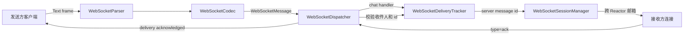
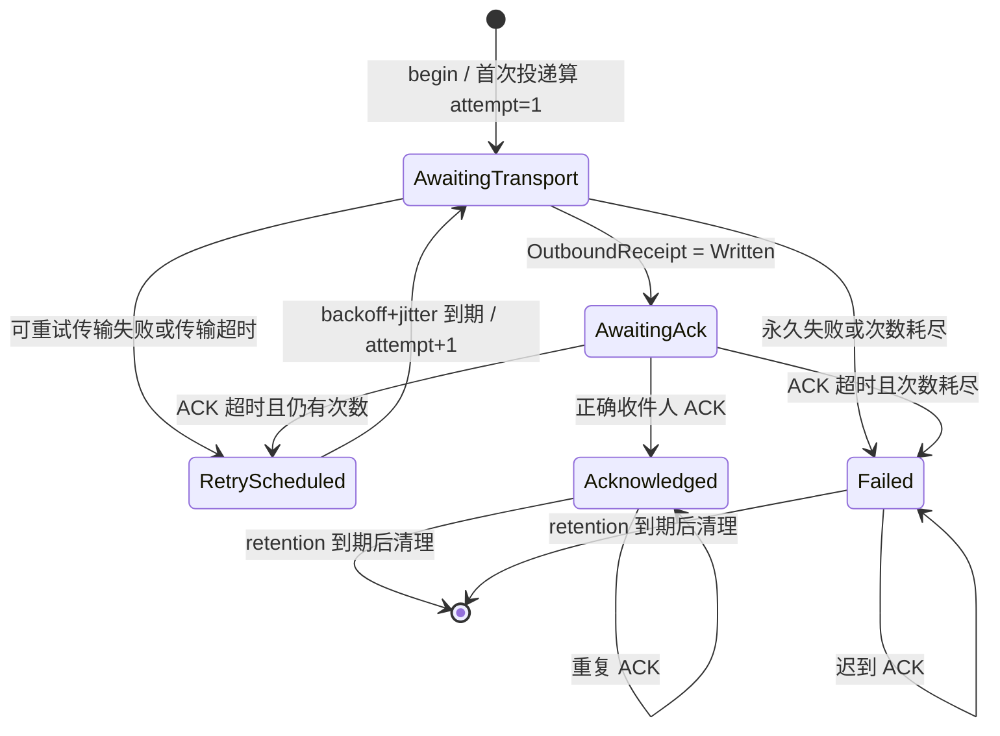

# 第十阶段：WebSocket 应用信封、ACK 与幂等窗口

> 本阶段解决“服务端怎样知道某一条业务消息被正确的接收者确认”。它建立可靠投递的状态核心；
> 后续的周期驱动、最终写回执与停机边界已在
> [`lesson11_websocket_retry_runtime.md`](lesson11_websocket_retry_runtime.md) 接入。

## 1. 本课学习目标

完成本课后，应能清楚区分三层“成功”：

1. `EnqueueResult::Ok`：目标 Reactor 的邮箱接单了。
2. `OutboundOutcome::Written`：字节已经由本机写入内核 socket。
3. `DeliveryAckStatus::Acknowledged`：指定接收者用应用消息明确确认了这封信。

可以把它们类比为寄挂号信：

- 邮局收件，对应 `EnqueueResult::Ok`；
- 邮车离开本地网点，对应 `Written`；
- 收件人签收，对应应用层 ACK。

前两步都不能证明收件人的业务代码已经处理消息。WebSocket 建在 TCP 上，TCP 保证有序字节流，
但不了解“订单”“聊天消息”或“已读”这些业务含义。

## 2. 新增的架构层



这里有两种容易混淆的“信封”：

- `WsFrame` 是运输箱，字段是 FIN、opcode、mask、payload，规则来自 RFC 6455。
- `WebSocketMessage` 是业务信封，字段是 type、id、replyTo、from、to、status、ack、content。

`WebSocketCodec::serializeApplicationMessage()` 只生成 JSON 业务信封；真正加 WebSocket 帧头仍由
`encodeText()` 完成。把这两步分开，可以避免把业务版本 `v=1` 误当成 WebSocket 协议版本。

## 3. 线上的消息格式

发送方先给请求一个客户端消息 ID：

```json
{"v":1,"type":"chat","id":"client-42","to":1002,"content":"hello"}
```

服务端登记后生成自己的 ID，并转发给接收方：

```json
{"v":1,"type":"chat","id":"ws-1001-boot7-1","from":1001,"to":1002,"attempt":1,"ack":true,"content":"hello"}
```

ID 格式为 `ws-发送者-服务实例ID-序号`。实例段防止服务重启后序号重新从 1 开始时与旧消息碰撞。

同时，发送方收到准入结果：

```json
{"v":1,"type":"delivery","id":"ws-1001-boot7-1","replyTo":"client-42","to":1001,"status":"accepted"}
```

接收方业务处理完后确认服务端 ID：

```json
{"v":1,"type":"ack","replyTo":"ws-1001-boot7-1"}
```

服务端验证 ACK 的连接身份后通知原发送方：

```json
{"v":1,"type":"delivery","id":"ws-1001-boot7-1","replyTo":"client-42","from":1002,"to":1001,"status":"acknowledged"}
```

### 字段职责

| 字段 | 谁产生 | 作用 |
|---|---|---|
| `v` | 双方 | 应用信封版本；当前只处理 1 |
| `type` | 双方 | Dispatcher 的业务路由键 |
| `id` | 当前消息的生产者 | 唯一标识当前消息 |
| `replyTo` | 回复者 | 指向被回复或被确认的消息 |
| `from` | 服务端 | 真实发送者；不信任客户端自行填写的值 |
| `to` | 发送方或服务端 | 目标用户 |
| `status` | 服务端 | accepted、acknowledged、failed 等结果 |
| `attempt` | 服务端 | 当前是第几次发送，用于诊断和拒绝旧回执 |
| `ack` | 服务端 | 接收方是否需要回应用 ACK |
| `content` | 发送方 | 业务正文 |

`id` 使用字符串。JavaScript 的普通 Number 只能精确表示到 `2^53-1`；若 C++ 的 64 位整数 ID
直接发给浏览器，数值可能被四舍五入，ACK 就会引用错误的消息。字符串省掉了这一类跨语言陷阱。

## 4. 投递状态机



`maxAttempts=3` 包含第一次发送，所以最多是“首次发送 + 两次重发”。这是常见的边界错误：
如果把首次发送排除在外，配置 3 最终会实际发送 4 次。

`collectDue(now)` 只修改状态并返回两组动作：

```cpp
struct DeliverySweep {
    std::vector<DeliveryRetry> retries;
    std::vector<DeliveryFailure> failures;
    std::size_t transportTimeouts;
    std::size_t ackTimeouts;
    std::size_t retriesScheduled;
};
```

它不访问 socket，也不调用 `SessionManager`。这相当于让“登记员只开任务单，邮递员负责送信”。
`WebSocketDeliveryService` 领取这些任务单并执行 I/O，从而避免 Tracker 在持锁期间跨 Reactor，
也方便用固定时间点做确定性测试。

## 5. 两张索引表为何同时存在

`WebSocketDeliveryTracker` 保存两张表：

```text
(sender, clientMessageId) ──> serverMessageId
serverMessageId ────────────> 完整 Record
```

第一张表回答“这个客户端请求以前见过吗”，第二张表回答“这次 ACK 对应哪一封服务端消息”。

去重键必须包含发送者：用户 1001 和用户 1002 都可以使用 `client-1`，二者不是同一个请求。
同一发送者再次提交相同 ID 时：

- 收件人与正文都相同：返回 `Duplicate`，不再次投递；
- 收件人或正文不同：返回 `Conflict`，说明客户端错误复用了 ID；
- 终态仍在保留期：直接返回 acknowledged 或 failed，帮助客户端恢复本地状态。

如果 ACK 只按 server ID 查表而不比较 `recipient`，另一个在线用户只要猜到 ID 就能伪造签收。
当前 `acknowledge(uid, serverId)` 会比较当前连接的真实 uid 与记录中的收件人，错误时返回
`WrongRecipient`，且原记录仍保持 `AwaitingAck`。

## 6. 线程边界

当前 WebSocket handler 在所属 SubReactor 线程中同步执行；它没有像 HTTP handler 那样投递到
Executor。因此 `chat` 和 `ack` handler 必须很短，不能做数据库查询、sleep 或复杂计算。

Tracker 由 `WebSocketDeliveryService` 持有并被多个 SubReactor 与重试线程访问，内部用一把 mutex
保护两张表。临界区只做校验、查表和状态修改，不做网络 I/O。锁释放后，Service 才通过
`WebSocketSessionManager` 把消息投递到目标 Reactor 邮箱。

这个选择适合当前教学规模，优点是规则集中、容易验证。在线用户和 ACK 吞吐很高时，一把全局锁会
成为争用点，可以按 sender 或 server ID 分片，但分片前应先用指标确认瓶颈。

## 7. JSON 入口的防线

当前 Codec 实现的是“扁平 JSON 应用协议”，支持：

- 标准字符串转义，如 `\"`、`\\`、`\n`；
- `\uXXXX` 与 surrogate pair 到 UTF-8 的转换；
- 字符串或数字形式的无符号整数；
- 布尔字段 `ack`；
- 对象前后的空白。

它会拒绝嵌套对象/数组、重复 key、截断对象、尾逗号与尾随垃圾。拒绝后消息降级为 `echo`，不会
写入投递登记簿。这个小解析器适合固定教学协议；若业务字段继续增长，应换成成熟 JSON 库和正式
schema 校验，避免不断扩充手写解析器。

## 8. 当前已完成与后续边界

已完成：

1. 应用信封序列化、转义解析和版本入口。
2. 客户端 ID 去重、ID 冲突检测、服务端 ID 分配。
3. ACK 归属校验、重复 ACK、迟到 ACK 与未知 ACK 分类。
4. 有界记录数、终态保留与清理。
5. 分离传输超时、ACK 超时与最大尝试次数下的重发/失败决策。
6. 原来的 `@uid:text` 无 ID 消息仍走 best-effort 兼容路径。
7. `WebSocketDeliveryService` 已接入周期线程、`OutboundReceipt`、自动重发和失败通知。
8. 后续阶段已加入指数退避、确定性抖动、投递指标和客户端幂等示例。

尚未完成：

1. Tracker 是内存状态，进程重启会丢失；它不适合直接承担支付或订单级持久可靠性。
2. 尚无进程级发送速率限制和按租户公平配额。
3. 内存接收端去重窗口不能跨客户端重启；强业务仍需数据库唯一键。
4. 指标尚无延迟直方图和外部持久化后端。

## 9. 与上传版 web-test6.1 的区别

上传版已经提供 Reactor、连接协程、HTTP 解析与响应发送，可理解为“公路和货车”。2.0 先增加了
WebSocket 帧、协议升级、会话目录、跨 Reactor 邮箱和统一 Writer；本阶段再增加“挂号信编号和
签收登记”。

| 能力 | 上传版 | 当前 2.0 |
|---|---|---|
| HTTP 请求/响应 | 有 | 有，并进入统一出站体系 |
| WebSocket 帧与升级 | 无独立 websocket 模块 | 有 |
| 跨用户主动推送 | 无 | SessionManager + Reactor 邮箱 |
| 业务消息 ID | 无 | client ID + server ID |
| ACK 与去重 | 无 | 已有内存状态机 |
| 自动超时重发 | 无 | 已接入 Runtime 生命周期与最终写回执 |

## 10. 适用场景、优点与代价

适合聊天私信、设备命令回执、可靠通知等“需要知道接收方是否处理”的消息。输入状态、在线人数、
心跳等允许丢失的信息继续走 best-effort 路径更合适。

优点：

- 能把邮箱准入、内核写入和业务确认分清楚；
- 客户端重试不会重复投递同一请求；
- 伪造 ACK 不能改变别人的投递状态；
- 状态机无 I/O，时间相关测试稳定。

代价：

- 每条待确认消息都占用内存；
- 全局 mutex 在高吞吐时可能争用；
- “至少一次投递 + 接收方幂等”仍不能凭空变成严格 exactly-once；
- 进程级可靠消息最终需要持久化日志、消息队列或数据库事务配合。

## 11. 本课代码阅读顺序

1. [`WebSocketMessage.h`](../../../server/websocket/WebSocketMessage/WebSocketMessage.h)：先看业务信封字段。
2. [`WebSocketCodec.cpp`](../../../server/websocket/WebSocketCodec/WebSocketCodec.cpp)：看扁平 JSON 的完整验证、提取与序列化。
3. [`WebSocketDeliveryTracker.h`](../../../server/websocket/WebSocketDelivery/WebSocketDeliveryTracker.h)：只看公开状态和动作。
4. [`WebSocketDeliveryTracker.cpp`](../../../server/websocket/WebSocketDelivery/WebSocketDeliveryTracker.cpp)：沿 `begin → acknowledge → collectDue → pruneTerminals` 阅读。
5. [`main.cpp`](../../../main.cpp)：看 chat/ack handler 如何把 Codec、Tracker 和 SessionManager 串起来。
6. [`unit_tests.cpp`](../../../tests/unit_tests.cpp)：用边界测试反推契约。
7. [`websocket_blackbox.py`](../../../tests/integration/websocket_blackbox.py)：看两个真实客户端怎样完成投递、ACK 和重复请求。

## 12. 理解检查

1. `accepted`、`Written`、`acknowledged` 分别证明了什么，不能证明什么？
2. 为什么去重键是 `(sender, clientMessageId)`，不能只用 clientMessageId？
3. 为什么 ACK 要引用服务端 ID，而发送方的回执还要保留 `replyTo=clientMessageId`？
4. `maxAttempts=3` 时总共会发送几次？
5. 为什么终态记录不能 ACK 后立刻删除？
6. 为什么 `collectDue()` 不应在持锁时直接调用 `SessionManager::sendText()`？
7. 当前 WebSocket handler 跑在哪个线程？在里面执行 `sleep(1)` 会影响谁？
8. 为什么 WebSocket/TCP 可靠仍不足以表示订单已经被业务处理？

周期驱动与最终写回执的完整讲解见
[`lesson11_websocket_retry_runtime.md`](lesson11_websocket_retry_runtime.md)。
