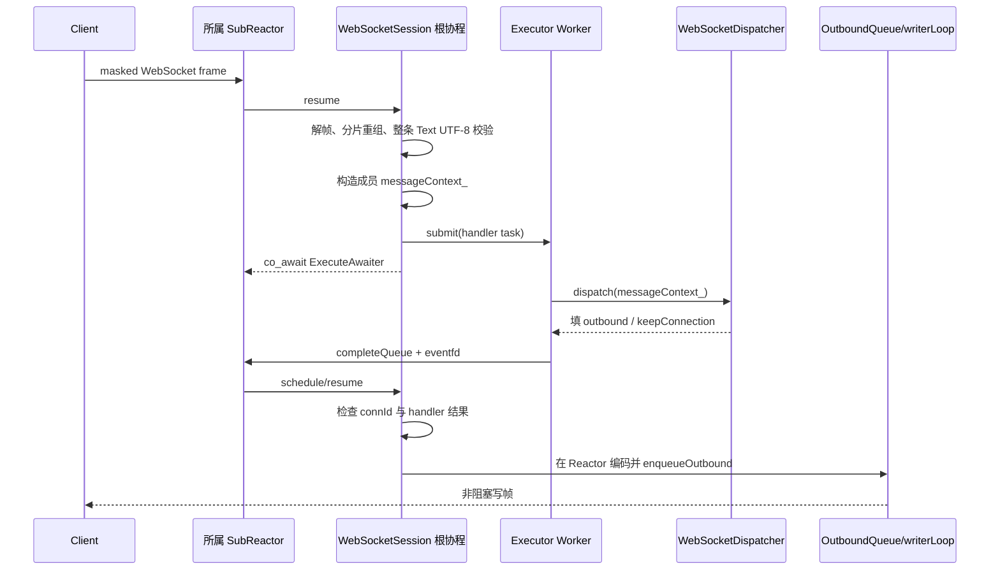

# 第十四阶段：WebSocket 业务线程边界与安全停机

> 本文记录第十四阶段完成时的结构。第十五阶段已把共享 Worker 池拆成 HTTP/WS 两条容量通道，
> 并加入协作式取消与 deadline；当前结构以
> [`lesson15_handler_cancellation_and_executor_isolation.md`](lesson15_handler_cancellation_and_executor_isolation.md) 为准。

## 1. 本阶段解决什么问题

此前 HTTP handler 已经交给共享 `Executor`，但 WebSocket handler 仍由所属 Reactor 同步调用。
这相当于让前厅经理一边接待整层客人，一边亲自做一道耗时一秒的菜：这一秒内，同一 Reactor 上的
Ping、Close、收帧和其它连接都无法前进。

本阶段完成两件互相依赖的升级：

1. WebSocket handler 移入共享 Worker 池，Reactor 只处理协议和 I/O；
2. Runtime 显式排空 Worker 后再销毁 Reactor，保证 Worker 的完成回调目标一直存活。

只做第一项会制造关闭期悬空指针；只做第二项则没有解决慢业务阻塞事件循环。两者共同组成完整的
线程与生命周期边界。

## 2. 改造后的完整消息链



可以把 `messageContext_` 看成一张跨窗口流转的工作单：前厅填写输入，后厨填写业务结果，前厅拿回后
才装盘发出。socket、解析器、Connection 表和出站队列都不跟着工作单去后厨。

## 3. 为什么必须拆成 start 和 finish

`WebSocketSession` 现在使用两个阶段：

```cpp
const auto result = startAppMessage(opcode, payload);
if (result == WsHandlerStartResult::Submitted) {
    co_await ExecuteAwaiter(reactor_, key_);
    if (!getConn()) co_return;
    if (!finishAppMessage()) co_return;
}
```

- `startAppMessage` 在 Reactor 线程解析业务消息、重置 Context、提交 Worker；
- Worker 只调用 Dispatcher 并填写 Context；
- `finishAppMessage` 恢复到 Reactor 后编码响应、入出站队列或开始 Close。

如果让 Worker 直接调用 `enqueueOutbound`，它可能同时访问只允许 Reactor 修改的连接状态；如果让
Worker 直接写 socket，还会绕过统一出站队列、背压、顺序和最终回执。两段式让业务和传输各回到
自己的所有者线程。

## 4. 为什么 Context 从栈变量变成 Session 成员

旧代码在一次同步函数调用里使用局部变量：

```cpp
WsMessageContext ctx;
dispatcher.dispatch(ctx);
```

提交 Worker 后，`startAppMessage` 会先返回并让协程挂起。局部变量若仍放在普通函数栈上，会在 Worker
使用期间已经销毁。现在 `messageContext_` 属于 Session；调度器持有 Session 的 `shared_ptr`，Worker
任务还额外捕获 `shared_ptr<WebSocketSession>`，因此工作单至少活到任务结束。

同一 Session 一次只提交一条消息，根协程必须等它完成才读下一条，所以无需给 Context 自身再加锁。
这是“跨连接并行、连接内串行”：不同用户可同时处理，同一用户的消息保持收到顺序。

## 5. Worker 与 Reactor 怎样安全交接结果

Worker 写完 `messageContext_` 后调用：

```text
notifyExecuteComplete
  → lock completeMtx
  → push(fd, connId)
  → unlock
  → write(eventfd)
```

Reactor 的 `processComplete` 会锁同一把 `completeMtx`，交换队列，再恢复协程。互斥锁的解锁与后续加锁
建立 happens-before：Reactor 恢复后能看见 Worker 对 Context 和结果标志的写入。`eventfd` 负责叫醒，
互斥队列同时负责传递身份和建立内存可见性。

Worker 可能快到在根协程执行 `co_await` 前就发出通知，但不会丢唤醒：完成队列只能由当前 Reactor
线程消费，而它此刻仍在运行这条协程；只有协程执行 `await_suspend`、登记 `EXECUTE` 状态并把控制权
还给事件循环后，Reactor 才可能处理该通知。

## 6. 为什么删除 `ctx.session`

旧 `WsMessageContext` 暴露 `WebSocketSession*`，项目业务并未使用它。handler 进入 Worker 后，这个指针
会诱导业务直接修改 `state_`、parser 或连接，破坏线程归属。

现在 Context 只保留 `uid` 和线程安全的 `manager` 投递入口。业务若要向另一用户发送消息，走：

```text
Manager → ReactorGroup::postOutbound → 目标 Reactor 邮箱 → eventfd → OutboundQueue
```

这是消息传递，而不是跨线程摸别人的 Connection。后续若需要更多来源信息，应增加不可变值字段，
而不是重新暴露 Session 裸指针。

## 7. Dispatcher 为什么增加 shared_mutex

多个 Session 会在多个 Worker 上并发查同一张 `type → handler` 表。静态注册完成后，容器的并发只读
本来可以工作；但公开的 `on/onDefault` 没有禁止运行期注册，读写同一个 `unordered_map` 会产生数据竞争。

当前策略是：

1. 注册时持独占锁；
2. dispatch 时持共享锁查表并复制命中的 `std::function`；
3. 释放锁后才调用 handler。

第三步很关键。任意业务代码可能很慢，甚至在内部注册新路由；若调用期间仍持锁，会让注册长期阻塞或
发生自锁。锁只保护“分机簿”，不保护 handler 捕获的业务对象。多个 Worker 同时调用同一个 handler 时，
其中的共享 map、计数器或数据库客户端仍需各自的线程安全设计。

## 8. 过载与异常怎样收敛

`startAppMessage` 有三种结果：

| 结果 | 含义 | Session 行为 |
|---|---|---|
| `Submitted` | Worker 已接单 | `co_await ExecuteAwaiter` |
| `Overloaded` | Executor 已停或队列已满 | 回 Close 1013，结束会话 |
| `Closed` | fd/connId 已失效 | 直接退出 |

handler 抛出的任意异常在 Worker 内捕获；Worker 仍然发送完成通知，Reactor 恢复后回 Close 1011。
这样既不会让异常逃出线程入口触发 `std::terminate`，也不会让根协程永远停在 `EXECUTE`。

1013 表示服务暂时无法处理、客户端可稍后重试；1011 表示服务端处理出现意外。二者分别表达容量问题
和业务故障，排障含义不同。

## 9. 为什么同一连接暂不并行 handler

假设同一客户端连续发送 `A=修改昵称`、`B=发送消息`。若 A、B 同时进入不同 Worker，B 可能先完成，
看到旧昵称；响应顺序也需要额外票据重排。

本阶段选择每连接最多一个在途 handler：

- 优点：天然保持业务顺序，Context 无并发写，资源上限清楚；
- 代价：某条连接的慢 handler 期间，该连接自己的 Ping/Close 和下一条消息也要等待；
- 系统级效果：其它连接和整个 Reactor 不再被它阻塞。

未来只有在业务明确允许乱序时，才值得加入“多在途任务 + 序号重排 + 每连接取消令牌”。

## 10. 安全停机的真实顺序

Worker 任务结束时会访问 `SubReactor*` 调 `notifyExecuteComplete`。C++ 成员默认逆序析构原先会先销毁
`reactorGroup_`，再析构 `executor_`；线程池析构才开始 drain，已经在途的 Worker 就可能回调悬空对象。

现在 Runtime 显式执行：

```text
1. stop DeliveryService + acceptor
2. stop + join Reactor threads       // 不再产生新业务任务
3. Executor::shutdown                // 拒绝新任务，做完已接任务并 join Worker
4. reactorGroup_.reset               // 最后销毁 Reactor、Session、协程帧、eventfd
```

第 2 步只是让 Reactor 线程停止运行，没有立刻销毁 Reactor 对象。第 3 步期间 Worker 的完成通知仍有
合法目标；跨线程发送发现 Reactor 已停止时返回 `Closed`。所有 Worker 退出后，第 4 步才拆掉回调目标。

`ThreadPool::shutdown` 是幂等的，并在 `stop` 后拒绝新任务，但会排空停止前已经进入 FIFO 的任务。
这条规则叫“停止生产者，排空消费者，最后销毁依赖”。它同样适用于数据库回调、设备控制队列和
ROS 执行器关闭。

## 11. 与上传版 web-test6.1 的关系

上传版已经建立 Reactor、协程等待和 HTTP 业务分离的基础；2.0 把这套思想扩展到长连接：WebSocket
协议状态仍归 Reactor/Session，业务 handler 与 HTTP 一样归共享 Executor，响应再通过统一出站系统
回到所属 Reactor。

这次升级的重点不在“多开几条线程”，而在每种状态只有一个合法所有者：

| 状态或动作 | 所有者 |
|---|---|
| socket、epoll、Connection、parser、Session state | 所属 Reactor |
| `WsMessageContext` 的业务处理阶段 | 当前 Worker（一次一个） |
| handler 路由表结构 | Dispatcher 锁 |
| handler 捕获的业务共享状态 | 业务代码自己的同步机制 |
| Worker 任务队列与 drain | Executor / ThreadPool |
| 整体销毁顺序 | ServerRuntime |

## 12. 适用场景、优点与限制

适合 handler 可能包含数据库访问、文件处理、RPC 或有限阻塞工作的 WebSocket 服务，例如聊天网关、
协作编辑、设备控制台和机器人遥测入口。

优点：

- 慢业务不再冻结所属 Reactor 上的其它连接；
- HTTP 与 WebSocket 共用同一容量边界和完成通知模型；
- 协议解析和 socket 操作仍保持单线程所有权；
- 过载、异常与停机都有明确终态。

限制：

- 阻塞 handler 仍会占用 Worker；大量慢任务会把共享池耗尽；
- 同一连接在 handler 期间不能及时处理自己的控制帧；
- HTTP 与 WebSocket 当前共享一个 FIFO，尚无优先级或租户配额；
- handler 捕获的外部对象不会因 Dispatcher 加锁而自动线程安全。

## 13. 验证与实践

自动验证包含：

1. 单元并发测试：四条线程 dispatch，同时另一线程重复注册同一 type；
2. Executor 生命周期测试：shutdown 排空已接任务，并拒绝关闭后的新任务；
3. 单 Reactor 黑盒测试：一条 WS 连接执行 2 秒慢 handler，另一条连接的快 handler 必须在 1 秒内返回；
4. 异常黑盒测试：抛异常的 handler 返回 Close 1011；
5. Linux 发布门禁：完整 GoogleTest、WebSocket blackbox 与 TSan。

实践一：画出 Worker 在连接关闭前完成、连接关闭后完成、Runtime 正常停机三种时序，并指出 Session
分别由谁保活。

实践二：在 handler 中错误地直接调用一个只允许 Reactor 线程访问的 Session 方法，说明可能与哪些
路径并发；再把它改为 `postOutbound` 风格的消息投递。

实践三：若要允许同一连接同时处理四条消息，请列出至少三项新增机制。提示：在途上限、顺序号、
取消、Context 隔离、响应重排。

理解检查：

1. 为什么 Worker 能写普通 `bool handlerFailed_`，Reactor 恢复后仍能安全看见，而不必把它改成 atomic？
2. 为什么 `ctx.session` 在同步实现中勉强可用，迁移到 Worker 后应删除？
3. 为什么 shutdown 不能先 `reactorGroup_.reset()` 再等待 Executor？
4. 为什么 Dispatcher 要复制 handler 后释放锁再调用？
5. “连接内串行、跨连接并行”解决了什么，又牺牲了什么？
