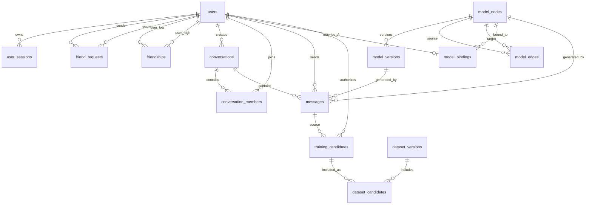

# Phase 11 PostgreSQL 表结构学习指南

这份文档对应当前唯一的数据库迁移
[001_phase11.sql](../../server/phase11/storage/postgres/migrations/001_phase11.sql)。它解释当前真实代码中的
16 张表（1 张迁移登记表和 15 张业务表），不把规划中的功能写成已经实现。

当前虚拟机的实际行数、AI 绑定和本地测试账号统一记录在同目录的
`phase11-app-data.local.md`。该文件包含测试密码并被 `.gitignore` 排除，只保留在本地与虚拟机，
不会随项目提交到公开仓库。

可以把整个数据库想成一座聊天园区：

- `users` 是人员花名册，`user_sessions` 是出入证；
- `friend_requests` 是申请单，`friendships` 是已经生效的双向关系；
- `conversations` 是房间，`conversation_members` 是房间名单；
- `messages` 是按房间编号保存的信件，`outbox_events` 是等待通知系统领取的发货单；
- `model_*` 是 AI 模型资产目录，`training_*` 和 `dataset_*` 是经过授权的数据加工区。

## 1. 总体关系



`outbox_events` 通过 `aggregate_type + aggregate_id` 指向业务对象，而不是数据库外键。这样一张表可以统一保存
消息、好友申请和会话邀请等不同事件。

## 2. 账号与登录

### `phase11_schema_migrations`：数据库版本登记簿

| 字段 | 含义 |
|---|---|
| `version` | 迁移版本号，当前为 `1` |
| `description` | 该版本做了什么 |
| `applied_at` | 迁移执行时间 |

它像数据库的“装修记录”。应用以后增加 `002_xxx.sql` 时，可以据此判断哪些改动已经执行，避免重复建表。

### `users`：用户花名册

| 关键字段 | 含义 |
|---|---|
| `id` | 数据库生成的用户主键，也是界面里使用的用户 ID |
| `username` | 唯一登录名，只允许小写字母、数字、下划线和连字符，长度 3–32 |
| `display_name` / `biography` | 展示名称和个人简介 |
| `password_hash` | Argon2id 密码散列，不保存明文密码 |
| `disabled` | 是否停用账号 |
| `ai_account` | 是否为 AI 特殊账号 |

注册主要写入这张表。`username` 的唯一约束是最后一道并发防线：两个人同时注册同名账号时，只能成功一个。

### `user_sessions`：登录出入证

| 关键字段 | 含义 |
|---|---|
| `id` | Session 标识 |
| `user_id` | 这张出入证属于哪个用户 |
| `token_hash` | Session Token 的带密钥 Hash；数据库泄漏时也不能直接冒充用户 |
| `csrf_hash` | 防止跨站请求伪造的校验值 |
| `expires_at` | 自动过期时间 |
| `revoked_at` | 主动退出或吊销时间；非空表示不能再使用 |

登录会创建 Session；退出登录不会删除历史记录，而是填写 `revoked_at`。这使安全审计比“直接删掉”更清楚。

## 3. 好友关系

### `friend_requests`：好友申请单

`sender_id` 是申请人，`receiver_id` 是接收人，`state` 只能是 `pending`、`accepted`、`rejected`。
`decided_at` 记录处理时间。

唯一索引会先用 `LEAST/GREATEST` 把 A→B 和 B→A 排成同一对用户，所以同一时间只能存在一张待处理申请，
可以挡住双方同时点击添加造成的重复数据。

### `friendships`：已经确认的双向好友关系

它没有保存“谁关注谁”，而是只保存较小的用户 ID `user_low_id` 和较大的 `user_high_id`。一行数据代表双方已经
是好友，因此读取时要检查当前用户出现在任意一列。

```text
用户 8 和用户 3 成为好友
        ↓ 统一排序
user_low_id=3, user_high_id=8
```

这种结构天然阻止 `(3,8)` 与 `(8,3)` 同时存在。

## 4. 会话与消息

### `conversations`：聊天房间

| 关键字段 | 含义 |
|---|---|
| `kind` | `direct` 私聊或 `group` 群聊 |
| `title` | 群名称；私聊可以由成员资料生成显示名称 |
| `created_by` | 创建者 |
| `next_sequence` | 下一条消息应使用的房间内序号 |
| `direct_pair_key` | 私聊双方的规范化组合，保证同一对用户只有一个私聊 |

`next_sequence` 像房间自己的取号机。每个会话独立从 1 递增，客户端断线重连时可以说“给我序号 27 之后的消息”。

### `conversation_members`：房间名单与阅读进度

这是用户与会话之间的多对多连接表：一个用户可以加入多个会话，一个会话也可以有多个用户。

| 关键字段 | 含义 |
|---|---|
| `role` | `owner` 创建者或普通 `member` |
| `last_delivered_sequence` | 服务端确认已经投递到该用户的最大序号 |
| `last_read_sequence` | 用户确认已经读到的最大序号 |
| `joined_at` | 加入时间 |

两个游标像书签。`last_read_sequence <= last_delivered_sequence` 的约束防止出现“已经读到 20，但其实只投递到 10”的
不可能状态。

### `messages`：持久化消息正文

| 关键字段 | 含义 |
|---|---|
| `conversation_id + conversation_seq` | 一条消息在会话中的稳定位置 |
| `sender_id` | 发送人 |
| `client_message_id` | 浏览器生成的幂等 ID，重试不会重复写入 |
| `body` | 1–16384 字节的文字正文 |
| `model_node_id / model_version_id / adapter_name` | AI 回复的模型来源；普通消息为空 |

消息先写 PostgreSQL，所以接收人不在线也不影响发送。对方再次登录后，服务端依据会话序号恢复漏掉的消息。

`messages_body_search_idx` 是全文检索索引。当前使用 PostgreSQL `simple` 分词配置，适合教学和基础搜索；它不是完整的
中文分词系统，复杂中文搜索以后可接专用分词或搜索引擎。

### `outbox_events`：可靠通知发货单

写消息时，`messages` 和 `outbox_events` 在同一事务内提交：

```text
消息入库 + 生成待推送事件
            ↓ 同一事务成功
Outbox Dispatcher 领取事件
            ↓
WebSocket / SSE 推送
            ↓
published_at 标记完成
```

如果进程在消息落库后、推送前崩溃，`published_at IS NULL` 的事件仍在，恢复后可以继续处理。这解决了“数据库写成功，
实时推送却丢了”的双写问题。投递语义是至少一次，接收端仍需按事件或消息 ID 去重。

## 5. AI 模型注册

### `model_nodes`：逻辑模型节点

表示“星云助手”“代码助手”这类稳定身份。`kind` 为根模型 `root` 或专业模型 `specialist`，
`active_version_id` 指向当前启用版本。

### `model_versions`：可以部署的具体版本

同一个节点可以有多个版本。`runtime` 决定交给 `ollama`、`onnx-inprocess` 或 `onnx-grpc` Provider；
`model_artifact`、`adapter_artifact` 描述模型和 Adapter，`checksum` 校验内容，`state` 管理候选、启用、退役和拒绝状态。

### `model_edges`：模型关系图

保存父模型控制子模型 `parent_controls_child`，或同级模型协作 `peer_collaborates`。当前只搭建关系和约束，
没有实现根模型自动调度整棵模型树。

### `model_bindings`：AI 账号与模型绑定

`ai_user_id` 必须来自 `users`，`model_node_id` 指向模型节点。业务收到对某个 AI 账号的生成请求后，通过这张表找到模型，
再读取它的激活版本和运行时。

## 6. 授权训练数据

### `training_candidates`：训练候选样本

它不是“所有聊天自动拿去训练”。只有用户明确授权的消息，经过脱敏后才能形成候选项。字段记录数据所有者、来源消息、
脱敏后的提示与回答、同意协议版本以及审核状态。

状态依次可能是：

```text
submitted → approved → exported
          ↘ rejected
任意允许的阶段 → revoked
```

### `dataset_versions`：不可混淆的数据集版本

保存数据集名称、校验和和创建时间。校验和用于确认训练时使用的内容与审核通过的内容完全一致。

### `dataset_candidates`：数据集内容清单

连接数据集版本与候选样本。一份候选样本可以进入不同实验数据集，一个数据集也可以包含多份样本，因此使用多对多表。

## 7. 四条主要业务写入路径

### 注册和登录

```text
注册 → users
登录 → 读取 users → 新增 user_sessions
退出 → user_sessions.revoked_at
```

### 添加好友

```text
发送申请 → friend_requests + outbox_events
接受申请 → friend_requests.state=accepted
         → friendships
         → outbox_events
```

### 创建会话

```text
创建房间 → conversations
加入人员 → conversation_members
邀请通知 → outbox_events
```

### 发送离线消息

```text
锁定 conversations.next_sequence
          ↓
写入 messages
          ↓ 同一事务
写入 outbox_events
          ↓
在线成员立即收到；离线成员以后按 sequence 恢复
```

## 8. 在 Navicat 中建议先看的内容

先注册两个测试账号，再按下面顺序观察：

1. 打开 `users`，确认账号生成了不同的 `id`，密码列只有 Hash。
2. 登录后打开 `user_sessions`，比较 `expires_at` 和 `revoked_at`。
3. 发送并接受好友申请，观察 `friend_requests` 与 `friendships` 的变化。
4. 创建私聊，观察一行 `conversations` 和两行 `conversation_members`。
5. 让接收者离线后发送消息，确认 `messages` 仍然新增。
6. 查看 `outbox_events.published_at`，理解落库和实时通知是两个阶段。

只读查询示例：

```sql
SELECT id, username, display_name, ai_account, created_at
FROM users
ORDER BY id;

SELECT conversation_id, conversation_seq, sender_id, body, created_at
FROM messages
ORDER BY conversation_id, conversation_seq;

SELECT id, event_type, aggregate_type, aggregate_id,
       published_at IS NOT NULL AS published
FROM outbox_events
ORDER BY id DESC;
```

学习时优先执行 `SELECT`。直接在 Navicat 修改游标、序号、Session Hash 或模型激活版本，可能绕开业务层约束，制造
应用正常操作不会产生的状态。

## 9. 代码索引

| 内容 | 文件 |
|---|---|
| 表、约束和索引 | [001_phase11.sql](../../server/phase11/storage/postgres/migrations/001_phase11.sql) |
| PostgreSQL Repository | [PostgresStore.cpp](../../server/phase11/storage/postgres/PostgresStore/PostgresStore.cpp) |
| 连接池 | [PostgresConnectionPool.cpp](../../server/phase11/storage/postgres/PostgresConnectionPool/PostgresConnectionPool.cpp) |
| Repository 业务接口 | [Ports.h](../../server/phase11/ports/Ports/Ports.h) |
| 数据库契约测试 | [postgres_contract.cpp](../../tests/phase11/unit/postgres_contract.cpp) |
| 迁移脚本 | [postgres-migrate.sh](../../scripts/phase11/postgres-migrate.sh) |
