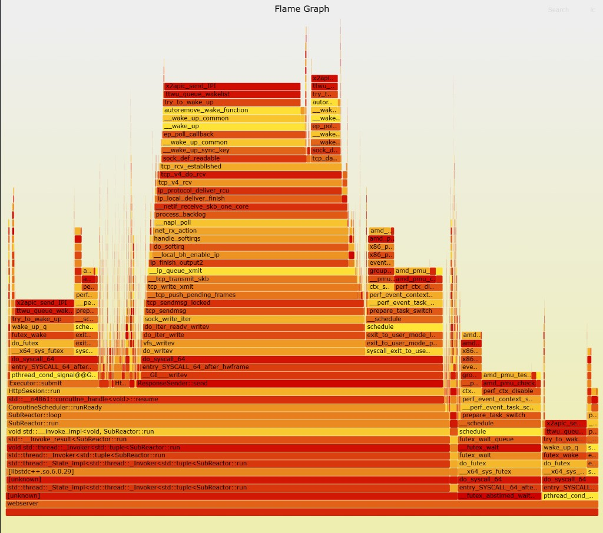

# 火焰图：生成命令流 + 读图教学 + 本机实战解读

> **位置**：测试学习综合讲义 · 火焰图实战篇（配套 [09_火焰图.md](09_火焰图.md)）  
> **样本**：下方为本仓库 `webserver` 在压测窗口采集的一张 **CPU on-CPU 火焰图**。  
> **目标**：会生成、会读图、能把图和第三阶段架构（SubReactor / 协程 / Executor / ResponseSender）对上号。

---

## 我对火焰图的理解（笔记）

> **火焰图 = 把 CPU 采样统计画成图；横向越宽越吃 CPU；用来回答「慢在哪个函数调用栈」。**

---

## 一、先看这张图（本机样本）



**这张图在证明什么（架构层面，先建立信心）：**

从下往上能清楚认出你的第三阶段栈：

```text
webserver
  → SubReactor::run / SubReactor::loop
  → CoroutineScheduler::runReady
  → coroutine_handle::resume
  → HttpSession::run
  → ResponseSender::send  或  Executor::submit
```

说明采样窗口里服务器确实在按设计跑：**Reactor 线程 + 协程调度 + Session + 发送/提交执行**，不是「空转或完全卡死在未知符号」。

---

## 二、怎么读火焰图（通用教学）

### 2.1 坐标含义（必须钉死）

| 方向 | 含义 | 常见误解 |
|------|------|----------|
| **横向宽度** | 该函数（及其子调用）在采样中出现的比例 ≈ **CPU 时间占比** | 宽 = 热，不是「先执行」 |
| **纵向高度** | **调用栈深度**（谁调用谁） | 高 ≠ 更慢，只是调用链更长 |
| **左右顺序** | 通常按名字排序/折叠排列 | **不是时间轴**，左边不是「较早」 |

颜色（经典 FlameGraph）：多为区分相邻框，**颜色本身一般不表示冷热**；冷热看**宽度**。

### 2.2 读图三步法

```text
① 从最底下找进程/线程入口（webserver / std::thread）
② 往上看「最宽的几座塔」——那是 CPU 大户
③ 分清：用户态业务符号 vs 内核网络/调度符号 vs 锁/futex
```

### 2.3 三种「宽」的不同含义

| 你看到 | 可能含义 |
|--------|----------|
| 用户态某函数自己很宽，上面孩子不多 | 该函数本体在算（解析、拷贝、日志） |
| 用户态框不算特别宽，但上面内核 `tcp_*` / `vfs_*` 很宽 | **IO / 系统调用路径**在吃 CPU（发得多、收得多） |
| `futex` / `pthread_cond_*` / `try_to_wake_up` 很宽 | **同步与唤醒**开销大（锁竞争、频繁 submit/唤醒） |

### 2.4 on-CPU vs off-CPU（别混）

- **本图这类 CPU 火焰图（perf record）**：主要反映 **正在跑在 CPU 上** 的栈。  
- 若线程大量在 `epoll_wait` / `futex_wait` **睡觉**，on-CPU 图里可能看不出「等」——那要用 off-CPU 火焰图。  
- 所以：on-CPU 宽 ≠ 一定是算法慢；也可能是「网络栈/软中断也在占采样」。

---

## 三、对本张图的具体解读

### 3.1 主路径 A：发送响应（用户态 → 内核发送）

可见链条（示意）：

```text
HttpSession::run
  → ResponseSender::send
  → do_writev / vfs_writev
  → tcp_sendmsg → tcp_write_xmit → ip_queue_xmit …
```

**人话：**  
压测时大量时间花在「把响应写进 TCP」。这很符合 HTTP 服务器在 Keep-Alive 高 QPS 下的画像：  
业务逻辑相对薄，**字节出站 + 内核协议栈**占大头。

**优化时先问：**

- 是不是小包太碎、syscall 太频繁？  
- 静态文件是否走了 `sendfile`？  
- Buffer / writev 是否可合并？  

不要一上来就怪「Parser 慢」——这张图里发送塔更显眼。

### 3.2 主路径 B：收包与 epoll 唤醒（内核收包塔）

可见链条（示意）：

```text
net_rx_action / __napi_poll / softirq
  → tcp_v4_rcv / tcp_rcv_established
  → sock_def_readable / ep_poll_callback
  → 唤醒用户态 Reactor
```

**人话：**  
这是 Reactor 的「心跳」：网卡收包 → TCP 处理 → epoll 通知可读 → 你的 `SubReactor::loop` 继续跑。  
宽，说明采样窗口里**收发很忙**，符合 wrk 压测，不一定是 Bug。

### 3.3 路径 C：Executor 提交与 futex 同步

可见：

```text
HttpSession::run → Executor::submit
pthread_cond_signal / futex_wake / futex_wait / try_to_wake_up
```

**人话：**  
协程把业务丢给线程池时，会有条件变量/ futex 唤醒 Worker。  
若这座塔**相对业务逻辑异常地宽**，才需要怀疑：提交太碎、锁竞争、worker 过少导致频繁睡醒。

结合你的架构：`/slow` 应在 Worker 睡，Reactor 仍应在 loop——火焰图若几乎全是 futex 而几乎没有 `SubReactor::loop`，才更像「全员在等锁」。本图仍能看到清晰的 Reactor/Session 塔，更像**正常高负载下的同步开销 + IO**。

### 3.4 对本张图的总体结论（可写进笔记）

| 结论 | 说明 |
|------|------|
| 架构可见 | SubReactor + 协程 resume + HttpSession + ResponseSender/Executor 栈完整 |
| 主要 CPU 画像 | **网络收发 / 内核协议栈 + 写路径**，不是「纯用户态 Parser 独占」 |
| 同步开销存在 | futex / cond_signal 可见，属 Executor 模型常态；是否成瓶颈要对比优化前后宽度 |
| 下一步 | 若要优化：优先对照 Benchmark 基线；针对发送合并/`sendfile`/减少无效唤醒做 A/B；Parser 热点需另看是否出现更宽的 `HttpParser` 框 |

**一句话：**  
这是一张「高并发 HTTP 服务在忙着收发包」的健康偏 IO 型火焰图，并成功验证了你的异步运行时调用链。

---

## 四、生成火焰图的命令流（教学用完整版）

> 与 [../../../performance/BENCHMARK.md](../../../performance/BENCHMARK.md) 一致；下面按「从零到 SVG」逐步写清。

### 4.0 前置条件

```bash
# 工具
sudo apt install linux-tools-common linux-tools-generic   # 或 CentOS: perf
# FlameGraph 脚本（示例放到家目录）
git clone https://github.com/brendangregg/FlameGraph.git ~/FlameGraph

# 二进制要有符号，否则全是 ?? / unknown
cmake -S . -B build-profile \
  -DCMAKE_BUILD_TYPE=RelWithDebInfo \
  -DBUILD_TESTING=OFF \
  -DCMAKE_CXX_FLAGS_RELWITHDEBINFO="-O2 -g -fno-omit-frame-pointer"
cmake --build build-profile --parallel
```

`-fno-omit-frame-pointer`：让 `perf -g` 更容易拆出完整用户态栈。

### 4.1 启动服务器并确认 PID

```bash
./build-profile/webserver &
# 或你的 Release 路径
SERVER_PID=$(pgrep -n webserver)
echo "SERVER_PID=$SERVER_PID"
```

### 4.2 另开终端制造稳定负载（与采样重叠）

```bash
wrk -t4 -c100 -d60s --latency http://127.0.0.1:8080/
```

采样窗口应落在 wrk **稳态段**（不要只采启动前几秒）。

### 4.3 采样（核心）

```bash
# -F 99 或 199：每秒采样次数；-g：记调用栈；-p：指定进程
sudo perf record -F 199 -g -p "${SERVER_PID}" -- sleep 30
```

生成当前目录下的 `perf.data`。

### 4.4 导出文本栈 → 折叠 → SVG

**分步（便于排查）：**

```bash
sudo perf script > out.perf
~/FlameGraph/stackcollapse-perf.pl out.perf > out.folded
~/FlameGraph/flamegraph.pl --title "webserver CPU" out.folded > cpu-flamegraph.svg
```

**一行管道（本仓脚本习惯）：**

```bash
sudo perf script \
  | ~/FlameGraph/stackcollapse-perf.pl \
  | ~/FlameGraph/flamegraph.pl --title "webserver CPU" \
  > cpu-flamegraph.svg
```

浏览器打开 `cpu-flamegraph.svg`。可点击框放大、搜索函数名。

### 4.5 快速文本热点（可选，不必出图）

```bash
sudo perf report -g --stdio | less
# 或采样中： sudo perf top -p "${SERVER_PID}"
```

### 4.6 常见翻车与处理

| 现象 | 处理 |
|------|------|
| 全是 `[unknown]` | RelWithDebInfo + frame pointer；确认没 strip |
| `perf` 权限不足 | `sudo`；或调 `/proc/sys/kernel/perf_event_paranoid` |
| 栈只有内核没有 `HttpSession` | 用户态符号没解析到；检查 binary 与正在跑的是否同一份 |
| 图很「碎」、看不出主塔 | 加大 `-d` 压测与 `sleep` 采样时间；提高 `-F` |
| 想看「在等什么」 | on-CPU 不够 → 做 off-CPU（见 BENCHMARK.md） |

### 4.7 和本仓脚本的关系

`scripts` / `gen_report` 文档中有类似：

```bash
sudo perf record -F 199 -g -p $(pgrep -n webserver) -- sleep 30
sudo perf script | ~/FlameGraph/stackcollapse-perf.pl | ~/FlameGraph/flamegraph.pl > cpu-flamegraph.svg
```

讲义命令流与之一致；正式可复现实验规范以 [BENCHMARK.md](../../../performance/BENCHMARK.md) 为准。

---

## 五、读图练习清单（对着本图做一遍）

1. 找出最底部的 `webserver` / 线程入口。  
2. 指出 `SubReactor::loop` 有多宽——Reactor 是否在忙。  
3. 找到 `coroutine_handle::resume` → `HttpSession::run`——协程是否在跑业务。  
4. 比较 `ResponseSender::send` 塔 vs `Executor::submit`/futex 塔——谁更宽？  
5. 指出一块纯内核 `tcp_*` / `napi`——说明压测时网络栈也在占 CPU。  
6. 用一句话写下：**当前更像 CPU 算爆了，还是 IO/系统调用路径忙？**（对本图：偏后者。）

---

## 六、和测试闭环怎么接

```text
Benchmark 发现 P99/QPS 不对
  → Metrics/top 看 CPU 是否打满
  → 本命令流采火焰图
  → 按「宽塔」定优化点
  → 只改一个变量
  → 再 Benchmark 对比基线
```

相关讲义：

- 概念篇：[09_火焰图.md](09_火焰图.md)  
- 压测篇：[04_Benchmark压测.md](04_Benchmark压测.md)  
- 实验协议：[../../../performance/BENCHMARK.md](../../../performance/BENCHMARK.md)
