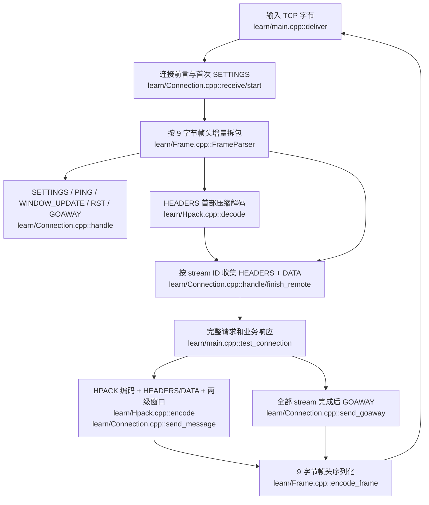

# HTTP/2 阶段总览：从 test7.0 到 test8.0

`test8.0` 在 GitHub [`test7.0`](https://github.com/aurora-deng/web/tree/test7.0)（SSE 版，提交 `067d34c`）上加入了**服务器进程内部的 HTTP/2**。本篇主要讲 Phase 6 的明文 **h2c prior knowledge**：客户端一连上来就发送 HTTP/2 前言，不经过 Caddy。生产协议栈由 nghttp2 处理二进制帧、HPACK、流状态与流量控制，项目代码负责把完成的 stream 接入现有 Reactor、Router、Executor 和统一出站队列。随后 Phase 7 增加了独立的 TLS/ALPN 入口，见 [`phase7.md`](../../docs/architecture/phase7.md)。独立手搓 HTTP/2 教学版位于 [`learn/README.md`](learn/README.md)，不参与生产构建。

## 1. 概念先建立

HTTP/1.1 与 HTTP/2 的 GET、POST、状态码等业务语义仍是 HTTP；变化很大的是**线上如何传**。把一条 TCP 连接想成一条公路，HTTP/1.1 在本项目中是一辆车走完再处理下一辆；HTTP/2 给不同请求贴 stream 编号，让多个请求的帧交错行驶。它减少应用层逐请求等待，但**同一 TCP 丢包仍会拖住该连接上的所有 stream**。规范见 [RFC 9113](https://www.rfc-editor.org/rfc/rfc9113.html)。

| 名词 | 用大白话理解 | 本项目对应 |
|---|---|---|
| h2 / h2c | 前者经 TLS/ALPN 协商；后者是明文 HTTP/2 | Phase 6 的明文端口为 h2c prior knowledge；Phase 7 的可选 TLS 端口使用 ALPN `h2` |
| client connection preface | 客户端先报“接下来按 HTTP/2 讲话”的固定 24 字节 | `Http2Preface.h` + `HttpSession.cpp`；nghttp2 再消费前言 |
| frame（帧） | 带类型和 stream 编号的小包；固定 9 字节帧头 + payload | nghttp2 生产解析；教学版 `learn/Frame.cpp` |
| stream（流） | 一条连接里的一个双向请求/响应通道；客户端新建流通常用奇数 ID | `Http2Session` 为每个完成的 stream 建独立 Job |
| HEADERS / DATA | 首部块 / 消息体；一个请求可由多个帧组成 | `Http2Codec` 回调收集，END_STREAM 后分发 |
| HPACK | 压缩 HTTP 首部的二进制格式 | 生产版 nghttp2；教学版 `learn/Hpack.cpp` |
| 静态表 / 动态表 | 预设常见首部目录 / 每条连接运行时记住的首部目录；索引相当于目录编号 | 动态表是连接方向上的状态，不属于单个 stream |
| Huffman | HPACK 中对字符串进一步按码表压缩的可选编码 | nghttp2 支持；教学版故意不实现 |
| SETTINGS / ACK | 连接双方通告参数及确认 | `Http2Codec` 提交 SETTINGS；教学版有收发和 ACK |
| END_HEADERS / END_STREAM | 本次首部块结束 / 该方向的消息结束 | 不可混淆；POST 可能 HEADERS 后仍有 DATA |
| WINDOW_UPDATE | 告诉对方“又有多少接收额度” | nghttp2 管理生产窗口；教学版显示两级额度 |
| RST_STREAM / GOAWAY | 取消一条 stream / 准备结束整条连接 | nghttp2 处理；业务需尊重 stream 取消 |

### 帧长什么样

```text
0                   2 3       4       8
+---------------------+--------+-------+-------------------+
| Length (24 bits)    | Type   | Flags | Stream ID (31bit) |
+---------------------+--------+-------+-------------------+
| Payload (Length 字节)                                  ... |
+-----------------------------------------------------------+
```

`HEADERS` 的 payload 不是 HTTP/1.1 文本首部行，而是 HPACK 编码的字段块；`DATA` 的 payload 才是消息体的一段。实际 HEADERS 可通过 CONTINUATION 跨帧，教学版为了看清主干暂不实现。完整格式以 [RFC 9113 第 4～6 节](https://www.rfc-editor.org/rfc/rfc9113.html) 和 [HPACK RFC 7541](https://www.rfc-editor.org/rfc/rfc7541.html) 为准。

## 2. 和上一版 test7.0 对比

| 维度 | test7.0（SSE 已接入） | test8.0（加入 HTTP/2 与 TLS/ALPN） |
|---|---|---|
| 入口 | HTTP/1.1 请求进入 `HttpSession`，可交接 WS/SSE | 同一明文端口先识别 HTTP/2 前言；匹配则交 `Http2Session`，否则沿原路径 |
| 并发单位 | HTTP/1.1 会话处理请求；WS/SSE 各占一条长连接 | HTTP/2 **每连接一个 Session、每 stream 一个业务 Job** |
| 线上格式 | HTTP/1.1 文本首部，SSE 事件经 HTTP chunk 发送 | HTTP/2 二进制帧 + HPACK；不能直接复用 chunk/101 字节 |
| 编解码 | 项目内 HTTP/WS/SSE 自写模块 | HTTP/2 标准细节交 nghttp2，项目写适配器 |
| 出站 | `OutboundTask` → 唯一 writer | 相同出站链路，先由 nghttp2 产出 HTTP/2 字节 |
| SSE/WS | 在 HTTP/1.1 可用 | HTTP/1.1 上保留；HTTP/2 stream 上对应路由目前回 501 |
| 验证状态 | SSE 编码及部分单元验证，Linux 黑盒待虚拟机 | nghttp2 编解码独立往返通过；完整服务 Linux 网络验收待虚拟机 |
| HTTPS | 无 | 独立可选 TLS 端口，ALPN 选择 `h2` 或 `http/1.1`，详见 Phase 7 |

当前 HTTP/2 限定普通有界请求/响应：请求体和响应体各最多 1 MiB，请求首部累计最多 16 KiB，向客户端宣告最多 32 个并发 stream。Phase 7 已接入 TLS/ALPN；仍未接 h2c Upgrade、HTTP/2 上 SSE 长流和 [RFC 8441 Extended CONNECT WebSocket](https://www.rfc-editor.org/rfc/rfc8441.html)；大文件 `sendfile` 和 HTTP/1.1 chunked 响应不能原样搬到 DATA 帧，相关路径暂回 501。出站积压仍受 4 MiB 水位约束。更细的架构说明见 [`../../docs/architecture/phase6.md`](../../docs/architecture/phase6.md)。

## 3. 生产版如何用 nghttp2

`nghttp2` 是实际已使用的第三方 HTTP/2 协议库；头文件为 `<nghttp2/nghttp2.h>`。它不是“仅一个头文件”：Linux 上需要开发包的头文件和链接库。项目的 `CMakeLists.txt` 通过 `find_path` / `find_library` 查找它，并把库链接到 `webserver_core`。官方 [Programmers' Guide](https://nghttp2.org/documentation/programmers-guide.html) 可和下面代码对读。

1. **每条 TCP 连接创建一个 `nghttp2_session`**：[`Http2Codec.cpp`](Http2Codec.cpp) 构造函数创建 callbacks，注册 `onBeginHeaders`、`onHeader`、`onData`、`onFrame`、`onClose`，然后调用 `nghttp2_session_server_new()` 和 `nghttp2_submit_settings()`。这份 session 要由所属 Reactor 线程独占访问，因为 HPACK 和 stream 状态都在里面。
2. **喂入收到的字节**：`HttpSession` 用 [`Http2Preface.h`](Http2Preface.h) 判断前言并交接；`Http2Session::run()` 把完整读到的字节交 `Http2Codec::receive()`，里面调用 `nghttp2_session_mem_recv()`。nghttp2 再按帧边界、HPACK 和 stream 规则触发回调。`onFrame` 看到 END_STREAM 后才把完整请求放进 `ready_`。
3. **让旧业务继续工作**：[`Http2Session.cpp`](Http2Session.cpp) 从 `takeReady()` 取 stream ID、方法、路径、首部和请求体，建 `RequestContext`/Job，交给现有 HTTP Executor。Worker 完成后以 `fd + connId + streamId` 找回所属连接及 stream；`connId` 防 fd 被复用，`streamId` 区分同连接的不同请求。
4. **提交响应**：`Http2Codec::submitResponse()` 整理 `:status` 和小写首部；调用 `nghttp2_submit_response()`，有 body 时提供 `nghttp2_data_provider` 的读取回调。连接级的 `Connection`、`Transfer-Encoding` 等首部不能塞入 HTTP/2。
5. **取出待发送字节**：`Http2Codec::drainOutput()` 循环调用 `nghttp2_session_mem_send()`。返回的指针由 nghttp2 管理、只在下一次调用前有效，故立即复制到项目的 `OutboundTask`，交给唯一 writerLoop。stream 关闭回调清理缓存；会话析构调用 `nghttp2_session_del()`。

一条关键边界：**nghttp2 管协议状态，项目管业务与线程调度**。不要让 Worker 直接调用同一 `nghttp2_session`，也不要把 nghttp2 的临时输出指针长期保存。

把上述步骤压缩成 API 路线，就是 `callbacks_new` → `set_on_*_callback` → `session_server_new` → `submit_settings` → 反复 `session_mem_recv`/处理完成的 stream → `submit_response` → 反复 `session_mem_send`/复制到出站队列 → `session_del`。`submit_response` 的 body 回调持有的对象必须活到 nghttp2 读完该 stream，不能指向 handler 栈上的临时字符串；本项目的 `outgoing_` 映射负责这个生命周期。具体调用顺序和错误返回检查可直接对读 [`Http2Codec.cpp`](Http2Codec.cpp)。

## 4. 如果手搓，完整主干怎样分层

下图每个节点都标有教学实现的真实文件索引；图后再给出生产版的对应入口。手搓版明确是教学子集；达到 nghttp2 的标准覆盖度还需要补上 `learn/README.md` 列出的所有缺口。



生产路径的对应关系为：`HttpSession.cpp`/`Http2Preface.h`（前言）→ `Http2Codec.cpp`/nghttp2（帧、HPACK、SETTINGS、stream、窗口）→ `Http2Session.cpp`（请求、Job）→ `Http2Codec.cpp`（响应编码）→ `OutboundTask`/`TransportWriter`（写 socket）。教学版的 `learn/Connection.cpp` 把多项协议状态集中到一个类，是为了跟着一条数据走；生产版把协议库和业务会话分离，才能少写高风险的标准边界代码。

| 选择 | 得到什么 | 自己还必须负责什么 |
|---|---|---|
| nghttp2 + 项目适配器 | 较完整的帧、HPACK（含 Huffman）、流状态、SETTINGS、窗口等协议机制；适合产品路径 | 前言交接、路由、任务调度、缓冲与出站背压、业务超时及测试 |
| 手搓教学子集 | 每一字节和状态变化都可见，便于理解“为什么需要这些层” | 协议全覆盖、恶意输入防护、互操作、性能与长期安全维护；本目录不承担这些目标 |

## 5. 项目依赖/封装清单：实际使用与可选项分开看

扫描范围是本项目根 `CMakeLists.txt` 与生产代码的 include；测试专用的 GTest/Python 不计入。**实际引入的第三方协议库只有 nghttp2**。不要把项目自己的 `.h`、C++ 标准库头或 Linux 内核接口误认成“生产验证的第三方库”。

工作区同级的 `nghttp2-1.70.0` 源码目录用于本机独立编译验证；它不在本项目构建清单内，也不是随本项目一同打包的 vendored 代码。

| 类别 | 当前项目中的头文件/入口 | 来源与作用 |
|---|---|---|
| 第三方 HTTP/2 协议库 | `<nghttp2/nghttp2.h>`；[`Http2Codec.h`](Http2Codec.h) | **已使用** nghttp2；帧、HPACK、stream/流控。需要链接 `libnghttp2` |
| TLS/ALPN 库 | `<openssl/ssl.h>`；[`../tls/TlsContext.h`](../tls/TlsContext.h) | **已使用** OpenSSL；TLS 握手、ALPN 与加密读写，见 Phase 7 |
| 线程链接目标 | `Threads::Threads`（根 `CMakeLists.txt`） | CMake 抽象出的系统线程支持，不是新的 HTTP 协议库 |
| Linux 系统接口 | `<sys/epoll.h>`、`<sys/eventfd.h>`、`<sys/socket.h>`、`<sys/sendfile.h>`、`<sys/mman.h>`、`<sys/uio.h>`、`<netinet/in.h>` 等 | 操作系统 API；负责事件、通知、socket、文件发送，非第三方协议解析 |
| 项目自写 HTTP/1 | [`../http/HttpParser/HttpParser.h`](../http/HttpParser/HttpParser.h)、[`../http/HttpCodec/HttpCodec.h`](../http/HttpCodec/HttpCodec.h) | 请求解析与响应编码；不是 llhttp |
| 项目自写 WebSocket | [`../websocket/WebSocketParser/WebSocketParser.h`](../websocket/WebSocketParser/WebSocketParser.h)、[`../websocket/WebSocketCodec/WebSocketCodec.h`](../websocket/WebSocketCodec/WebSocketCodec.h)、[`../websocket/WebSocketHandshake/WebSocketHandshake.h`](../websocket/WebSocketHandshake/WebSocketHandshake.h) | 帧解析、消息和握手；握手内的 SHA-1/Base64 也是项目自写 |
| 项目自写 SSE | [`../sse/SseCodec.h`](../sse/SseCodec.h)、[`../sse/SseSession.h`](../sse/SseSession.h) | SSE 文本事件、HTTP/1.1 长会话；SSE 无独立二进制帧库 |
| 项目自写并发/出站 | [`../thread_pool/thread_pool.h`](../thread_pool/thread_pool.h)、[`../transport/OutboundQueue.h`](../transport/OutboundQueue.h)、[`../transport/TransportWriter.h`](../transport/TransportWriter.h) | 调度与唯一写入入口，不是外部库 |

下面是**按本项目当前自写模块筛出的候选库**，不是声称这些库已经安装、接入或在本项目上完成生产验证。列出的是实际应包含的入口头文件；多数还要链接库，并非“复制一个 `.h` 就能用”。它们都有上游项目或官方文档供评估，但具体版本仍需在目标环境做兼容、安全和性能验证。

| 可替代/补充的层 | 候选库及入口头文件 | 能省下的工作 | 对本架构的影响 |
|---|---|---|---|
| HTTP/1 请求解析 | [llhttp](https://github.com/nodejs/llhttp)；`<llhttp.h>` | 增量 HTTP/1 解析、回调状态机；可替换项目的 `HttpParser` | 需把回调结果接到 `HttpSession`；它不负责响应、Router 或 HTTP/2 |
| HTTP/1 与 WebSocket | [Boost.Beast](https://www.boost.org/doc/libs/latest/libs/beast/doc/html/index.html)；`<boost/beast/http.hpp>`、`<boost/beast/websocket.hpp>` | HTTP/1 消息/序列化、WebSocket 流处理 | 基于 Boost.Asio 的流模型；与现有 epoll/协程整合成本较高；不替代 nghttp2 |
| WebSocket 协议栈 | [libwebsockets](https://github.com/warmcat/libwebsockets)；`<libwebsockets.h>` | 握手、帧与连接管理 | 更像接入另一套事件驱动框架，可能替换当前 WS Session 与部分 Reactor 设计 |
| 事件循环与缓冲 | [Libevent](https://libevent.org/doc/)；`<event2/event.h>`、`<event2/bufferevent.h>`、`<event2/http.h>` | 事件通知、缓冲 IO、简单 HTTP 服务 | 会与已有 epoll/SubReactor 重叠，通常是架构替换而非加一个头文件 |
| HTTP 内容压缩 | [zlib](https://www.zlib.net/manual.html)；`<zlib.h>` | gzip/deflate 压缩与解压 | 接在 HTTP 响应体/请求体处理层；不要与 HPACK 首部压缩混淆 |
| 日志 | [spdlog](https://github.com/gabime/spdlog)；`<spdlog/spdlog.h>` | 格式化、异步/滚动日志等 | 可替换 `log/logger`，对协议层改动较小 |

选择顺序要看缺的能力：当前 HTTPS/h2 已有 OpenSSL + ALPN 接线，但仍需在 Linux 完成互操作验证；若要减少 HTTP/1 解析代码，可研究 llhttp；若想整体重做事件框架，才考虑 Beast/Libevent/libwebsockets。**SSE 本身只是 HTTP 响应体里的文本格式，没有一个类似 HPACK 的必需协议库。**

## 6. 当前能怎样验证与使用

本地 Windows 主机没有可用的 Linux/WSL 运行环境；项目依赖 epoll，故**尚未实际启动完整服务验证路由注册**。已完成：SSE 事件与 HTTP chunk 编码独立运行检查、`sse_blackbox.py` 语法检查；HTTP/2 使用本地 nghttp2 静态库运行 `http2_codec_roundtrip`，覆盖拆分前言、HPACK、两个 stream、POST DATA、RST_STREAM；`learn` 教学版在 Windows g++ 下独立编译运行。它们不能代替真实连接测试。

源码注册检查也已完成：`main.cpp` 注册了 SSE 订阅 `GET /events`、发布 `POST /events/:uid`、状态 `GET /events-status`；`HttpSession.cpp` 检测 HTTP/2 前言，`ProtocolSessionFactory.cpp` 可创建 `Http2Session`，根 `CMakeLists.txt` 编入并链接了 HTTP/2 模块。这说明接线存在，**还不能证明虚拟机中的真实请求已经成功**。

| 核对对象 | 已验证的范围 | 尚待 Linux 虚拟机验证 |
|---|---|---|
| SSE | 路由注册源码、事件文本与 HTTP chunk 编码 | 真正订阅、发布、重连和跨 Reactor 推送 |
| HTTP/2 | 前言交接/工厂/CMake 接线源码；nghttp2 编解码往返 | 服务进程收发 h2c 请求、多 stream 与旧 HTTP/1 路径共存 |
| 独立 `learn` | Windows `g++` 编译及内存双端演示通过，包括 GOAWAY | 不承担生产互操作验证；本机 CMake 配置卡在编译器探测，未计为通过 |

到 Linux 虚拟机后，在项目根目录执行（先确认 `curl -V` 显示 HTTP2；Debian/Ubuntu 包名仅供对应发行版参考）：

```bash
sudo apt install libnghttp2-dev libssl-dev
cmake -S . -B build -DBUILD_TESTING=OFF
cmake --build build -j
./build/webserver
```

另开终端检查 HTTP/1.1 和 h2c：

```bash
curl -i http://127.0.0.1:8080/
curl -i http://127.0.0.1:8080/events-status
curl --http2-prior-knowledge -i http://127.0.0.1:8080/
curl --http2-prior-knowledge -i http://127.0.0.1:8080/user/42
```

前两条应走 HTTP/1.1，后两条应显示 `HTTP/2 200`；若 `curl` 报不支持 `--http2-prior-knowledge`，先换成带 HTTP/2 功能的客户端。本节命令专门验证明文 prior knowledge；可选 HTTPS/ALPN 验证另见 [`phase7.md`](../../docs/architecture/phase7.md)。不要用 HTTP/2 访问 `/events` 来判断 SSE 是否正常：当前 SSE 仅接在 HTTP/1.1，会在 HTTP/2 stream 上返回 501。

检查 SSE 时让订阅命令持续运行，再在另一终端发布：

```bash
curl -N 'http://127.0.0.1:8080/events?uid=1001'
curl -X POST 'http://127.0.0.1:8080/events/1001?event=notice&id=42&data=hello'
```

期望订阅端先收到 ready 事件，再收到 `notice`。还可运行 `python3 tests/integration/sse_blackbox.py --server ./build/webserver` 做自动黑盒，它会自行启动服务器，**不要与已经占用 8080 的实例同时跑**。如需跑 HTTP/2 编解码测试，启用 `-DBUILD_TESTING=ON` 并准备项目测试依赖，执行 `ctest --test-dir build -R http2_codec_roundtrip --output-on-failure`。这些是虚拟机待执行的验收步骤，不能写成已经通过。

浏览器在同源页面的控制台也可使用 `const source = new EventSource('/events?uid=1001'); source.addEventListener('notice', e => console.log(e.data));` 订阅，结束时调用 `source.close()`。这条浏览器路径走当前 HTTP/1.1 SSE；页面刷新或网络断开会重新建立连接，当前示例没有断线期间的事件补发。
