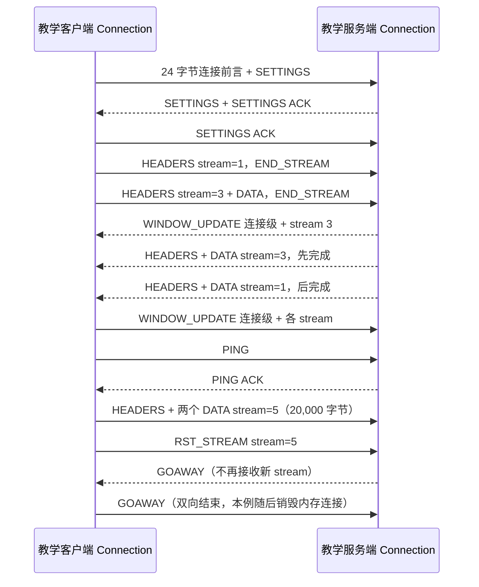

# HTTP/2 手搓教学版：从字节到两个并发请求

这个目录是**独立可运行的协议实验**，不用 nghttp2，也不加入服务器根目录的构建。它用两个内存中的 `Connection` 模拟客户端和服务端，把一端产出的真实 HTTP/2 二进制字节按 1～7 字节的小片送给另一端。这样 Windows 上也能观察整个协议流程，但它不是可对外监听的网络服务器，更不能替换生产版 `Http2Codec`。

## 1. 运行

在项目根目录执行（独立 CMake 工程，不依赖根项目的 Linux epoll 或 nghttp2）：

```bash
cmake -S server/http2/learn -B build-http2-learn
cmake --build build-http2-learn
./build-http2-learn/http2_learn
./build-http2-learn/http2_stream_coroutine_learn
```

Windows PowerShell 的最后两步需用 `.exe` 后缀。也可以直接用 C++20 编译协议演示：

```bash
g++ -std=c++20 -Wall -Wextra -Wpedantic \
  server/http2/learn/main.cpp server/http2/learn/Frame.cpp \
  server/http2/learn/Hpack.cpp server/http2/learn/Connection.cpp \
  -o http2_learn
./http2_learn
```

Windows PowerShell 上可把上面的 `g++` 参数写成一行，并将输出名改为 `http2_learn.exe`，再运行 `./http2_learn.exe`；本机验证采用了这个直接编译方式。

流协程演示可单独编译运行：`g++ -std=c++20 -Wall -Wextra -Wpedantic server/http2/learn/stream_coroutine_main.cpp -o http2_stream_coroutine_learn.exe`，然后运行 `./http2_stream_coroutine_learn.exe`。它复用项目的 `Task<T>`，不依赖 nghttp2、OpenSSL 或 Linux。

最后看到 `PASS: ...` 表示教学流程内的断言通过；控制台会列出每一帧的方向、stream ID、flags 和负载长度。

## 2. 一次完整交换是怎样走的



1. **连接前言与 SETTINGS**：`Connection::start()` 写出客户端固定前言和双方的 SETTINGS。服务端先收满 24 字节，再让 `FrameParser` 看后面的二进制帧；第一帧必须是非 ACK 的 SETTINGS。`SETTINGS ACK` 像“我已收到你的连接参数”回执。
2. **TCP 粘包/拆包**：`main.cpp::deliver()` 故意切碎字节；`FrameParser::feed()` 先缓冲，凑齐 9 字节帧头，再按 24 位 length 等待完整 payload。**一次 `recv` 不等于一帧**。
3. **HPACK**：`Hpack::encode()` 先查 RFC 的 61 项静态表，再查连接专属动态表。首轮 `x-course: http2` 以字面量发出并插入动态表；后续请求可只写索引。编码器和解码器各持一份同向同步的表，而非每个 stream 一份。示例也检查表大小改为 0 后的淘汰。
4. **stream 与消息**：HEADERS 帧给请求头贴 `stream_id=1/3`；POST 的 DATA 带 `END_STREAM` 才表示请求体结束。`Connection::finish_remote()` 此时产生一条完整 `Message`。服务端故意先应答 3 再应答 1，说明一条 TCP 内可以有多个独立 HTTP 交换。
5. **流量控制**：发送 DATA 前检查连接窗口和 stream 窗口；收到 DATA 后两级窗口都扣减。这个实验假设应用立即消费数据，于是发送两条 WINDOW_UPDATE，把额度补回来。窗口是“可接收字节的额度”，不是业务线程数量。
6. **控制帧**：PING 的 8 字节 payload 原样 ACK；`RST_STREAM` 可以取消某一个 stream。帧头的 `END_STREAM`、`END_HEADERS` 是不同位：前者结束消息方向，后者结束首部块。
7. **连接收尾**：服务端等当前演示的 stream 全部完成或取消后发送 `GOAWAY(last_stream_id, NO_ERROR)`；客户端收到后拒绝创建 stream 7，也回送 GOAWAY。这个实验随后销毁两个内存对象，模拟 TCP 生命周期结束。实际服务器还要处理“仍有活跃 stream 时先通知、等待其排空”的优雅关闭过程。

一个可在断点里亲眼看到的 HPACK 字节例子：静态表第 2 项 `:method: GET` 编成 `0x82`（最高位 1 表示“索引表示”，余下是索引 2）；第一个动态条目索引是 62，可用 `0xbe` 表示。这里的编号是**连接方向上的首部表编号**，与 stream 1、3、5 的编号完全不是一回事。

## 3. 文件与阅读顺序

| 顺序 | 文件 | 着重看 |
|---|---|---|
| 1 | [`Frame.h`](Frame.h)、[`Frame.cpp`](Frame.cpp) | 9 字节帧头、网络字节序、增量拆帧 |
| 2 | [`Hpack.h`](Hpack.h)、[`Hpack.cpp`](Hpack.cpp) | 整数前缀编码、61 项静态表、动态表插入/淘汰、字面量 |
| 3 | [`Connection.h`](Connection.h)、[`Connection.cpp`](Connection.cpp) | 前言、SETTINGS、stream 状态、HEADERS/DATA、窗口、PING/RST |
| 4 | [`main.cpp`](main.cpp) | 两端字节交换、拆包、逆序应答、自检断言 |
| 5 | [`stream_coroutine_main.cpp`](stream_coroutine_main.cpp) | 三个独立业务流协程挂起、取消 stream 5、stream 3 先于 1 恢复 |
| 6 | [`CMakeLists.txt`](CMakeLists.txt) | 独立构建，不依赖服务器或 nghttp2 |

可以先在 `main.cpp` 把 `deliver(..., 1)` 改成 `deliver(..., 100)` 比较行为：帧的结果应一样，只有喂入次数不同。随后看 stream 5 的 20,000 字节 body 如何被拆成 16,384 + 3,616 两个 DATA 帧，并在服务端重新拼回；再把 body 加大到超过教学窗口上限，观察明确报错，留作理解“等待窗口恢复后继续发送”的练习。

**流协程与协议 stream 是两层**：上面的 `Connection` 展示“线上帧按 stream ID 分开”；`stream_coroutine_main.cpp` 则展示“完整请求交给业务后，如何为每条 stream 保存独立的程序执行位置”。`co_await std::suspend_always{}` 像订单交给后厨后把叫号牌挂起来，不占用一个等待线程；Worker 完成时 Reactor 再 `resume()` 对应叫号牌。演示中三张叫号牌先后创建，5 被取消，3 先于 1 完成。真实服务器在 [`../Http2Session.cpp`](../Http2Session.cpp) 里由完成队列与 eventfd 驱动恢复，不按固定顺序手动调用。

## 4. 它刻意没有实现什么

这不是完整 HTTP/2 互操作栈。它仅处理本演示需要的无填充 HEADERS/DATA、固定单帧首部块、SETTINGS/ACK、WINDOW_UPDATE、PING、RST_STREAM、**无活跃 stream 时的 GOAWAY** 和未知帧忽略。HPACK 支持静态/动态索引、原始字符串、表大小更新及几种字面量，**不支持 Huffman 编码**。还没有 CONTINUATION、Padding、完整伪首部/内容长度校验、所有流状态转换、GOAWAY 的在途 stream 排空、TLS/ALPN、h2c Upgrade、服务端推送、优先级、网络 socket、复杂窗口等待队列或恶意流量防护。它把收到的消息体缓存在 65,535 字节内，单个首部块限 16,384 字节；窗口不足时直接报错，不异步等待。

因此不能拿它直接连接浏览器或 `curl` 作为通用 HTTP/2 服务端。生产版使用 [`../Http2Codec.cpp`](../Http2Codec.cpp) + nghttp2 正是为了避免把上述复杂边界误当成已经处理。协议权威定义见 [RFC 9113](https://www.rfc-editor.org/rfc/rfc9113.html) 与 [HPACK RFC 7541](https://www.rfc-editor.org/rfc/rfc7541.html)。
